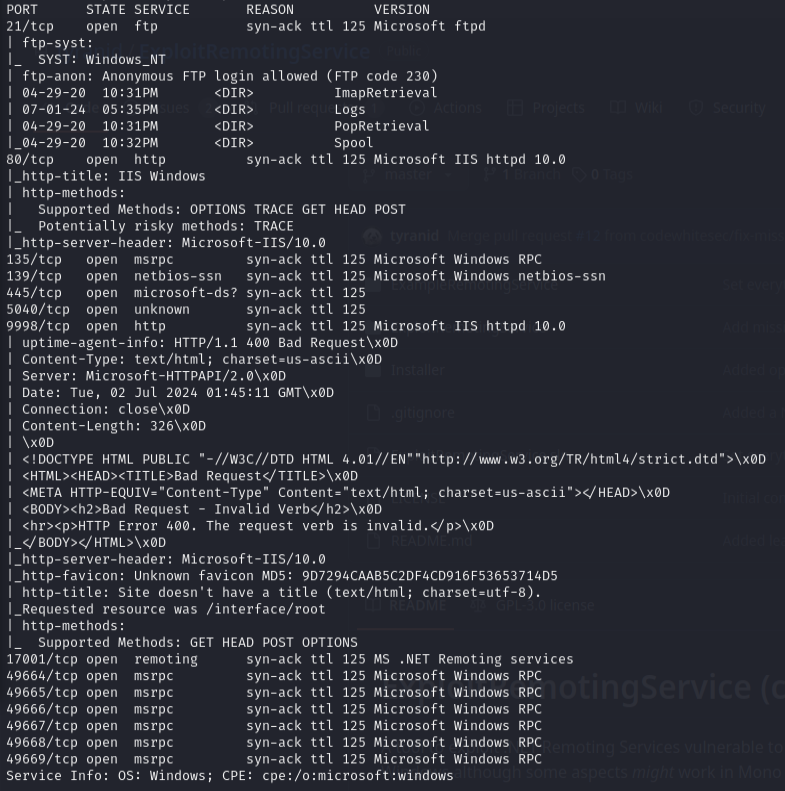
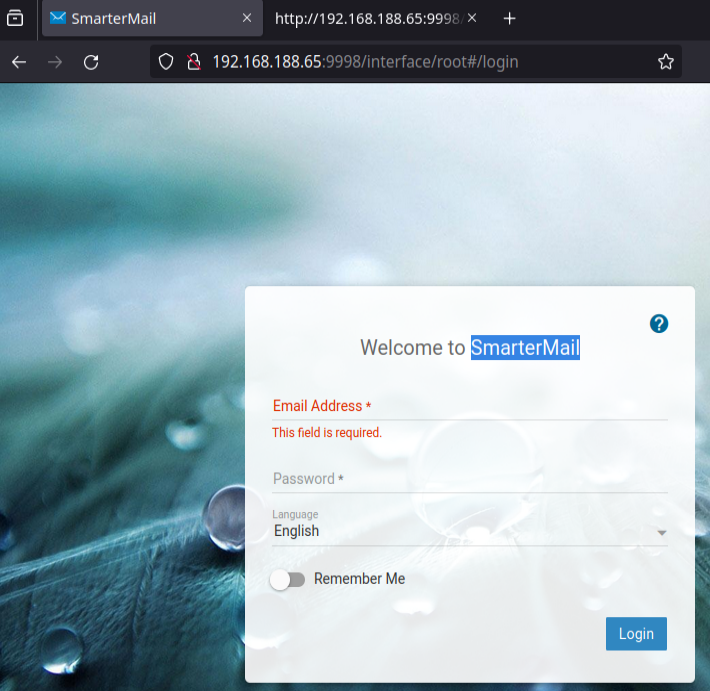
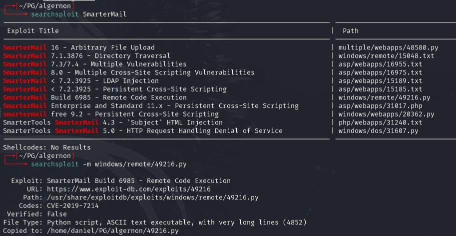
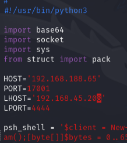
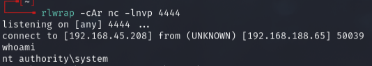

# Algernon -- Proving Grounds (write-up)

**Difficulty:** Easy / Beginner
**Box:** Algernon (Proving Grounds)
**Author:** dsec
**Date:** 2025-02-19

---

## TL;DR

### SmarterMail on port 9998 had a known exploit (EDB 49216) that gave SYSTEM immediately via a deserialization vulnerability.
---
## Target info

- Host: `192.168.188.65`
- Services discovered via nmap
---
## Enumeration

```bash
sudo nmap -Pn -n 192.168.188.65 -sCV -p- --open -vvv
```



---
## SmarterMail -- port 9998





Found exploit EDB 49216. Edited the script with target IP, local host/port, and the already-listed port 17001 (confirmed in nmap):



Set up listener:

```bash
rlwrap -cAr nc -lnvp 4444
```

```bash
python3 49216.py
```



---
## Lessons & takeaways

- SmarterMail deserialization is a one-shot SYSTEM exploit -- always check for it
- When nmap shows uncommon ports already open (like 17001), the exploit may already be configured for them
