# Apex -- Proving Grounds (write-up)

**Difficulty:** Hard
**Box:** Apex (Proving Grounds)
**Author:** dkrxhn
**Date:** 2024-06-24

---

## TL;DR

### Exploited OpenEMR via an authenticated file read vulnerability to extract MySQL credentials from sqlconf.php, cracked the admin password hash from the database, and escalated via password reuse to root.

---

## Enumeration

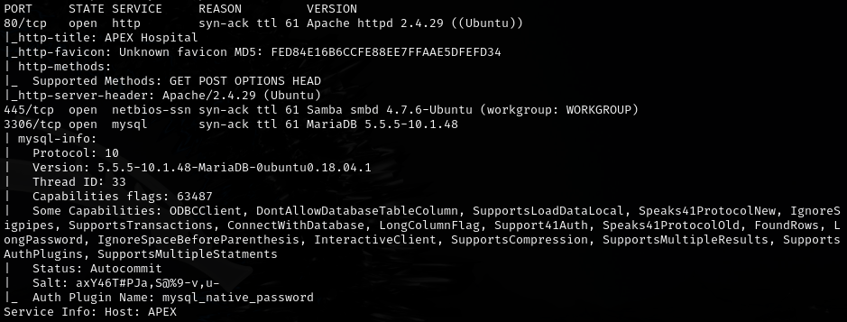

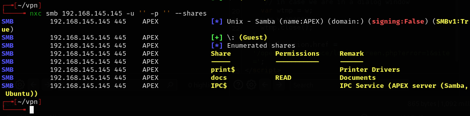

Found OpenEMR:

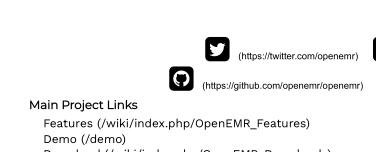

Searched GitHub for password handling:

```
repo:openemr/openemr "$pass"
```

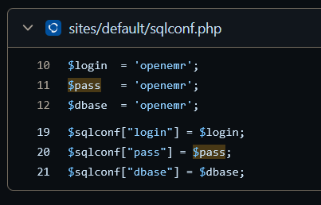

```bash
feroxbuster -u http://192.168.145.145/openemr -w /usr/share/wordlists/dirb/common.txt -n -x php
```

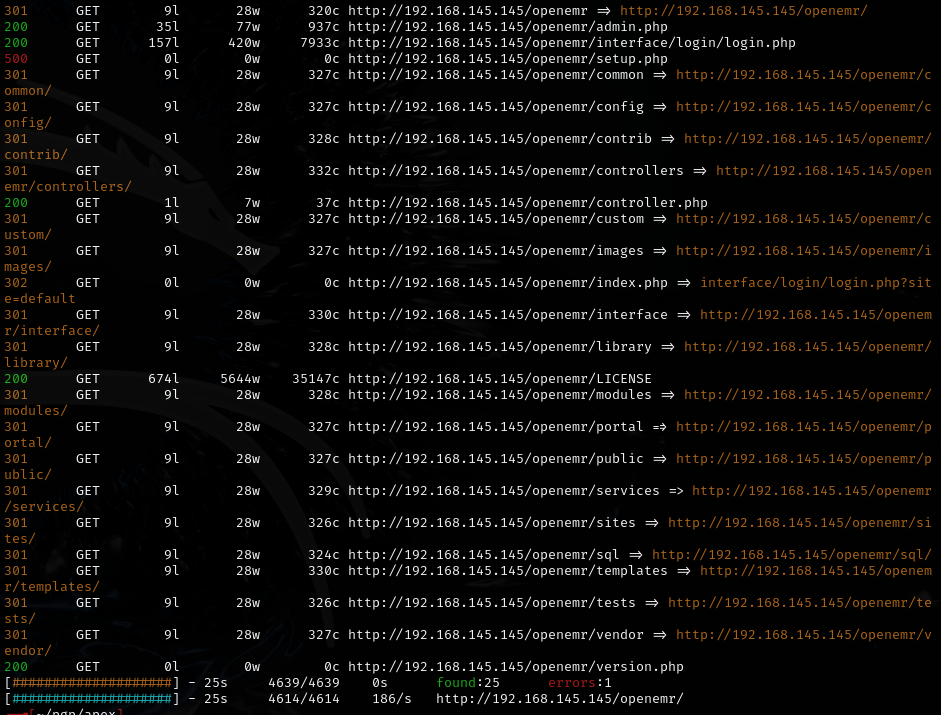

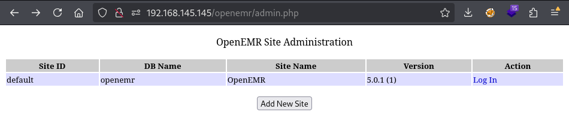

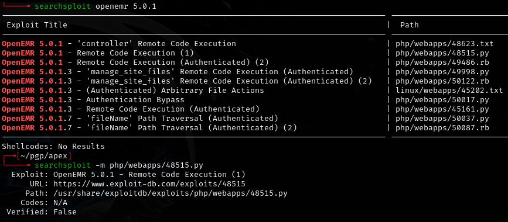

- Requires auth.

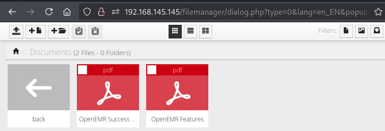

---

## Exploitation

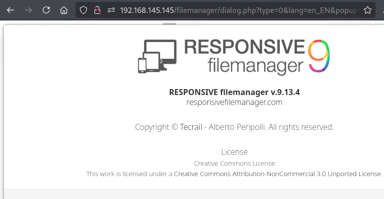

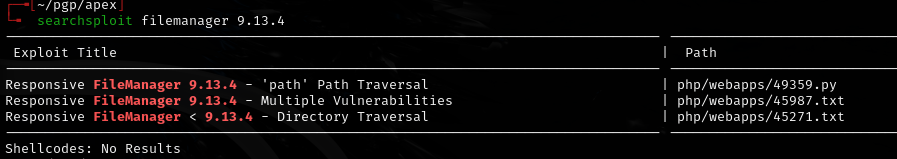

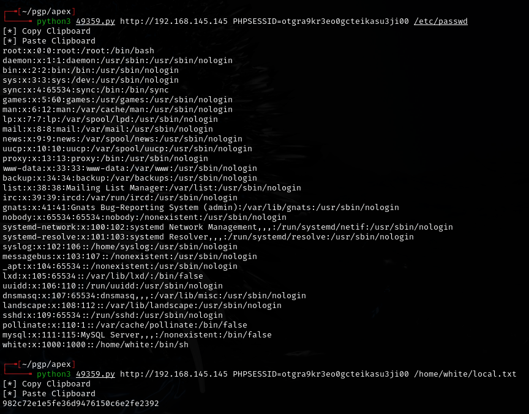

- Unedited script works but **fails** to get `sqlconf`.

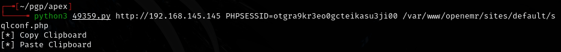

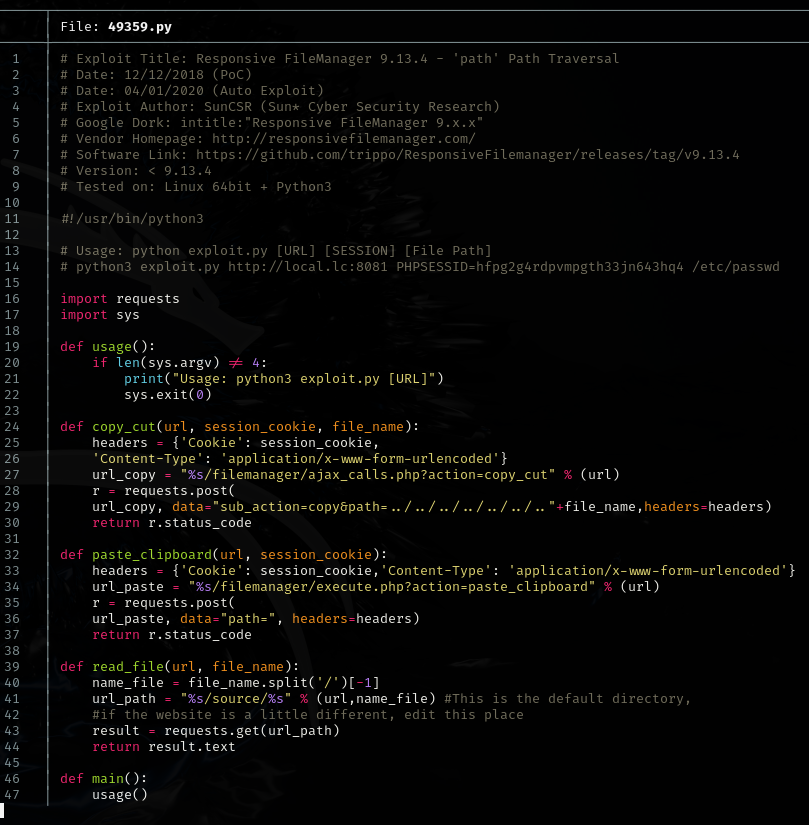

- Need PHPSESSID.

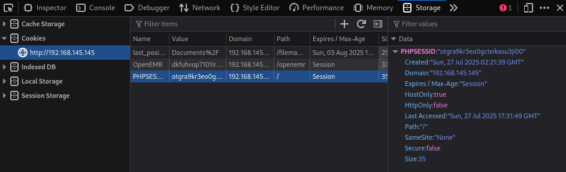

- `otgra9kr3eo0gcteikasu3ji00`

Script still fails:

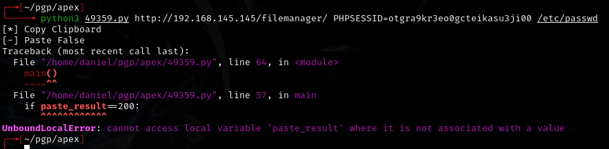

Had to edit the clipboard and read functions in the exploit:

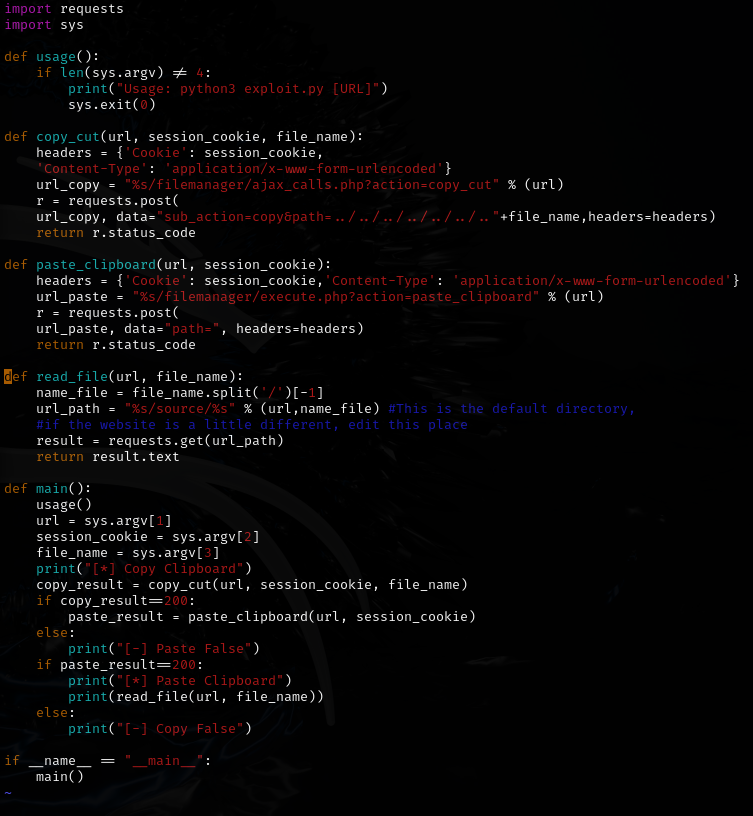

Changed to:

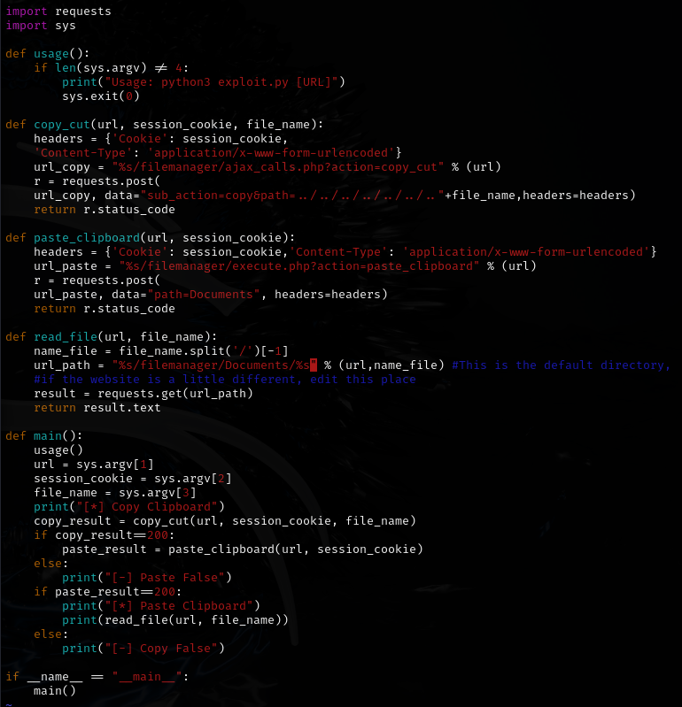

- Changed `data` variable in `paste_clipboard` function to `"path=Documents"` because this is the folder we have access to within filemanager.
- Changed `url_path` variable in `read_file` function to `%s/filemanager/Documents/%s`.
- The path for OpenEMR is under `/var/www` instead of `/var/www/html`.
- The copied `sqlconf.php` can only be viewed via the SMB share since PHP files get processed server-side.

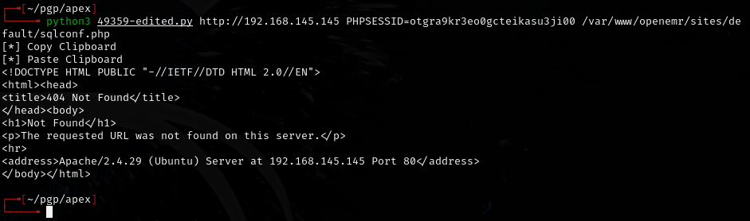

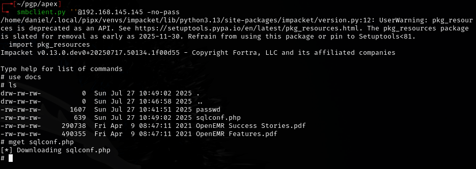

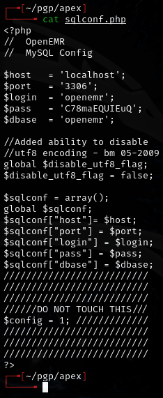

- `openemr:C78maEQUIEuQ`

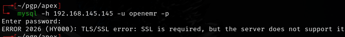

- SSL error, had to use `--ssl=0`.

```bash
mysql --ssl=0 -u openemr -p -h 192.168.145.145
```

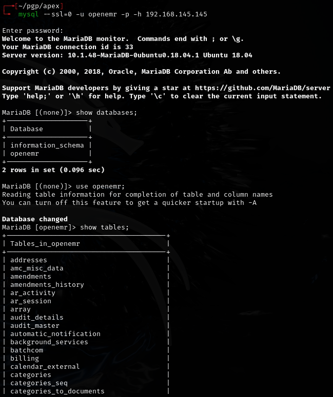

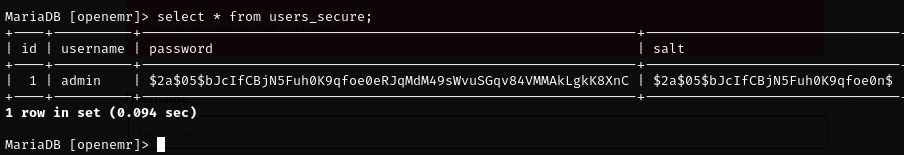

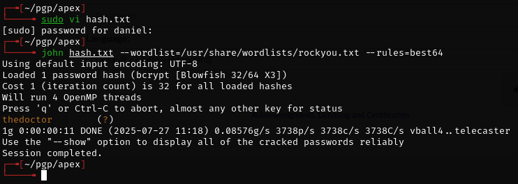

- Cracked without salt.

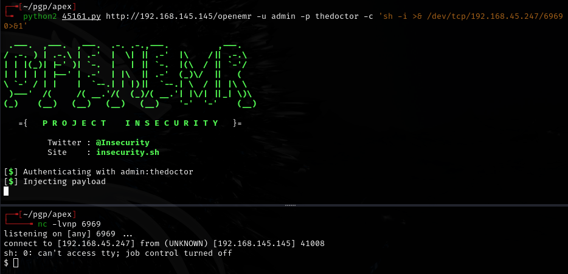

---

## Privilege escalation

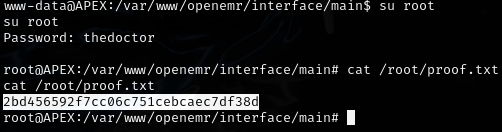

- Password reuse to root.

---

## Lessons & takeaways

- OpenEMR exploits often need tweaking -- the file paths and session handling vary between installations
- When PHP files are copied via exploits, view them through SMB or other non-PHP-processing means
- Always try `--ssl=0` if MySQL connections fail with SSL errors
- Password reuse between application databases and system accounts is common
