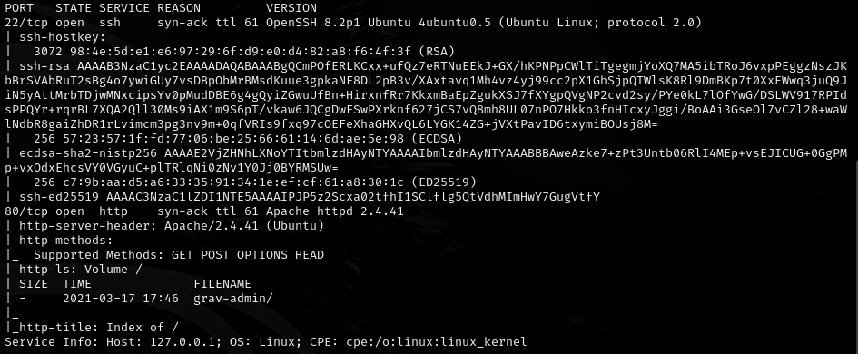
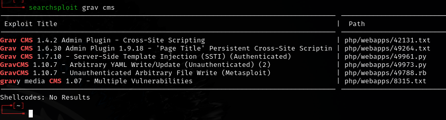
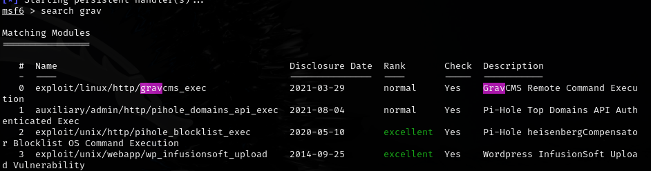
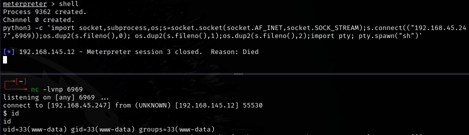
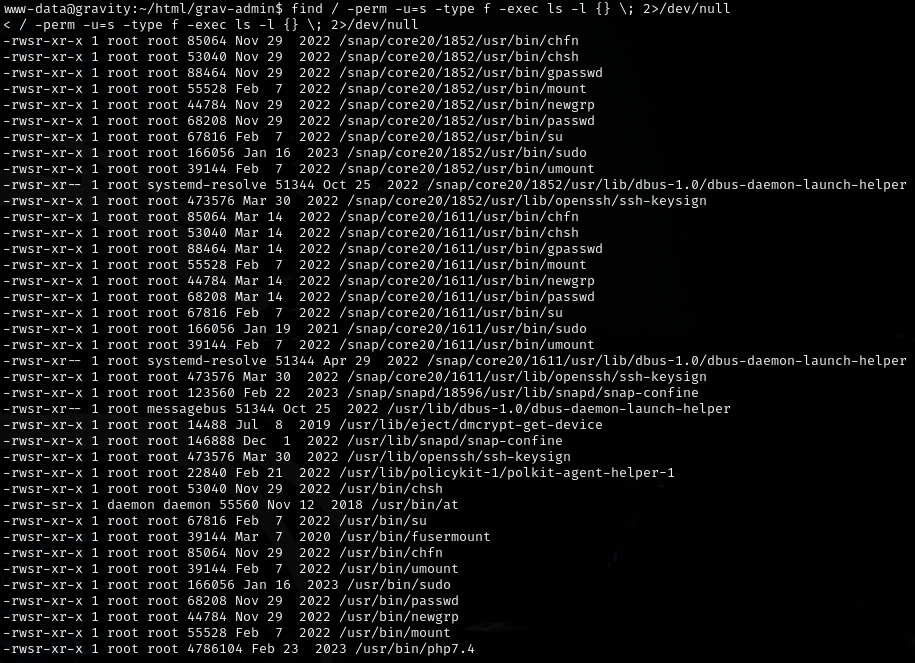
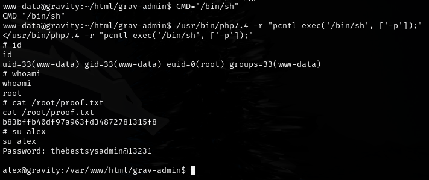

# Astronaut -- Proving Grounds (write-up)

**Difficulty:** Intermediate
**Box:** Astronaut (Proving Grounds)
**Author:** dsec
**Date:** 2025-10-10

---

## TL;DR

### Exploited web app with Metasploit (manual exploit failed). Pivoted to stable shell. Privesc via SUID on PHP.
---

## Target info

- Host: Astronaut (Proving Grounds)

---

## Enumeration

Could have used discovered credentials to SSH, but used Metasploit instead since the manual exploit would not work.

---

## Foothold

Meterpreter shell kept dying (unstable), so pivoted to a Python3 reverse shell (#2 from revshells):

---

## Privilege escalation

SUID bit set on PHP:

---

## Lessons & takeaways

- Meterpreter shells can be unstable -- always have a backup shell ready
- Check for SUID on interpreters like PHP, Python, Perl
- When manual exploits fail, Metasploit is a valid fallback
---
