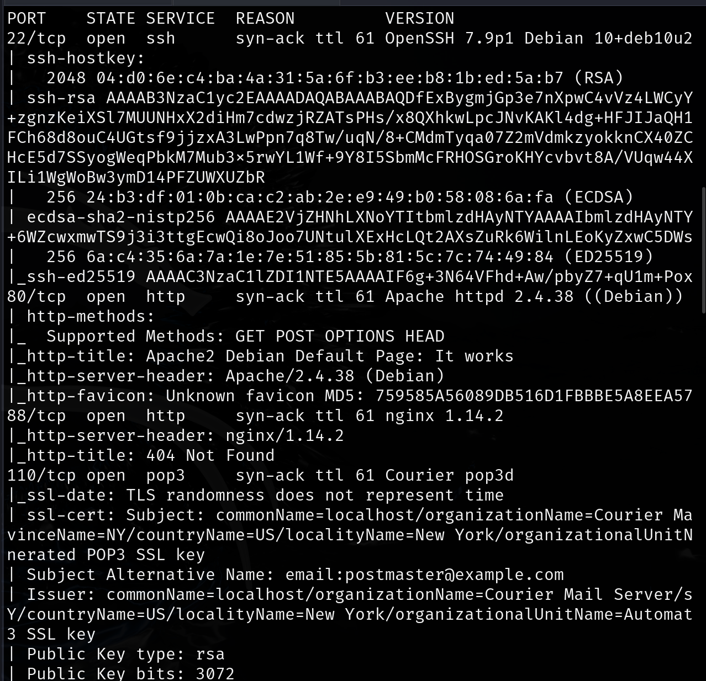
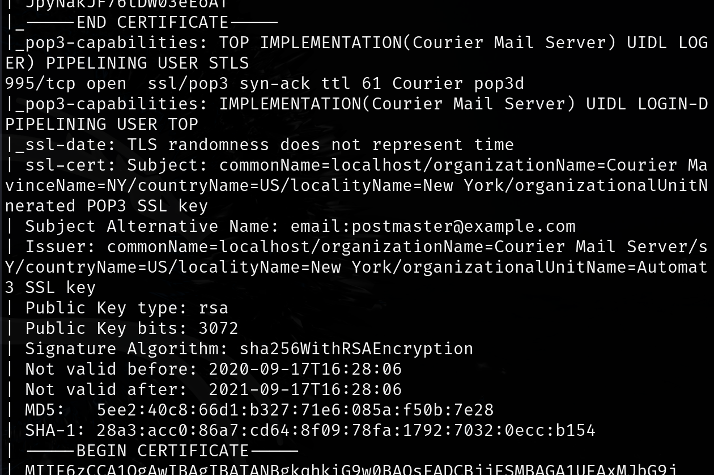
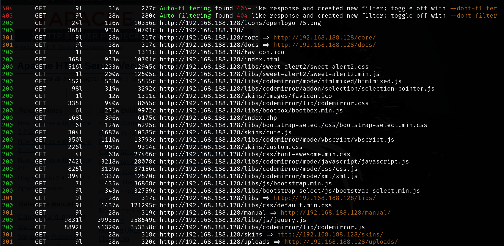
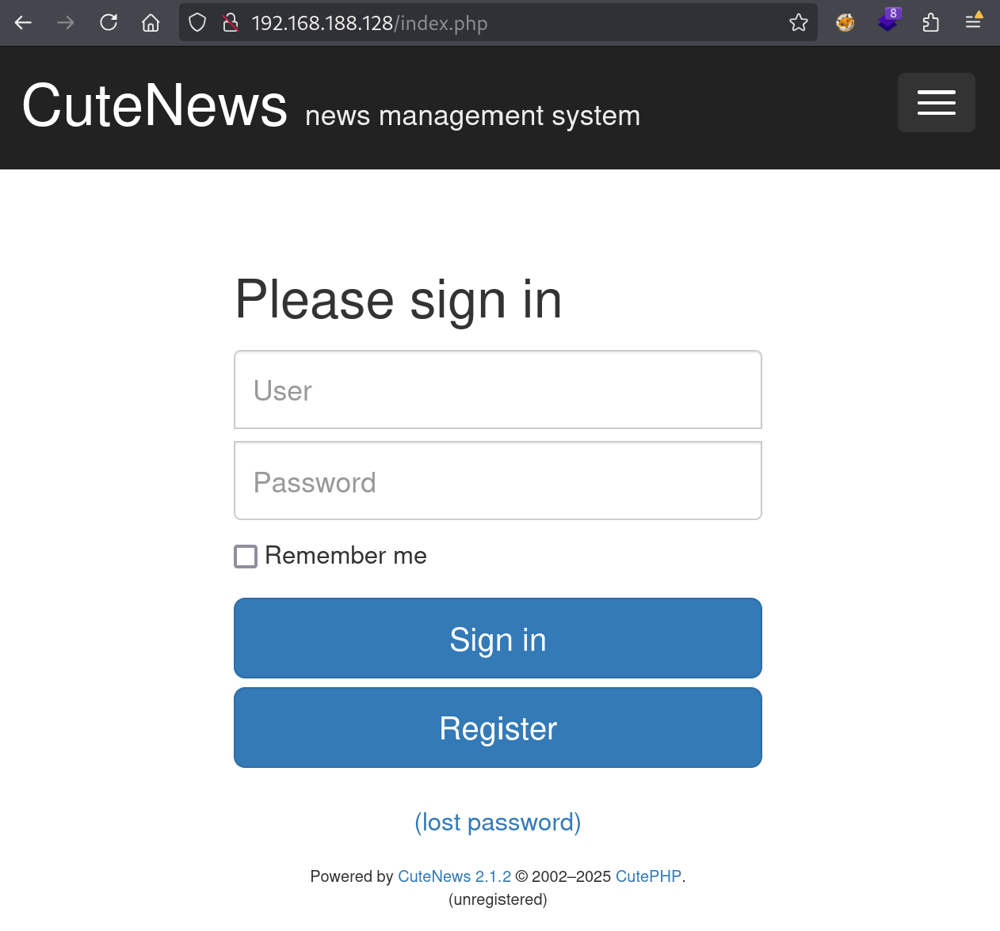
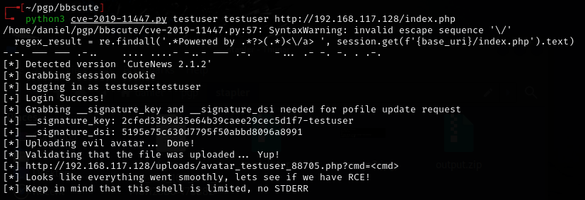
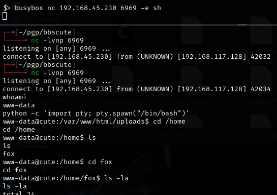
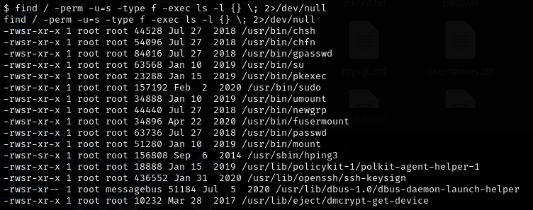
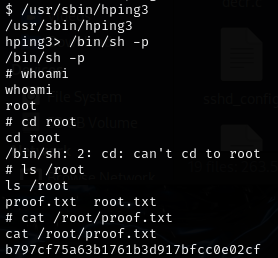

# BBSCute -- Proving Grounds (write-up)

**Difficulty:** Easy
**Box:** BBSCute (Proving Grounds)
**Author:** dkrxhn
**Date:** 2024-11-13

---

## TL;DR

### CuteNews 2.1.2 had a known CVE (CVE-2019-11447) that allowed remote code execution after registering an account. Used a public PoC for the shell.
---
## Target info

- Host: `192.168.188.128`
---
## Enumeration





```bash
feroxbuster -u http://192.168.188.128 -w /usr/share/wordlists/dirb/common.txt -n
```



Found index.php:



CuteNews 2.1.2.

---
## CVE-2019-11447

Registered an account (check source code for captcha at `/captcha.php`).

Used the public PoC for CVE-2019-11447. Downloaded the required `sad.gif` file too:









---
## Lessons & takeaways

- Always check the version of CMS software -- CuteNews 2.1.2 has a well-known avatar upload RCE
- Check page source for captcha endpoints when registering accounts
