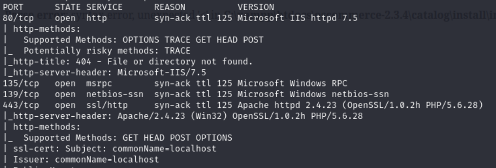
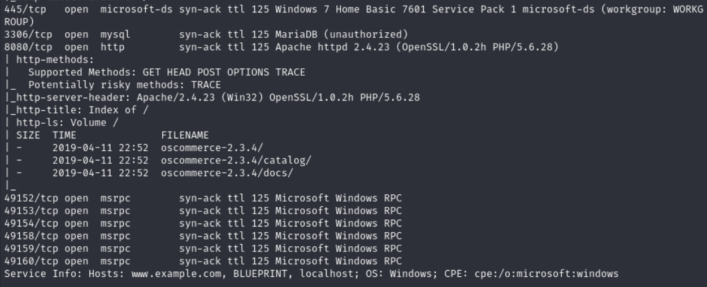
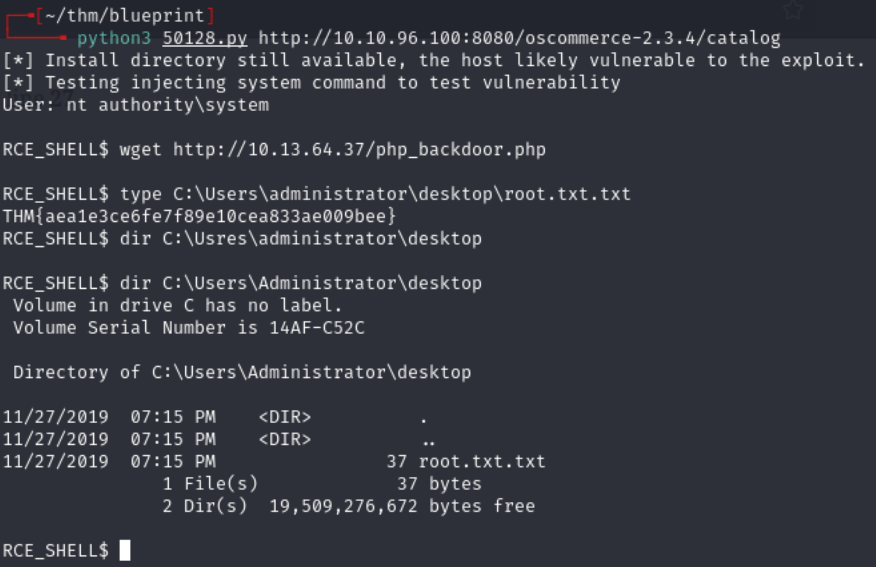

# Blueprint -- TryHackMe (write-up)

**Difficulty:** Easy
**Box:** Blueprint (TryHackMe)
**Author:** dkrxhn
**Date:** 2024-07-28

---

## TL;DR

### Very sparse notes on this one. Screenshots show enumeration and exploitation but the details are minimal.

---

## Enumeration

---

## Lessons & takeaways

- Take better notes during the box -- screenshots alone make it hard to reconstruct the attack path later
- Even easy boxes deserve documentation of each step
