# BoardLight -- HackTheBox (write-up)

**Difficulty:** Easy
**Box:** BoardLight (HackTheBox)
**Author:** dkrxhn
**Date:** 2025-07-22

---

## TL;DR

### Subdomain enumeration found a CRM app. Hardcoded creds in PHP config led to SSH access. Privesc via Enlightenment desktop environment SUID exploit (CVE-2022-37706).
---

## Target info

- Host: see nmap results
- Services discovered: `22/tcp (ssh)`, `80/tcp (http)`

---

## Enumeration

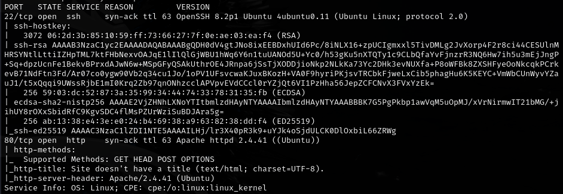

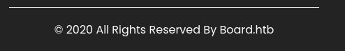

Added discovered hostname to `/etc/hosts`:

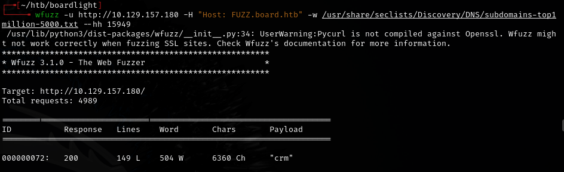

Added subdomain to `/etc/hosts`:

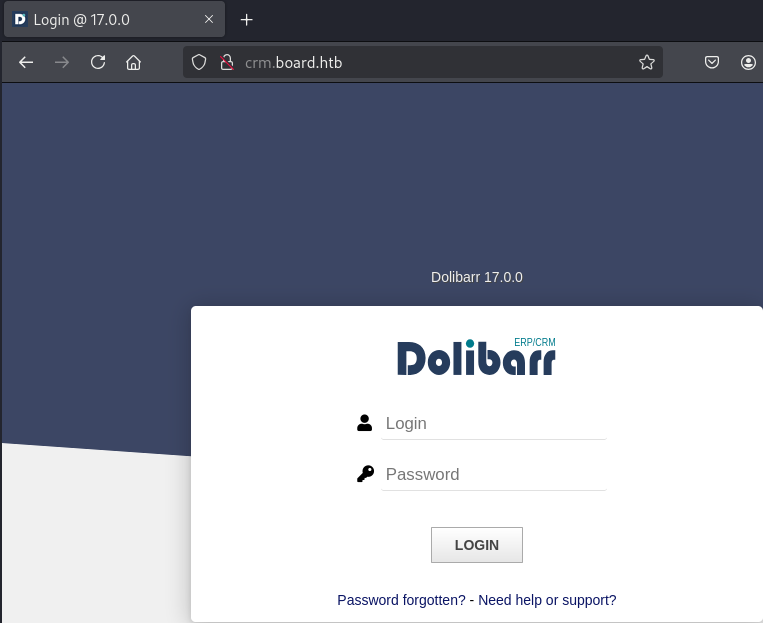

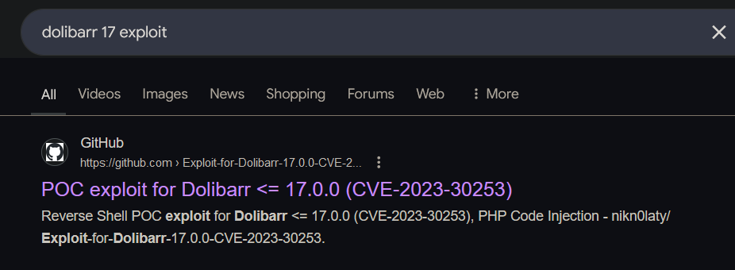

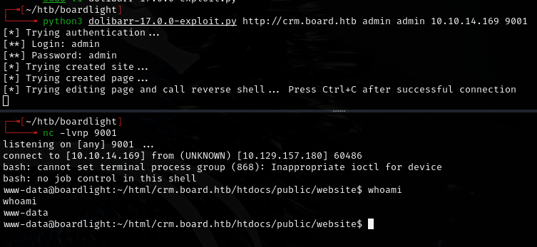

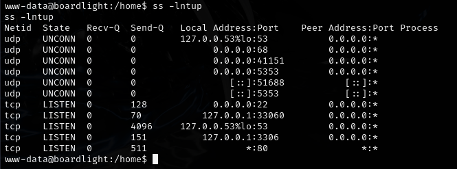

## Exploitation

Found hardcoded credentials in PHP config:

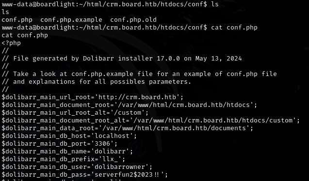

- `serverfun2$2023!!` -- works for user `larissa`

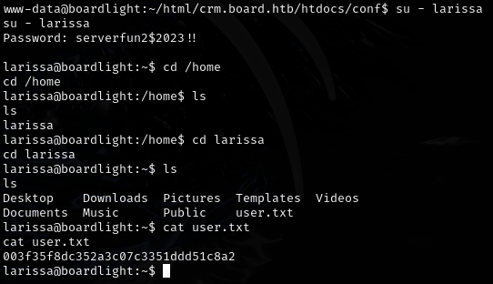

Also works for SSH:

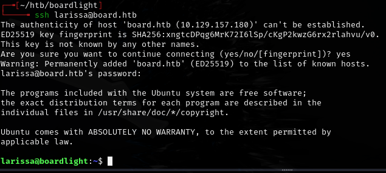

## Privilege escalation

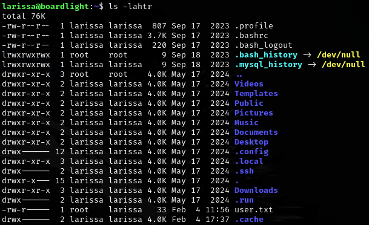

- Desktop, Downloads, Pictures suggest GUI desktop environment installed

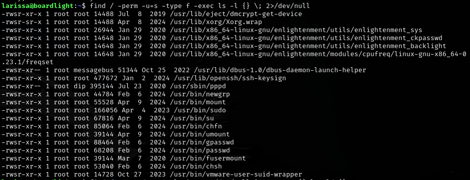

Found Enlightenment desktop manager -- CVE-2022-37706 LPE exploit:

<https://github.com/MaherAzzouzi/CVE-2022-37706-LPE-exploit>

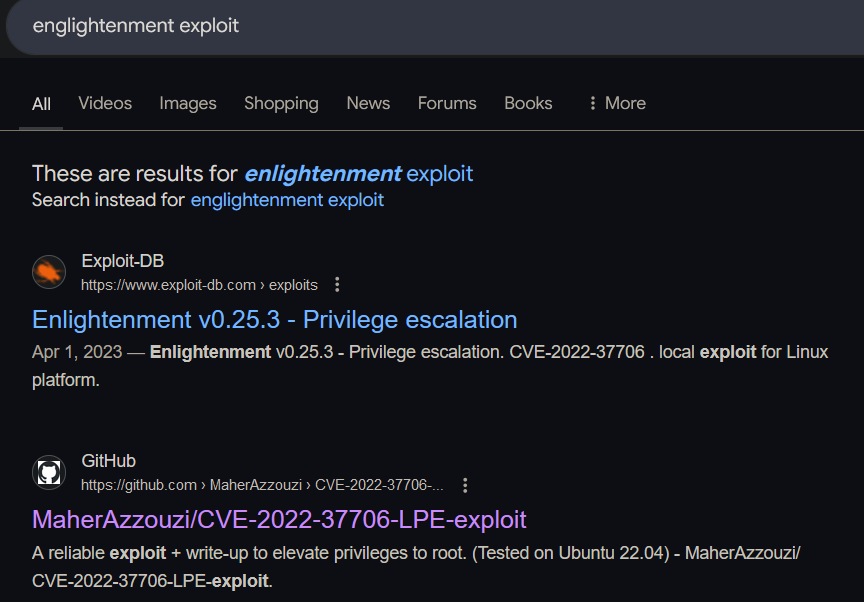

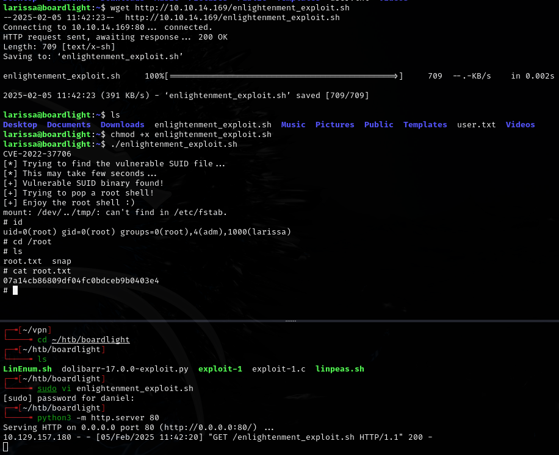

---

## Lessons & takeaways

- Search for hardcoded creds in `/var/www/html`: `grep -rEi 'password\s*=|db_pass|api_key|auth_token' /var/www/html --include="*.php"`
- Desktop directories (Desktop, Downloads, Pictures) hint at a GUI environment -- look for related exploits
- Always try credential reuse across services (web creds -> SSH)
---
