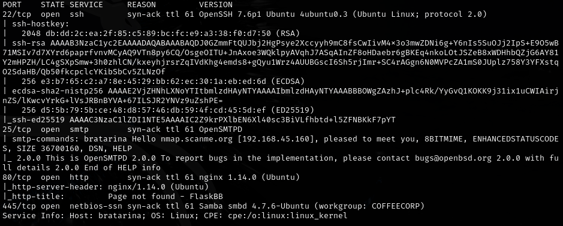
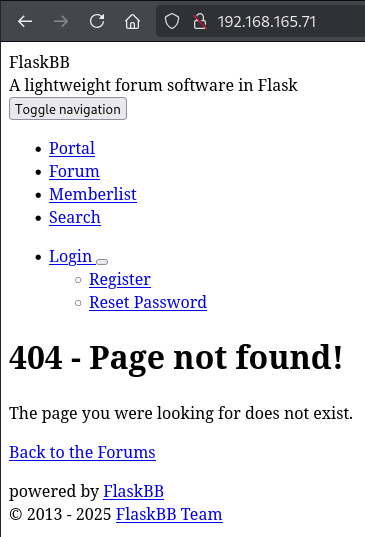
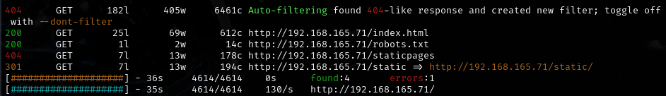
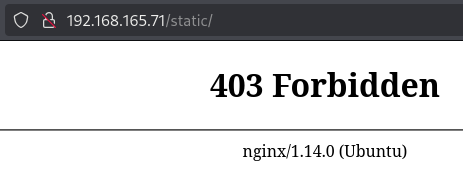
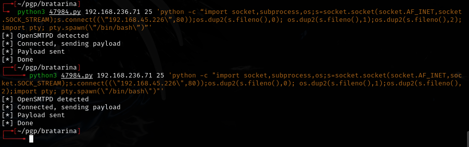
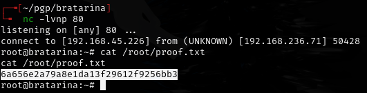

# Bratarina -- Proving Grounds (write-up)

**Difficulty:** Easy
**Box:** Bratarina (Proving Grounds)
**Author:** dsec
**Date:** 2025-09-11

---

## TL;DR

### SMTP service exploit gave initial shell. Straightforward foothold with a known vulnerability.
---

## Target info

- Host: `192.168.165.71`
- Services discovered via nmap

---

## Enumeration





Directory brute force:

```bash
feroxbuster -u http://192.168.165.71 -w /usr/share/wordlists/dirb/common.txt -n
```



---

## Foothold





Stabilized the shell. **Note:** the first PTY stabilization command did not work (had a space between `;` and `import pty`), but the second command from revshells worked:





---

## Lessons & takeaways

- Watch for syntax errors in shell stabilization commands -- spacing matters
- Always check SMTP services for known exploits
---
