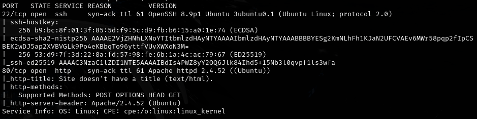
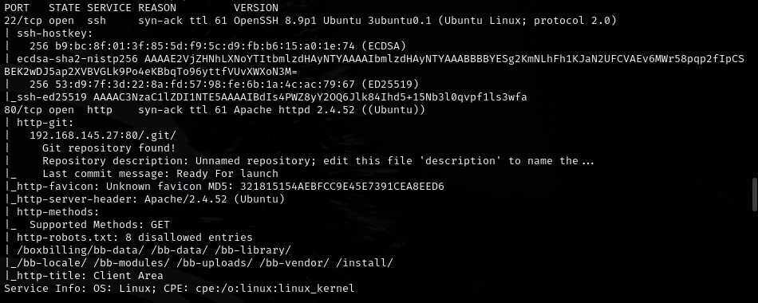
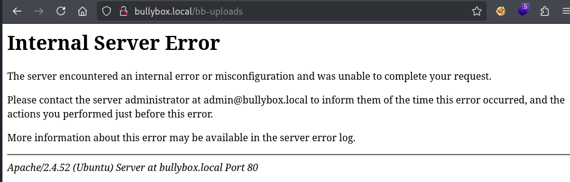
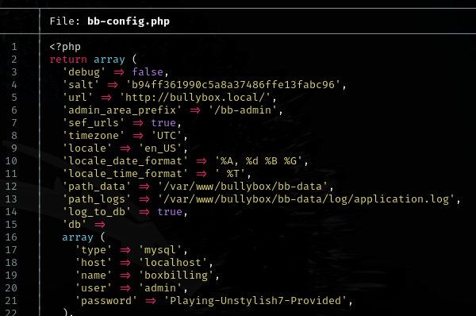

# Bullybox -- Proving Grounds (write-up)

**Difficulty:** Easy
**Box:** Bullybox (Proving Grounds)
**Author:** dsec
**Date:** 2025-06-24

---

## TL;DR

### Added hostname to /etc/hosts, then used discovered credentials to gain access.
---

## Target info

- Host: see nmap results

---

## Enumeration

Added hostname to `/etc/hosts`, then ran nmap:

## Exploitation

- Password: `Playing-Unstylish7-Provided`

Reference: <https://medium.com/@diogo.g.c/pg-ctf-200-06-walkthrough-guide-f8c6f55c4588>

---

## Lessons & takeaways

- Always add discovered hostnames to `/etc/hosts`
- Check walkthrough references when stuck on short boxes
---
