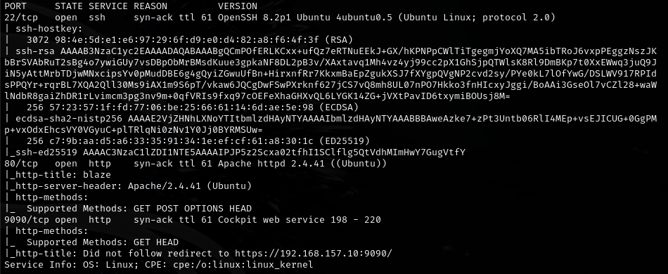
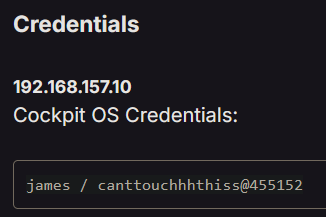
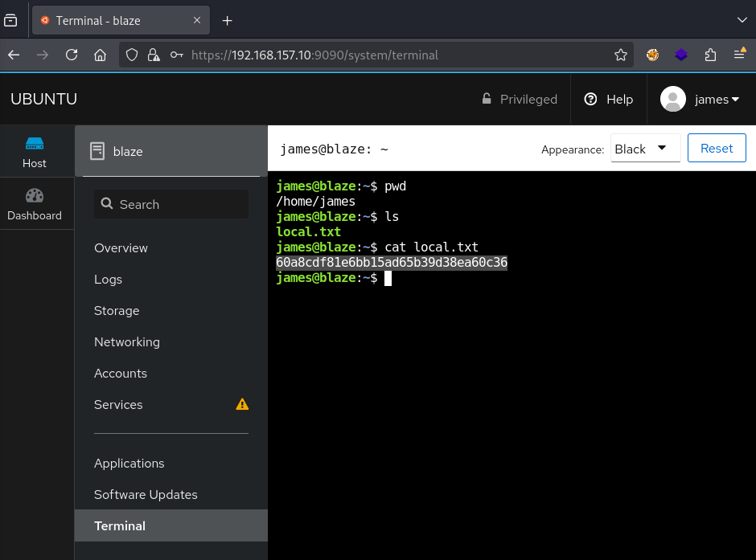
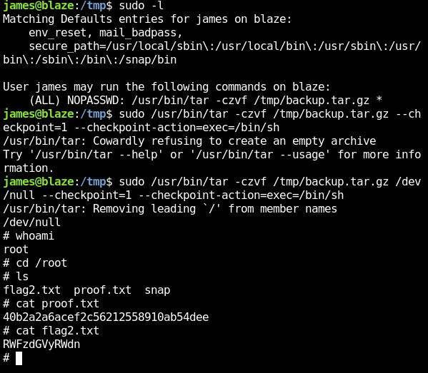
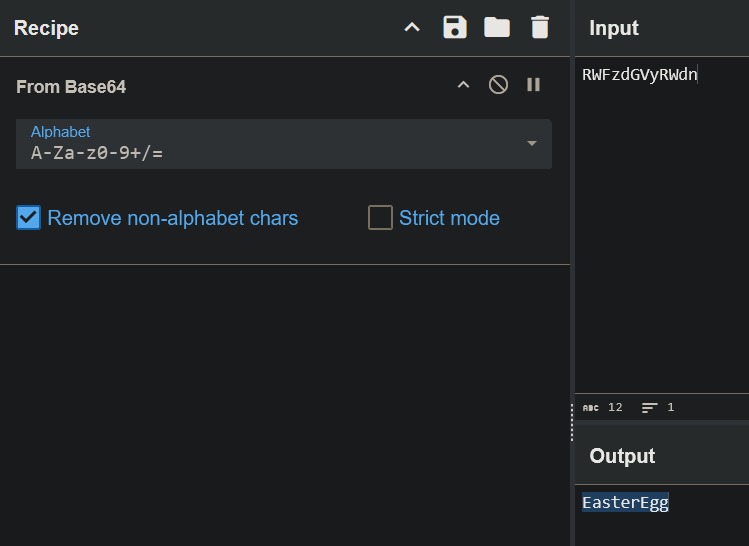

# Cockpit -- Proving Grounds (write-up)

**Difficulty:** Easy / Beginner
**Box:** Cockpit (Proving Grounds)
**Author:** dkrxhn
**Date:** 2025-05-12

---

## TL;DR

### Cockpit web interface on port 9090. Logged in with PG-provided creds. Straightforward escalation from there.
---
## Target info

- Host: Proving Grounds target
- Services discovered via nmap, Cockpit on port 9090
---
## Enumeration

Found Cockpit web interface on port 9090. Logged in with credentials provided by PG:

---
## Exploitation

---
## Lessons & takeaways

- Cockpit provides a built-in terminal -- if you have valid creds, you have a shell
- Always check for web management interfaces on non-standard ports
---
