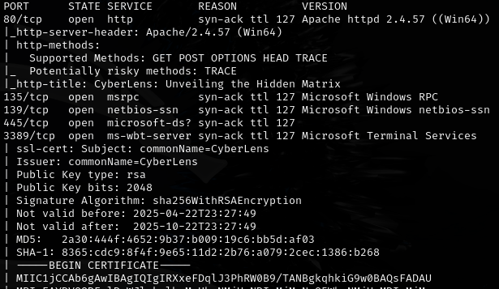
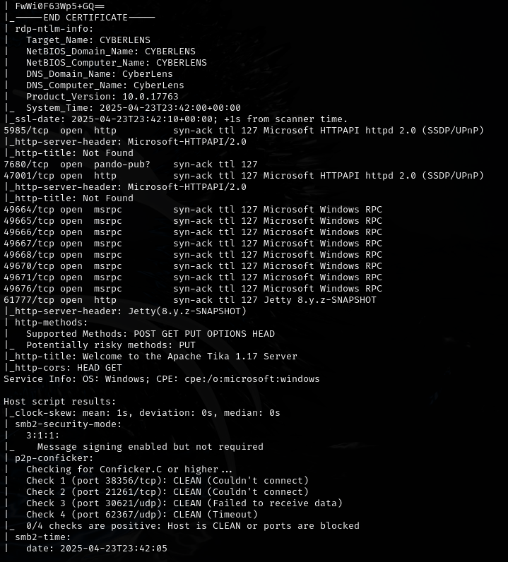
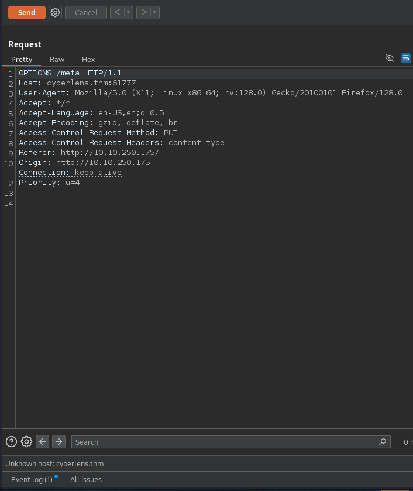
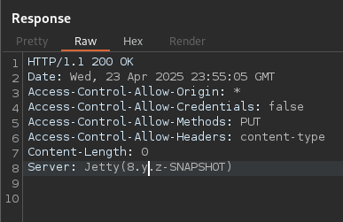
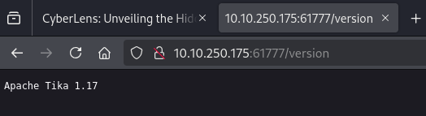
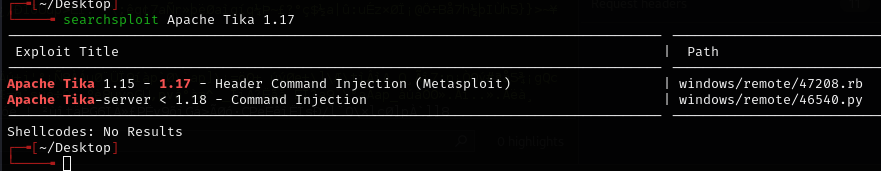
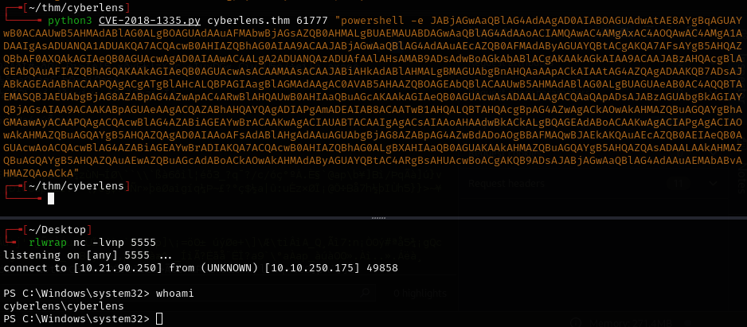
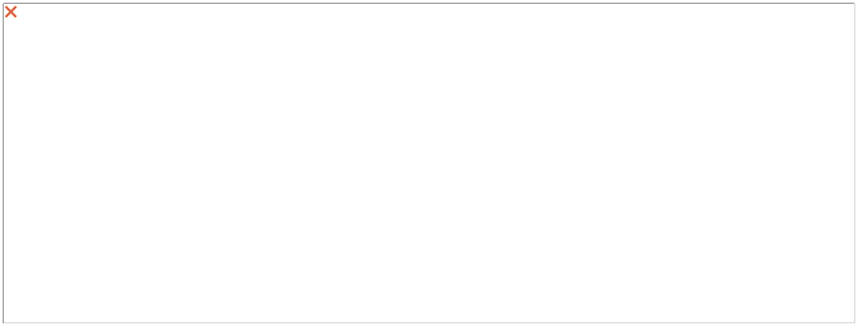
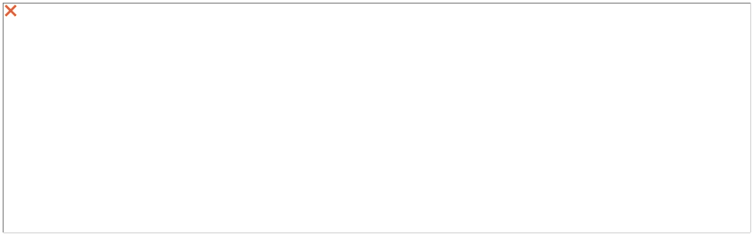

# CyberLens -- TryHackMe (write-up)

**Difficulty:** Easy
**Box:** CyberLens (TryHackMe)
**Author:** dsec
**Date:** 2025-10-07

---

## TL;DR

### Apache Tika on port 61777 vulnerable to CVE-2018-1335. Base64-encoded PowerShell reverse shell for initial access. AlwaysInstallElevated for SYSTEM.
---
## Target info

- Host: `cyberlens.thm`
- Services discovered: `80/tcp (http)`, `61777/tcp (Apache Tika)`
---
## Enumeration

Added `cyberlens.thm` to `/etc/hosts`.

Identified Jetty 8.y.z-SNAPSHOT.

Port 61777:

---
## Initial access

Used [CVE-2018-1335](https://github.com/RhinoSecurityLabs/CVEs/blob/master/CVE-2018-1335/CVE-2018-1335.py) (updated for Python3). Also works with Python2.

Used PowerShell base64-encoded reverse shell from revshells.com.

---
## Privilege escalation

WinPEAS found AlwaysInstallElevated:

---
## Lessons & takeaways

- Apache Tika instances exposed on non-standard ports are often vulnerable to CVE-2018-1335
- AlwaysInstallElevated = instant SYSTEM via malicious MSI
- Base64-encoded PowerShell payloads from revshells.com are reliable for Windows targets
---
