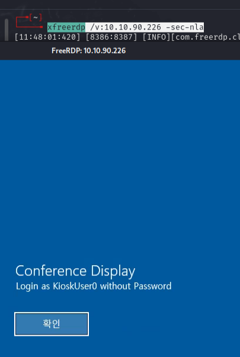
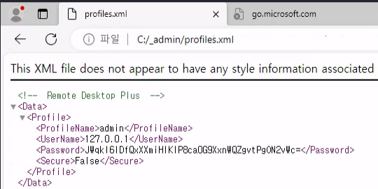
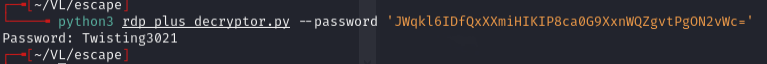
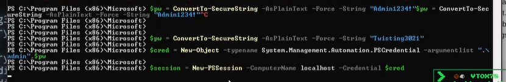
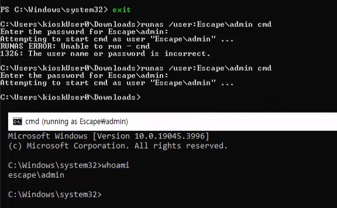
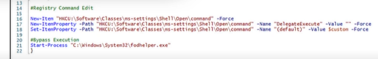
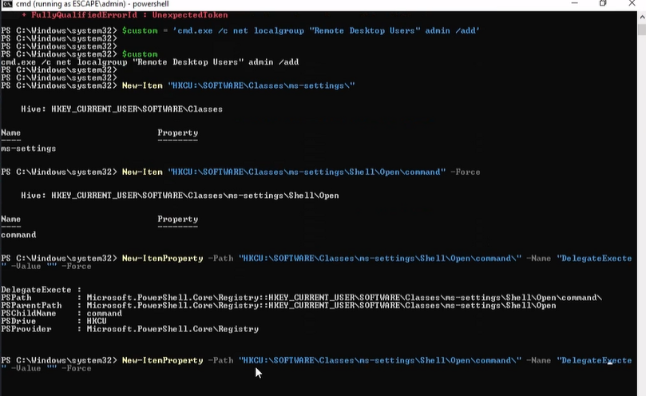
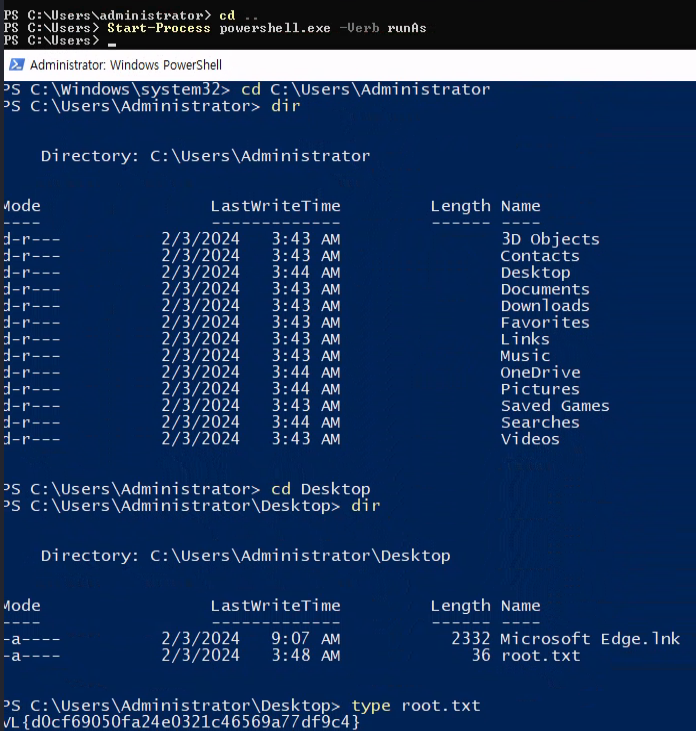
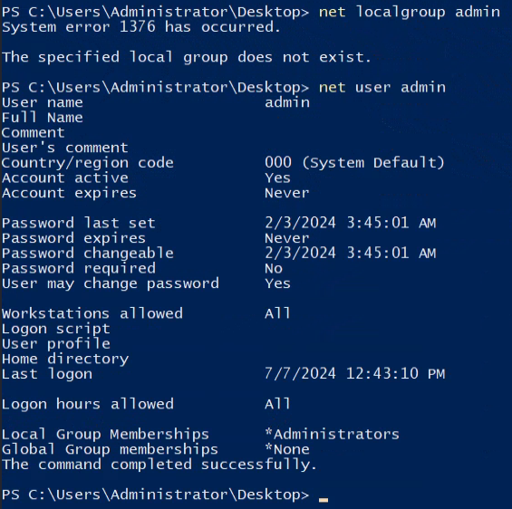

# Escape -- Vulnlab (write-up)

**Difficulty:** Easy
**Box:** Escape (Vulnlab)
**Author:** dkrxhn
**Date:** 2025-09-06

---

## TL;DR

### Kiosk-style Windows box. Bypassed app restrictions by renaming cmd.exe to msedge.exe. Found admin creds. UAC bypass via Start-Process -Verb runAs.
---
## Target info

- Host: `10.10.90.226`
---
## Initial access

Connected via RDP:

```bash
xfreerdp /v:10.10.90.226 -sec-nla
```





Found a key string: `JWqkl6IDfQxXXmiHIKIP8ca0G9XxnWQZgvtPgON2vWc=`

Renamed `cmd.exe` to `msedge.exe` and it opened -- bypassing the application whitelist.



Found creds: `admin:Twisting3021`





---
## Privilege escalation

**Tried fodhelper UAC bypass -- didn't work.**





Used `Start-Process` with `-Verb runAs` instead:

```powershell
Start-Process powershell.exe -Verb runAs
```



Confirmed admin is in the Administrators group:

```
net user admin
```



---
## Lessons & takeaways

- Application whitelisting by process name is trivially bypassable by renaming executables
- When fodhelper fails, `Start-Process -Verb runAs` can still elevate if the user is in the Administrators group
---
