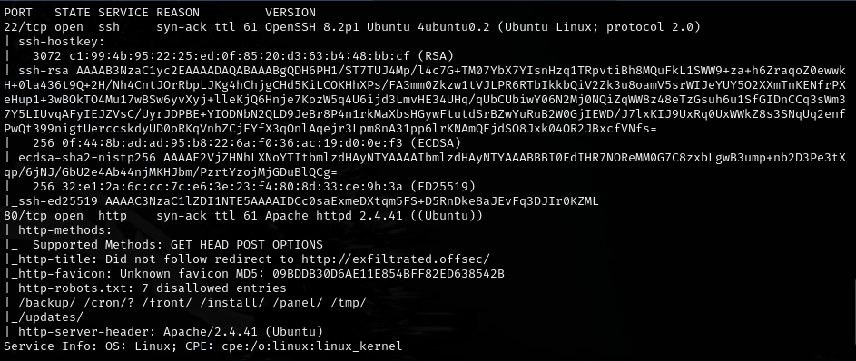
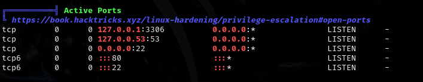
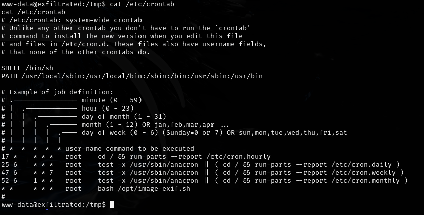
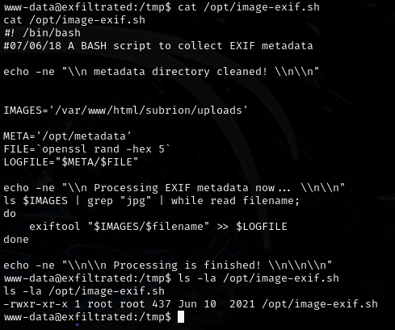
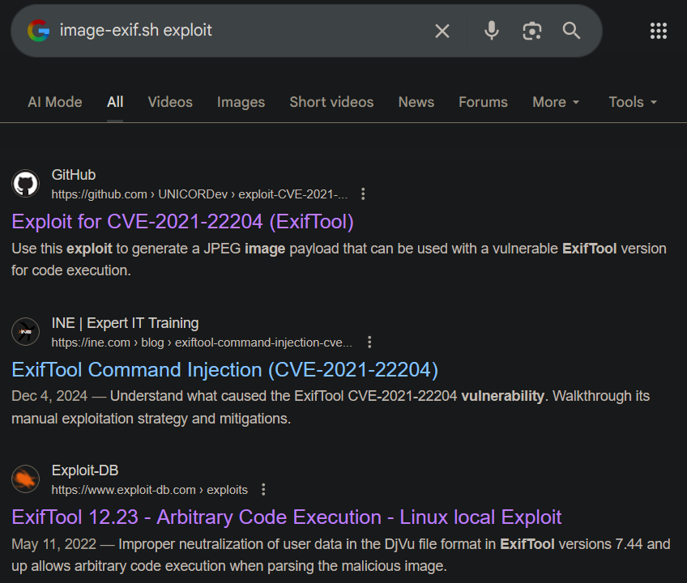

# Exfiltrated -- Proving Grounds (write-up)

**Difficulty:** Intermediate
**Box:** Exfiltrated (Proving Grounds)
**Author:** dsec
**Date:** 2025-11-16

---

## TL;DR

### Default admin:admin on Subrion CMS. Privesc via CVE-2021-22204 (exiftool) -- crafted malicious image uploaded to a cron-watched directory.
---

## Target info

- Host: `exfiltrated.offsec` (added to `/etc/hosts`)

---

## Foothold

`admin:admin` worked for login on `http://exfiltrated.offsec`:

---

## Privilege escalation

Linpeas findings:

A cron job checks the `/var/www/html/subrion/uploads` directory:

CVE-2021-22204 (exiftool RCE):

- `https://github.com/UNICORDev/exploit-CVE-2021-22204`
- Asks to install a dependency
- Works by running locally to create `image.jpg`, setting up a listener, then uploading `image.jpg` to `/var/www/html/subrion/uploads`

**Note:** the exploit-db version gives errors -- the GitHub version works.

---

## Lessons & takeaways

- Default credentials on CMS platforms are always worth trying
- Cron jobs that process uploaded files are prime targets for exploitation
- CVE-2021-22204 (exiftool) can be triggered by simply placing a malicious image where it will be processed
---
