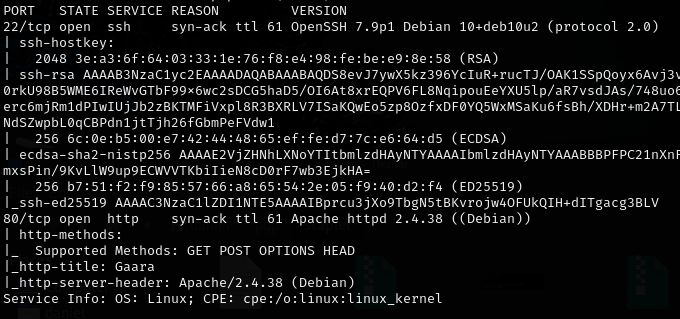
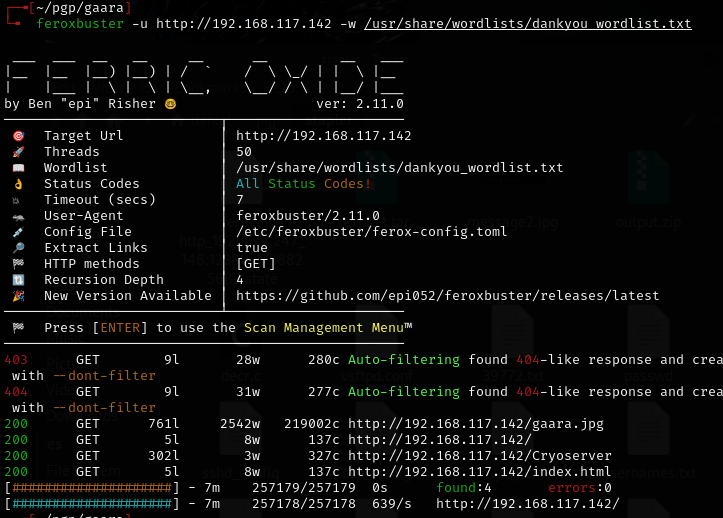
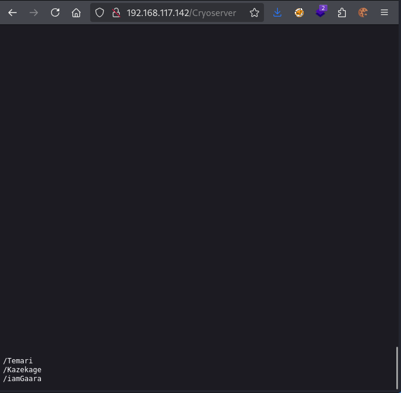
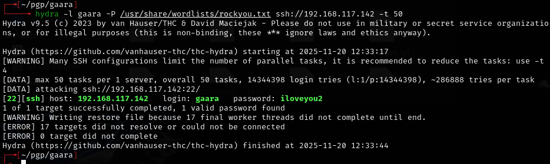
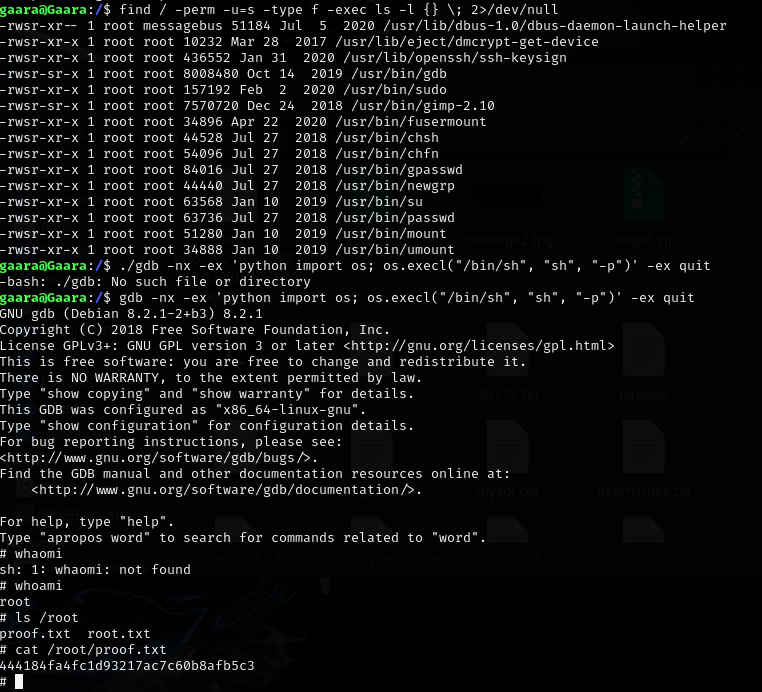

# Gaara -- Proving Grounds (write-up)

**Difficulty:** Easy
**Box:** Gaara (Proving Grounds)
**Author:** dsec
**Date:** 2024-08-25

---

## TL;DR

### Found a hidden /Cryoserver directory on the web server (case-sensitive), which contained information leading to access. Notes are sparse.

---

## Enumeration

Found `/Cryoserver`:
- Requires capital `C`.
- Page is blank until you scroll down.

---

## Lessons & takeaways

- Directory names can be case-sensitive -- always try variations when brute-forcing
- If a page looks blank, scroll down -- content can be hidden below the fold
- Take more detailed notes during the box
