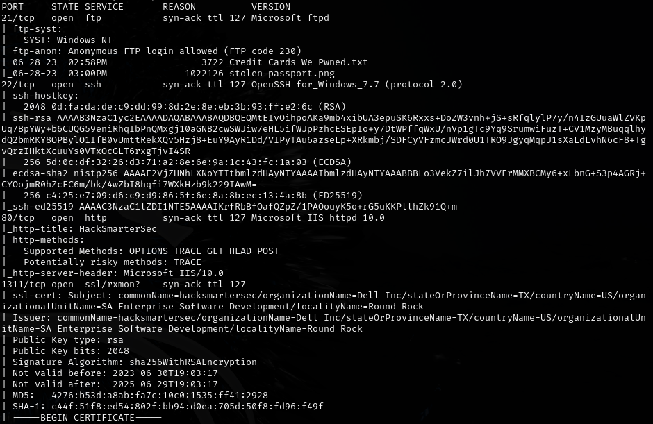
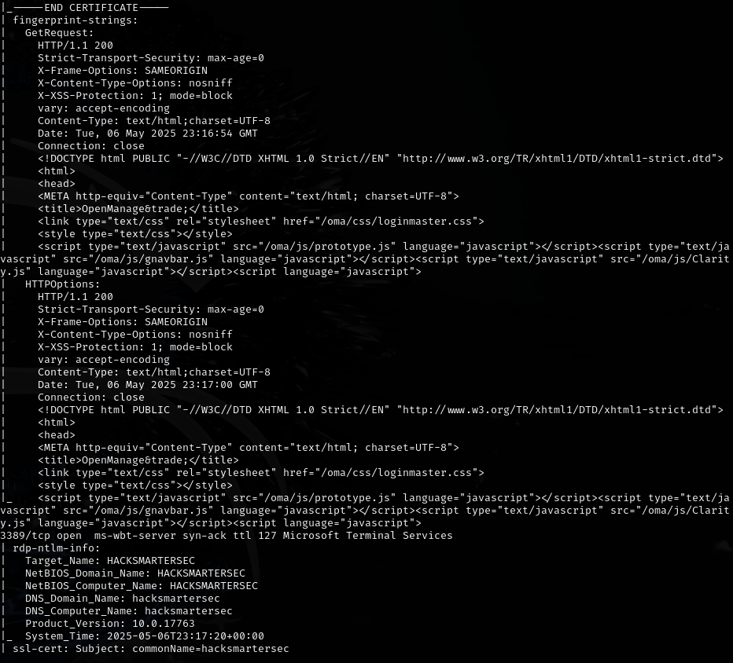
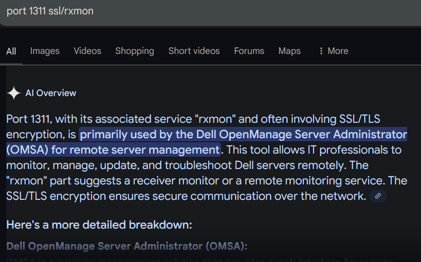
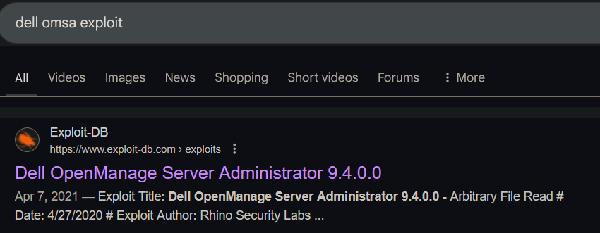
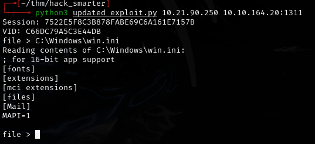
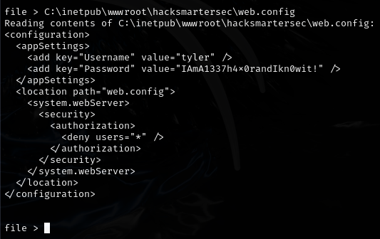
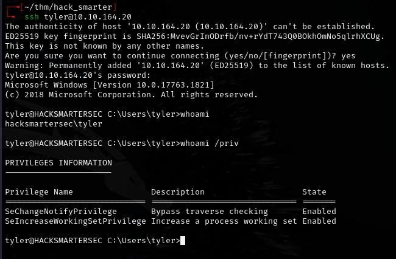

# Hack Smarter -- TryHackMe (write-up)

**Difficulty:** Medium
**Box:** Hack Smarter (TryHackMe)
**Author:** dsec
**Date:** 2024-10-11

---

## TL;DR

### Exploited a Dell SupportAssist vulnerability (CVE-2020-5377) to read files and extract credentials, then used them to get a shell as tyler. Privesc was started with PrivescCheck but notes end abruptly.

---

## Enumeration









---

## Exploitation

Had to get the updated POC from GitHub for CVE-2020-5377:





- `tyler:IAmA1337h4x0randIkn0wit!`



---

## Privilege escalation

Started with PrivescCheck:

```powershell
. .\PrivescCheck.ps1; Invoke-win
```

Notes end here.

---

## Lessons & takeaways

- Dell SupportAssist has known vulnerabilities -- always check for vendor-specific services on Windows boxes
- Use updated POCs from GitHub rather than relying on older exploit-db versions
- Finish the box and finish the notes -- incomplete documentation is frustrating later
